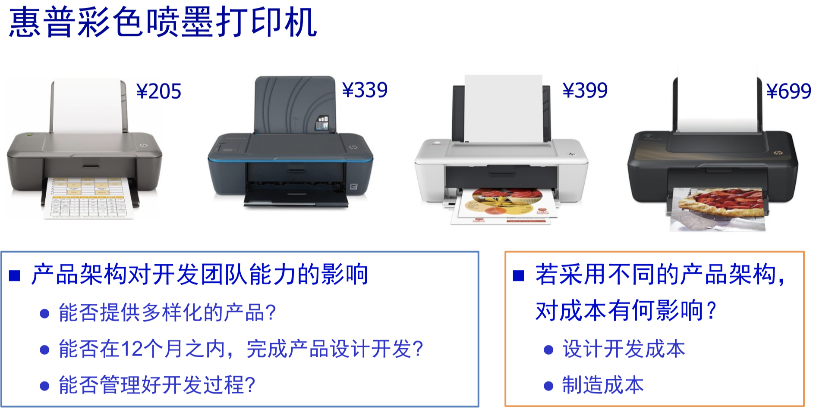
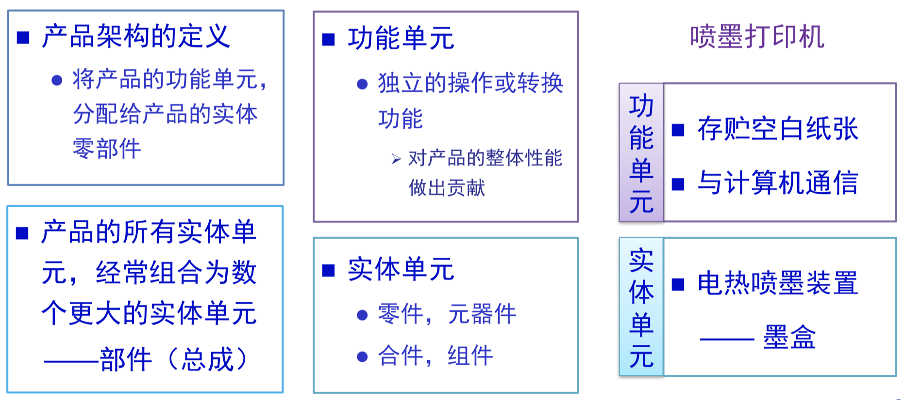

# 第10章 产品架构

[TOC]

## 10.0 前置场景与定义作用

市场成熟，需要满足各细分市场的细分需求，同时降低成本，需要思考：

- 对多样化产品的提供能力的影响
- 对成本的影响
  - 设计成本
  - 制造成本
- 对交付进度的影响
- 对开发流程的影响

定义：

产品架构**Product Architecture** 是一种分配形式assignment，将各**功能**元素分配个成品的**实体构建模块blocks**。

目标：

根据子内功能与子间联系，确定产品的基本实体架构，力求**便于将零部件的设计/测试分配下去（包括供应商）**，与产品多样性与供应链绩效有密切联系。

## 10.1 什么是产品架构

