# 第4章 产品规划

[TOC]

## 4.0 综述

**产**品规划 ***Product Planning***：<u>正式启动前，大量资源与团队投入前</u> =》==PMP启动组特征，因此时尚未有PM授权==。输出 ***Portfolio**=***做什么项目，研究什么4类产品****,并决定子项目的***时间、时序、关联组合方式***,<u>始于机会识别，终于任务陈述完成</u>，确定产品项目支持组织整体长期战略。

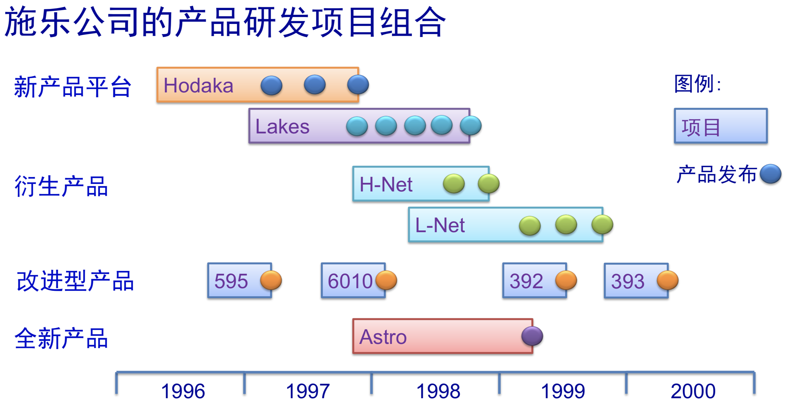

每一个项目的负责团队，需要知道*[任务书=任务描述/陈述Mission Statement=**章程Charter≠~~Chapter~~**=设计概要Design Brief，指明方向，但不精确，当然相对于PVS前景陈述还是要精确一点的](#4.5.1 任务书)*： 

`（市场、技术）、（成本、进度）、产品目标+财务目标、约束`

1. 考虑**市场**哪些组成部分=》**细分市场**
2. 哪些新**技术**=》**技术**
3. **目标与约束**=》**==目标==与约束**
4. **财务目标**=》**==财务目标==**
5. 预算与进度=》**成本&进度**

## 4.1 产品规划流程

产品机会： **市场、研究部门gfk/bcg、已有产品开发团队提议、竞争对手**

规划更新：**竞争、技术、已有成功产品信息**

制定产品规划：**综合考虑目标、能力、限制、竞争环境**，高层规划/规划主管，一年一次或几次

项目类型：***<u>新平台、新产品、衍生产品、改进产品</u>***

无规划代价：

- 产品竞争力不够，无法获取理想份额/对目标市场充分覆盖==》**竞争力**
- 入场时间不合适==》**入场时间**
- 总开发项目数量与开发能力不适配==》**开发能力**
- 项目间资源分配不合理==》**资源**
- 错误项目启动而终止==》**目标错误**
- 项目方向经常变==》**目标多变**

### 4.1.1 四种产品开发项目类型

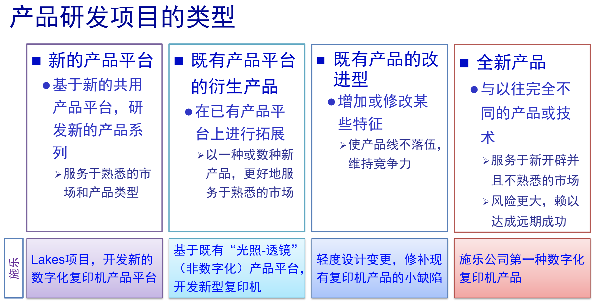

- **新平台 New Product Platform** =》在新通用平台上开发新的产品家族，服务于熟悉市场与产品类型
- **旧平台衍生品 Derivatives of Existing Product Platform**=》在已有平台上进行扩展，多种新衍生品服务于熟悉市场
- **旧产品改进 Incremental Improvements to Existing Products** => 增加或改进现有产品的特点，使不落伍有竞争力
- **新产品 Fundamentally New Product** => 全新产品或技术，全新市场，更大风险，长期成功所系。

### 4.1.2 流程5步骤

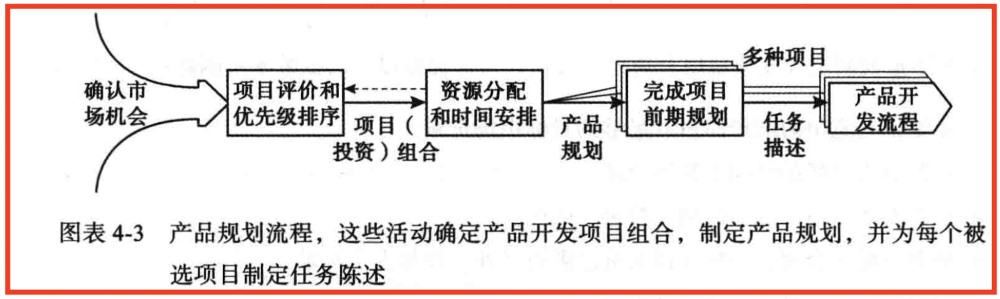

**制定 *产品规划*与*项目任务陈述* 的5个步骤，其中选择项目与分配资源常重叠非线性，需要随时调整：**

0. **[确认市场机会](#4.2 确认市场机会) =》输入**
1. **[项目评价与优先级排列](#4.3 项目评价与优先级排序)  =》 项目组合**
2. **[资源与时间分配](#4.4 时间与资源分配) =》任务陈述** 
3. **[项目前期规划](#4.5 项目前期规划)**
4. **[过程结果反思](#4.6 结果与过程反思)** =》==Inspect/Audit/Review? PMP知识管理与监控组？是否每过程都有==

## 4.2 确认市场机会

**机会漏斗 Opportunity Funnel**：追踪、排序、细化机会，对有希望的机会+简单清晰的描述，***存放到数据库中***

## 4.3 项目评价与优先级排序

找到最有希望项目，基于***[竞争策略](#4.3.1 竞争策略 Competitive Strategy)、[市场细分](#4.3.2 市场细分)、[技术曲线](#4.3.3 技术曲线 Technology S-Curve)与[产品平台](#4.3.4 产品平台规划)***。

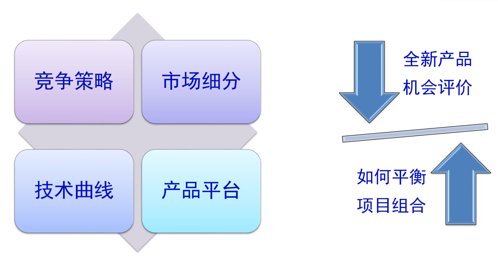

### 4.3.1 竞争策略 Competitive Strategy

在市场上与产品上针对竞争者的基本运作方法：

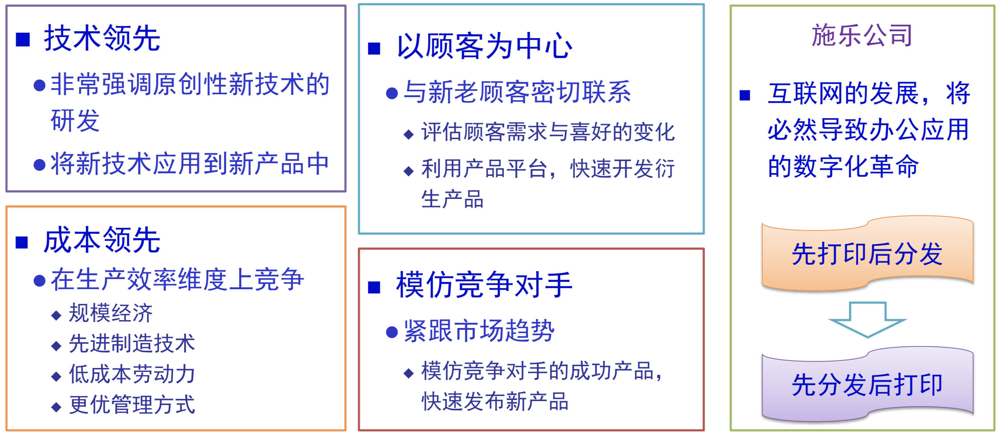

- **技术优势 Technology Leadership** =》强调新技术的研发应用
- **成本优势 Cost Leadership** =》强调效率，包含更多**生产工艺改进**项目，***<u>面向制造的设计</u>***
- - 规模经济
  - ***先进制造技术***
  - 低成本劳动力
  - ***更好的生产管理系统***
- **以顾客为中心 Customer Focus** =》新老顾客密切联系，**需求与偏好的变化**，**<u>*[产品平台](#4.1.1 四种产品开发项目类型)</u>***利于派生新特点，满足不同层次需求
- **模仿策略 Imitative** =》 跟进市场趋势，*<u>**快速模仿**</u>*，成功竞争者的产品

### 4.3.2 市场细分

根据详细定义的**细分市场客户群**，来权衡敌我行为与力量对比

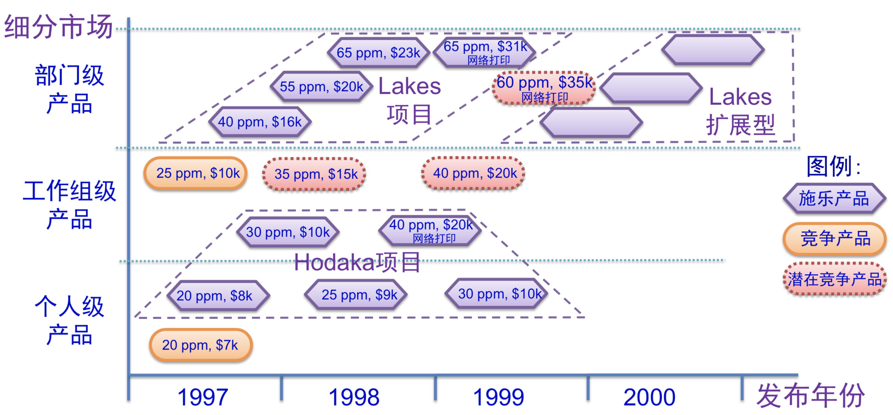

### 4.3.3 技术曲线 Technology S-Curve

- 关键决策：**何时启动何种技术**，某行业的某需求的**关键技术**

- Technology S-Curve：单一性能参数：完成情况、速度、可信度或其与成本比率 VS 时间)，但*未来走势(最终性能限制远近)很难预测*

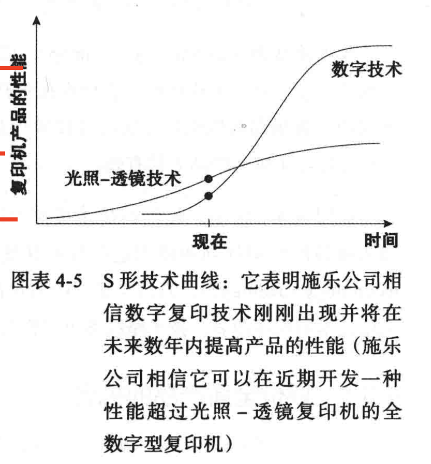

### 4.3.4 产品平台规划

~~== Customer Focus（层级不是对竞争策略的解释）~~

- 产品平台：一系列产品**共享的整套资产**，最重要是**零部件**；
- 平台收益：**杠杆作用，更快更容易衍生**，分别满足各细分市场；
- 平台成本：时间与资金**是衍生品开发的2-10倍；**
- 关键策略：现有平台还是新平台开发衍生品？**取决于企业中的技术开发工作，以及新产品当中使用哪种技术；**
- 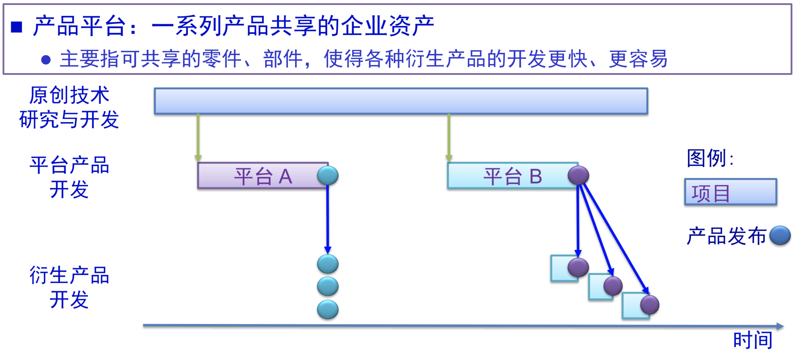
- 技术路线图 Technology Roadmap：正考虑开发的**<u>产品相关</u>**的各种**技术的<u>预期实用性</u>与<u>未来实用性</u>**，使**技术开发与产品规划**相一致。
- 产品技术路线图 Product Technology RoadMap: 技术路线图当中增加加入项目的时间规划+使用上述技术开发的项目，是制定**技术&产品开发联合策略**的规划工具，表现为 **产品的一个关键功能元件与既定时间内实现这些元件所采用技术的顺序图表**。
- 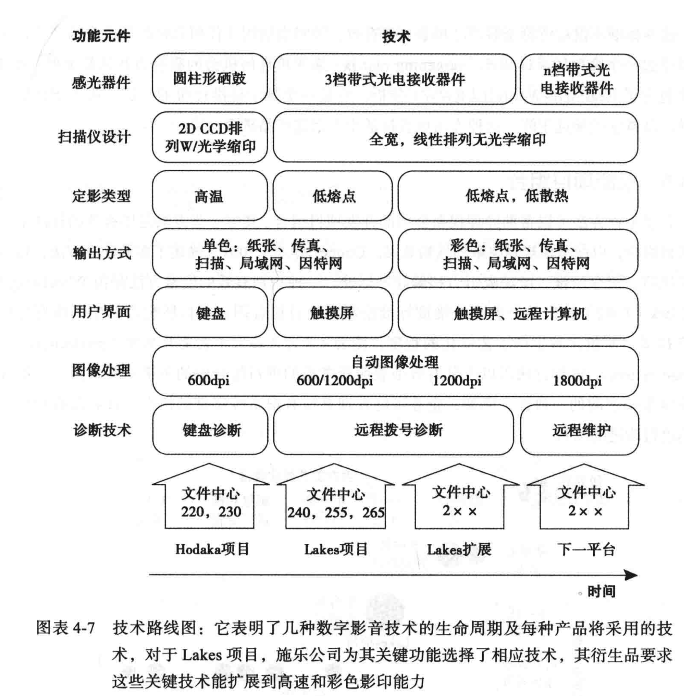

### 4.3.5 评价全新产品的机会

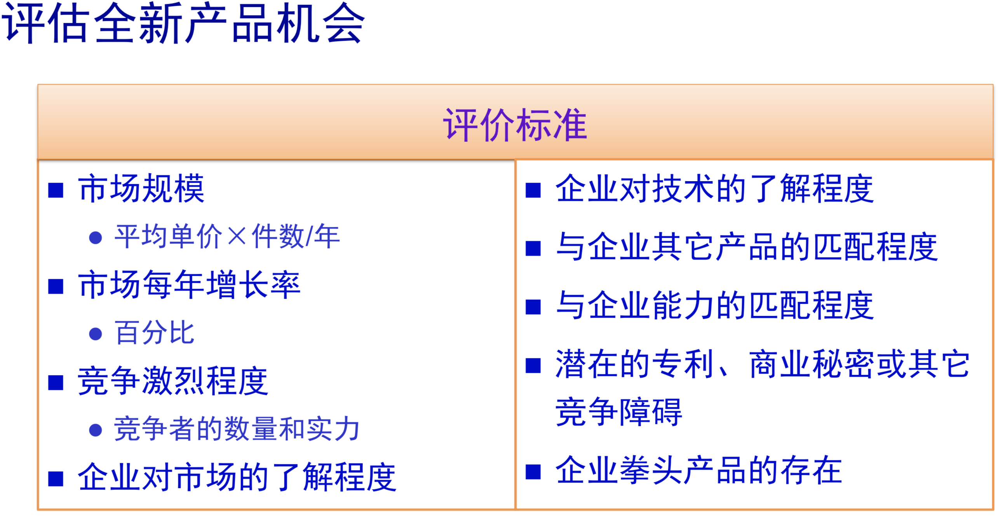

- 面向新市场新技术，高风险，但对于定期更新portfolio却是非常必要的。

- **筛选矩阵 Screening Matrix：机会吸引力 VS 风险**，可以评价任意机会不限于全新机会，==@RWW(Real-Win-Worth-It)是第三章基于标准的评价方法。==

- 标准：

- 1. 第一类是**客观认知**(**<u>市场总量、增长性、玩家情况</u>**)

- - **市场规模**，以总货值为单位
  - 市场**增长率**
  - **竞争激烈**程度(竞争对手的数量与质量)：此处只是客观描述对手们，不涉及竞争优势分析，或者说，这里应该更准确描述为市场现在以及潜在竞争对手分布特点。

  2. 第二类是**主观分析**(**<u>对技术/市场的了解，与自身产品/能力的匹配，专利等阻碍与拳头产品的情况</u>**)

  - 企业**对市场的了解**程度
  - 企业**对技术的了解**程度
  - 与企业**其他产品的匹配**
  - 与企业**能力的匹配**： ==*VRIN，Valuable 针对意义，Rare针对普遍性，Inimitable 针对可复制性，Nonsubstitutable 针对必要性*=> 能力、核心竞争力与竞争优势==
  - **专利、商业秘密或其他竞争障碍**的潜在压力
  - ==企业中**拳头产品product champion**的存在==

### 4.3.6 权衡项目组合

- 量度指标：**技术风险、资金回报、市场吸引力和偏好**
- **产品-工艺变化矩阵 Product & Process-Change Matrix**：项目所包含的**产品线变化**程度与项目所包含的**生产工艺变化**的程度，表明所考虑**项目组合==当中的不平衡==，==并评估项目组合==与*[竞争策略](#4.3.1 竞争策略 Competitive Strategy)*之间的一致性。** 
- 
- 竞争策略影响产品组合（这里没有列举跟随模仿者的策略）：
- - 成本领先：包含更多**生产工艺改进**项目，面向制造的设计；
  - 技术领先：包含更多技术开发与突破性项目，并有合适的冗余风控前瞻；
  - **多样化产品/客户中心**：在**已有平台**多开发衍生品；
- ==研究与技术开发的规划，**不在**产品规划流程的范围内。==

## 4.4 时间与资源分配

基于排序，按照最有希望的项目，如果太多导致资源争夺，后退排序削减。

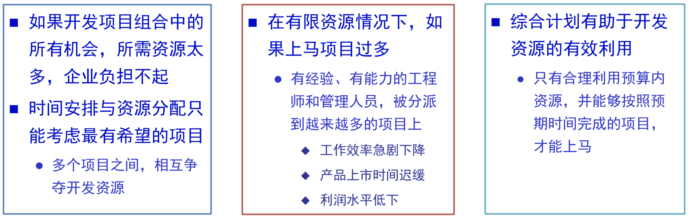

### 4.4.1 资源分配

- 综合计划 **Aggregate Planning**: 合理高效利用预算内资源，完成多个项目。
- 资源日历：所要求的资源@时间，VS 可用的资源@时间，可以**计算整体需求/能力利用比例，以及不同资源的利用率，考虑到意外储备，应该使之低于100%。**
- 主要资源：研发人员工作量，以人-小时/人-天计量单位；
- 其他资源：车间设备等；
- 综合计划编制当中，有可能资源被过度使用，这个时候先要对高权重项目给出绝对保障，牺牲其他项目可得性，然后需要用资源平衡与平滑进行关键链分析；
- 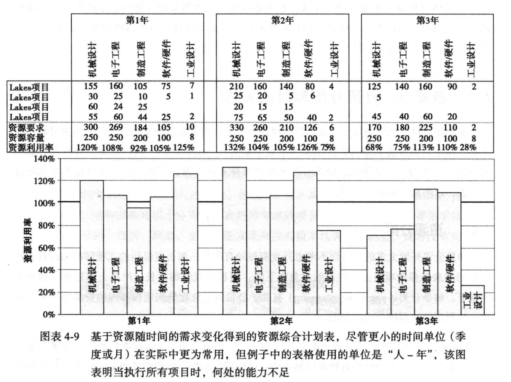

### 4.4.2 项目时间安排 

管道管理 Pipeline Management 考虑要素：

` 产品上市时间、竞品上市预期、技术成熟度、市场策略(先后与频率)` 

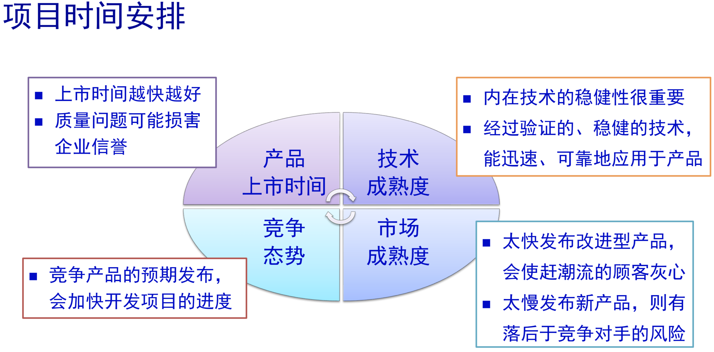

- 产品上市时间： 快 VS 质量
- 技术储备： 基础技术的稳健性-被证实、高成熟度
- 市场准备：
- - **上市顺序决定最初购买者意图：**高端先，低端先？ 举例Amazon图书精装纸板先发。
  - **上新速度：太快打击跟新热情**(保值炫耀时效，组件兼容升级，极飞VS大疆)，**太慢落后于对手。**
- 竞争：竞品上市预期促进进度。

### 4.4.3 产品规划 Product Plan

- 定义：确定了时间安排的项目（==组合？？应该是portfolio吧？？==）；
- 范围：包括了不同比例的全新产品、平台项目与衍生品；
- 更新：定期/季度OR/年，企业战略规划的一部分；

## 4.5 成项目前期规划

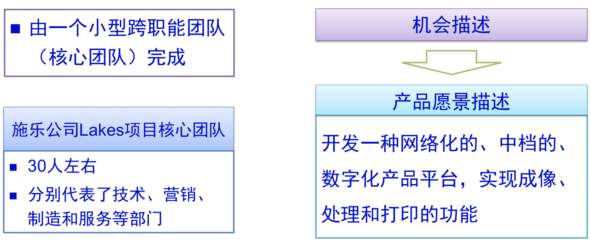

- 时间点：**项目确定，但还未进行物质资源分配**；
- 执行者：小型跨职能团队，核心团队 Core Team=技术、市场、制造、服务；
- **产品前景描述 Product Vision Statement**： 宽泛、不限定技术、职能与限制；
- 
- 任务陈述 Mission Statement：PVS被精细明确。
- 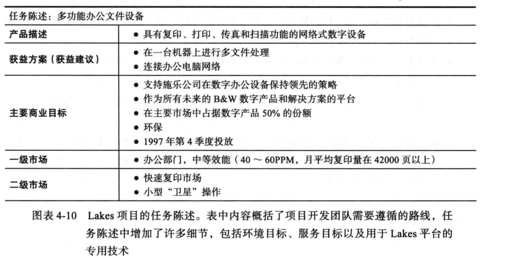
- 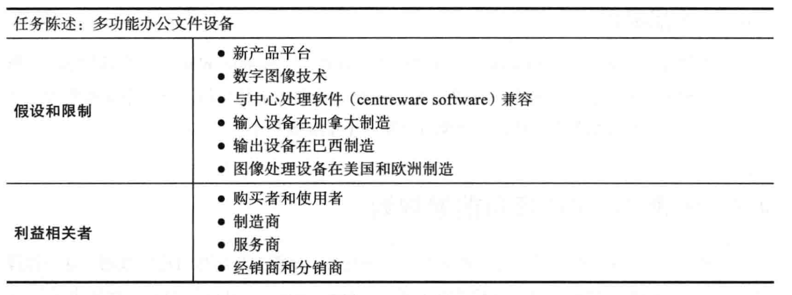
- 

### 4.5.1 任务书

任务书=任务描述/陈述Mission Statement=**章程Charter≠~~Chapter~~**=设计概要Design Brief，指明方向，但不精确，当然相对于PVS前景陈述还是要精确一点的

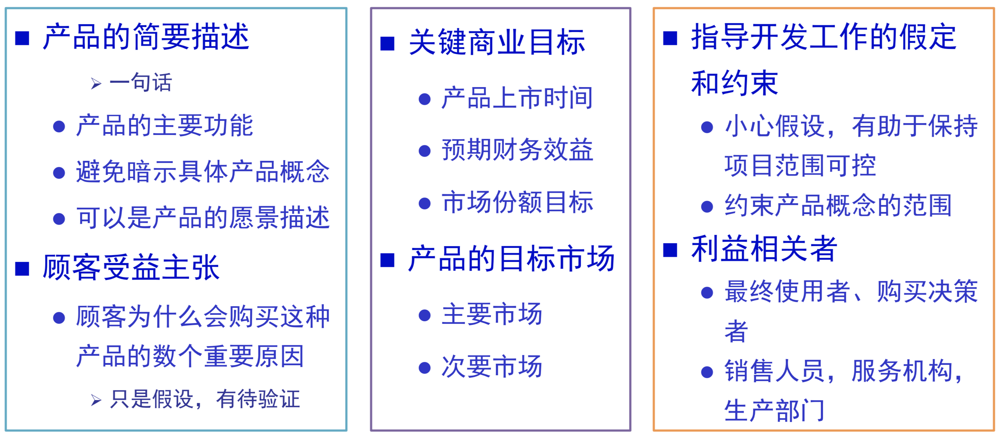

#### 4.5.1.1. 对产品的一句话概述=PVS前景描述：

**主要用途**，避免特定概念，可以是**PVS，产品前景说明**

#### 4.5.1.2 获益方案/获益建议 Benefit Proposition =付费动力：

**客户付费关键原因**，此时是**假设**，需要**验证@概念发展**阶段。

#### 4.5.1.3 主要商业目标=3基准：

公司战略支持，时间、成本、质量(**==类似三基准，但是质量替代了范围==**)，包括了上市时间、预期财务收益与市场份额等。

#### 4.5.1.4 目标市场：

一个产品可以有几个目标市场，任务陈述确定了一级市场（主要市场），以及开发过程当中需要考虑到的二级市场（次要市场）。

#### 4.5.1.5 指导项目的设想与制约：

尽量详细，尽管限制产品概念**范围**，但是有助于项目管理（PMP范围基准）。*==这个与4.5.2有什么区别？？？？ 与总结当中的关键设计也不相同==*

#### 4.5.1.6 相关方 Stakeholder

始于终端用户或购买决策者，扩展到内外PMP （销售、服务、生产等），提示兼顾诉求。

### 4.5.2 假设条件与制约要素

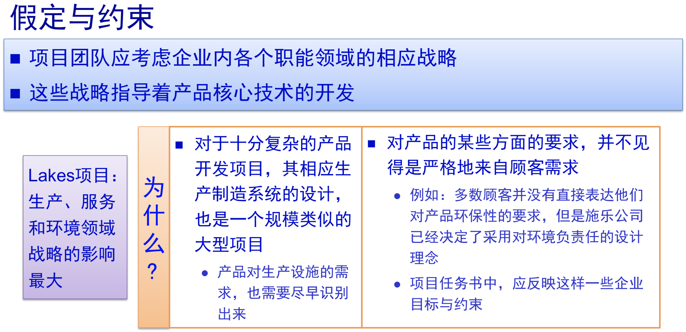

制定任务书时候，应考虑**不同职能部门的战略**，这指导着产品**核心技术**的开发过程。

其中部分要素有点像来源于EEF与OPA，有的则包括了产品的生产与售后环节：

- 环保 Environment：能量效率与可持续回收，**不一定从客户需求中来**；
- 服务 Service： 对服务影响成功，或服务收入影响成功情况，确定服务水平的目标非常必要，**设计时候要以维护维修便利为战略承诺，提高服务效率**，比如XA的快速插拔模块化；
- 制造 Manufacturing：初步设计时候就要考虑**制造系统的性能、产量、限制**，包括：
- - 哪些内部设备
  - 外部供应商@时间
  - 已有生产系统是否满足产品要求的新技术
  - 对于要求复杂制造系统的产品，可能产品的制造设备必须先行确定

### 4.5.3 人员配备和其他项目前期规划活动

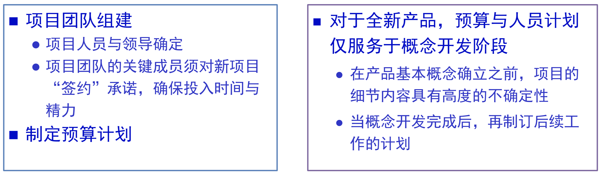

- 项目经理与项目团队，含开发资源签约
- 预算
- **对于全新产品而言，预算与人员仅为概念开发阶段制定，因为项目细节不确定，一直持续到基本概念确定。**

## 4.6 结果与过程反思

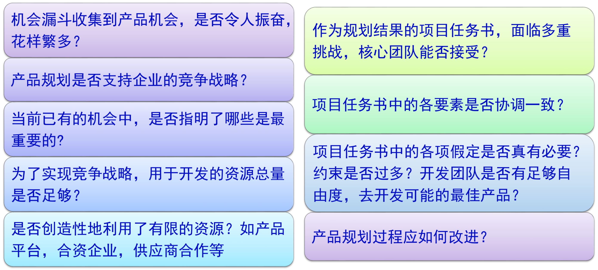

核心问题：

- **机会漏斗**：是否收集到了足够多样激动人心的产品机会
- 产品规划：是否支持企业的**竞争策略**，并针对现在**最大机遇**
- ~~产品规划：是否针对现在最大机遇~~
- **开发资源**：是否足够贯彻**竞争策略**
- **资源效率**：是否已经最大化与创造性应用，例如平台使用、合资、供应商合作
- 核心团队：是否接受任务书挑战并作出承诺
- **==任务书：是否各处自恰一致==**
- 假设与制约要素：==必要性与可控性，是否足够支持自由开发最好产品==
- 过程改进

任务书是将管理权移交开发团队，因此==进行开发之前必须做现状合适 Reality Check，在早期阶段纠正已知缺陷。==

产品规划方法，并不是一个顺序逐步的过程，比如一致性与适应性的反馈与批评是不间断的，应该同时执行，以确保**计划集与组织的目标、能力与限制相一致**。

## 4.7 小结

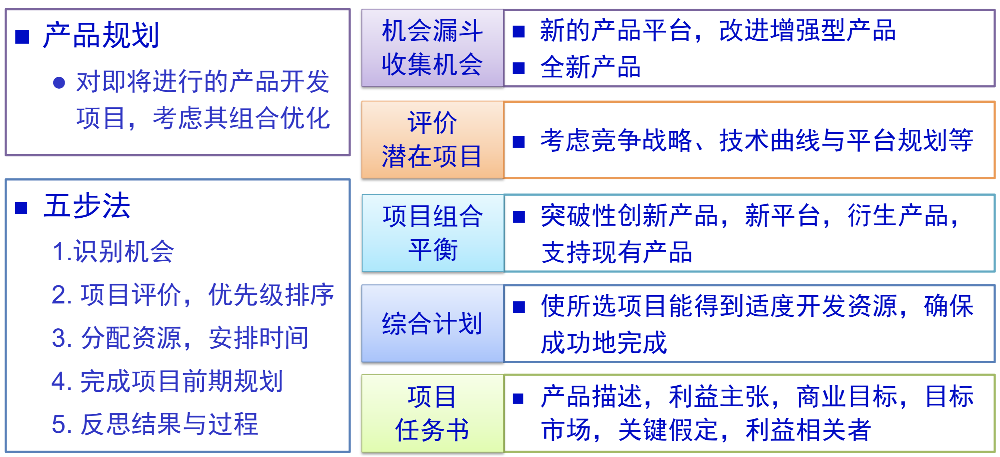

- 产品规划的[定义](#4.0 综述)
- 产品开发的[5个步骤](#4.1.2 流程5步骤)
- [机会漏斗](#4.2 确认市场机会)的内外来源，与产出(平台、改进、全新)
- 潜在产品开发，要根据公司**竞争策略、技术曲线与产品平台**进行评价
- **==一个产品开发项目的平衡项目组合，可以投资突破性产品、新平台、衍生品和支持现有产品==**
- **集成性规划**，确保有足够的**资源保证**所选项目的成功==》项目组合优先级取舍
- [任务书](#4.5.1 任务书)，指明了产品**[前景PVS](#4.5.1.1. 对产品的一句话概述=PVS前景描述：)、[获益方案](#4.5.1.2 获益方案/获益建议 Benefit Proposition =付费动力：)、[商业目标](#4.5.1.3 主要商业目标=3基准：)、[目标市场](#4.5.1.4 目标市场：)、==[关键设计](#4.5.1.5 指导项目的设想与制约：)==与[利益相关方](#4.5.1.6 相关方 Stakeholder)**

## 4.8 练习

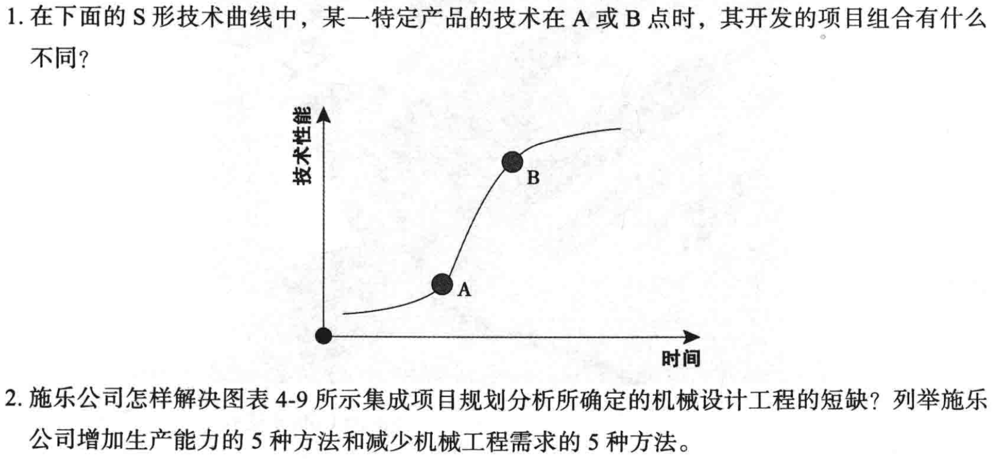

