# 第6章 产品规格

[TOC]

## 6.0 综述规格的意义与必要性：

- 规划目标：山地自行车零件公司计划推出新款前叉悬架，之前已有类似品，希望开发新品提供更优质体验。 ===》改进型产品？==
- 需求识别：自身体验，调研了山地车比赛选手，与休闲步道的骑行者，与经销商沟通 =》==专业领先+业余极端，以及用户与渠道购买决策者？==
- 需求清单中所面临的挑战=》读完后回来回答：
  - 如何将相对主观的**顾客需求（=需求陈述≠客户陈述）**，转化为后续**开发的精准目**标? =》**需求陈述2产品规格（目标规格）**
  - 如何让**开发团队和高管就产品成败达成共识** =》 **高管与执行达成成败共识（目标规格）**
  - 团队成员如何建立**信心**，产品能有足够大的**市场**? =》**激励对从事工作成就的信心**
  - 产品的**多种特性 & 成本质量**之间如何权衡?  =》**内在互斥产品特性，以及整体性能/质量/等级：==成本/技术约束==（最终规格）**
- **工具：电子表格**

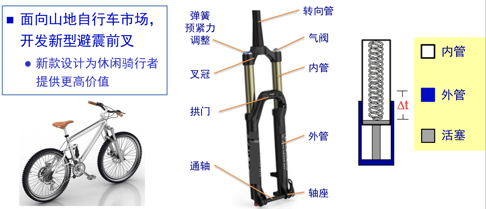

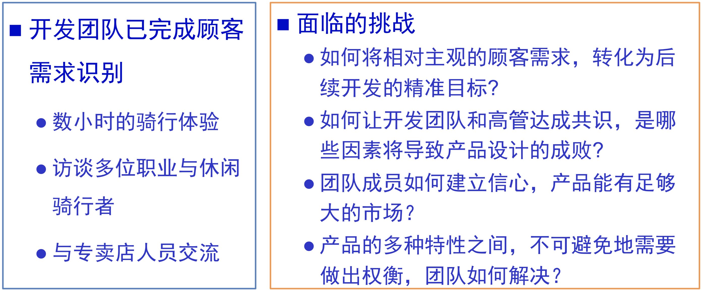

避震前叉􏰀的顾客需求，􏰁其相对重要度：

## 6.1 何为规格=产品需求/工程特性

客户的需求陈述，是一种主观的顾客语言描述，因此需要**简洁明了**的规格，来界定产品的**详细定量**属性。

规格不代表开发方法，但代表团队应该努力**达成的共识**，精准可量度。

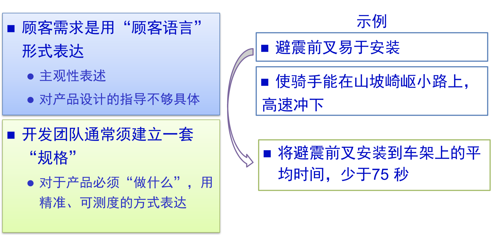

**产品规格Product Specification = *<u>产品</u>*需求Product Requirements = 工程特性 Engineering Characteristics** 

**规格=度量指标Metric：数值Value**，数值可以是数字、范围或不等式且通常带单位，**产品规格是规格的组合。**

- **规格与指标不同，<u>规格是字典类=键名键值对，指标是键名</u>**

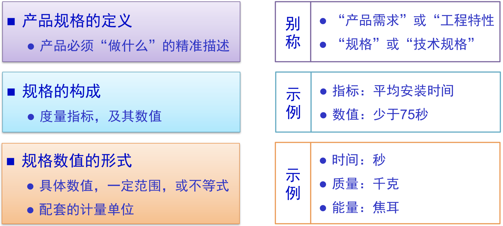

## 6.2 何时建立规格

理想情况下，规格于开发早期确定，适用于简单产品；复杂高科技产品，**至少要经过2次规格的确认**：

- **设置目标规格** Target Specification：**开发团队的希望与抱负**
  - 限制要素不明确
  - 目标产品不明确
- **设定最终规格** Final Specification：经过创建/选择/测试产品概念，对目标规格的修订
  - 考虑实际的**技术约束**，和期望的**产品成本** =>**整体性能/质量/等级：==成本与技术（非内部参数取舍性）约束==**
  - 在各种期盼的**产品特性之间**，不断进行艰难权衡 =》**内在互斥产品特性，==属于技术约束的一部分==**
  - 关键环节，于合同书(**Contract Book=计划、资源、成本效益等达成的各方共识**)中对其进行说明 =》**合同书体现共识**
  - 产品规格清单是完成开发过程中的一种*主要*信息系统

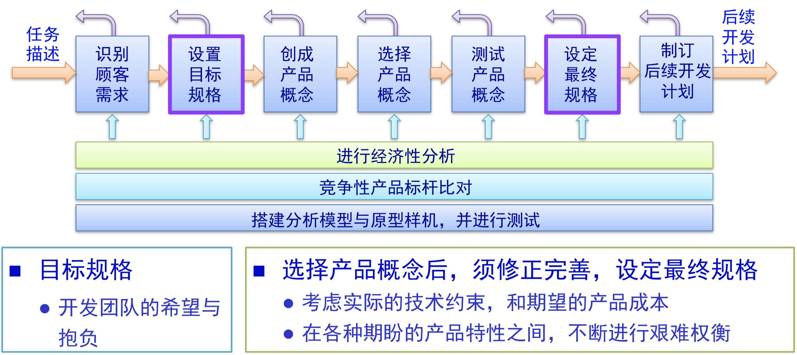

## 6.3 建立目标规格

位置：识别确认需求后，创造产品概念前；

随意设置规格，特别是互斥规格，可能技术上不可行，但偶尔也这么设置，代表着**团队的抱负**；

目标规格设定后，生成产品概念，目标规格用于选择产品概念，并确认商业可行性。

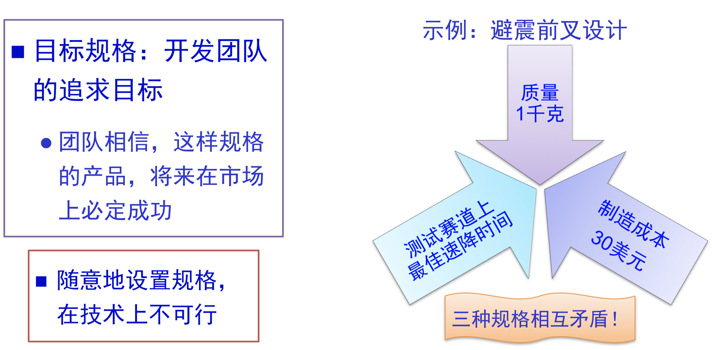

### 6.3.0 确立目标规格的步骤：

`目标规格：指标清单—>竞争标杆->理想边界`

1. [准备**度量指标清单**](#6.3.1 准备度量指标清单(只是键名，不是规格！！))
2. [收集**竞争性标杆**信息](#收集竞争性标杆信息)  =》竞争分析是在建立目标规格而非最终规格权衡上
3. [设定指标**理想值**与可接受**边界值**](#6.3.3 为每个度量指标设定指标理想值与可接受边界值)
4. [反思结果与过程](#6.3.4 对结果与过程反思)

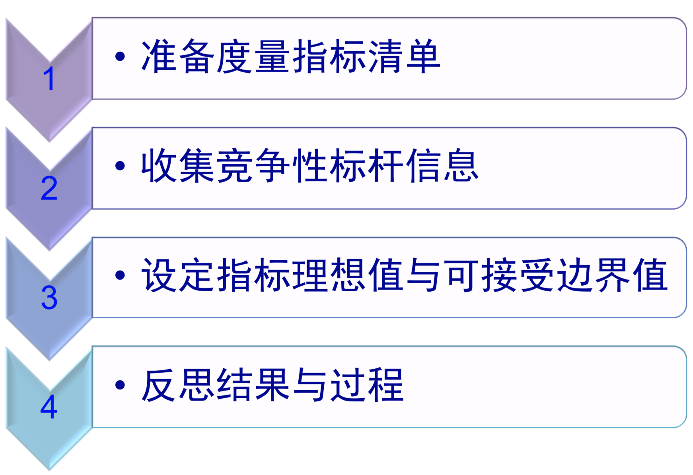

### 6.3.1 准备度量<u>指标</u>清单(只是<u>键名</u>，不是<u>规格</u>！！)

#### 6.3.1.1 需求/指标一一对应转换的假设与非理想性

最有用的度量指标，直接反映顾客需求满足的程度  =》==下文的指标是否都应该改为规格键值对，才能与需求对称==

基本假设：顾客需求可以转换为一系列精确的可度量指标（键名），**符合规格(键值对) = 满足需求** 

创建度量指标清单的正确方式：

- 依次考察每一种需求
- 考虑用产品的哪一种精确可度量特性，反映需求满足程度
- 理想情况下，指标与需求一一对应，但现实当中不存在

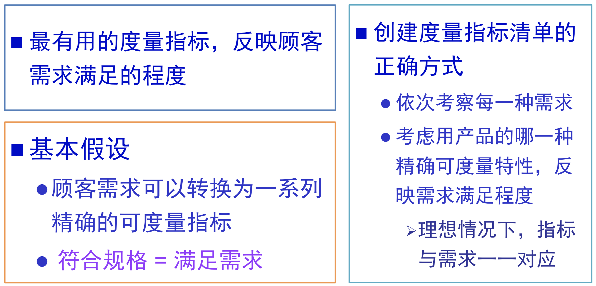

非理想性:

- 需求与某个指标之间的转换，并不那么轻易界定；
  - **有可能以牺牲其他潜在指标或引入其他代价**
  - **有可能需要针对多种具体情境或测量策略进行定义，需要几种指标**
- 为规避转换的不精确性，**转换应该在用户需求确认过程中**，通过直接交流=》==是顾客陈述还是需求陈述环节？==

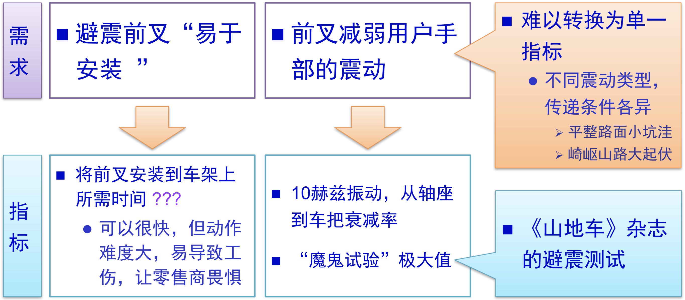

#### 6.3.1.2 需求/度量指标矩阵:

- 行表示需求
- **列表示度量指标，键名**
- 标记代表行列相关性，相关键值影响需求实现程度
- 该矩阵是**质量屋House of Quality**的关键组成部分，**质量屋是质量功能展开QFD(Quality Function Development)的一种图形化技术**
- 简单情况下，标记每指标相关的需求就可，不必矩阵；
- 复杂映射下，该矩阵尤为重要。

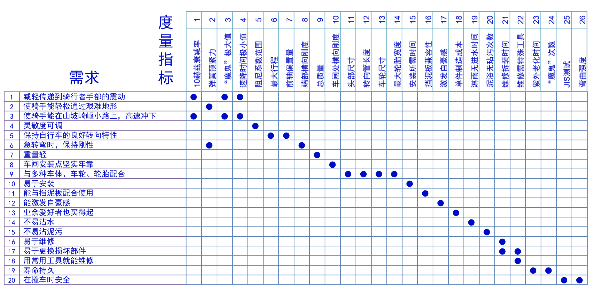

#### 6.3.1.3 构建度量指标清单的指南

- **指标应完整** =》**1对N的关系**
  - 理想情况下，每项需求对应于一个度量指标
  - 度量指标的数值与满意度相对应
  - 在实际中，可能数个指标才能完整反映一项需求 
- **指标间假定为非独立变量，相互依赖** =》**涉及了如何整体实现**
  - 例:避震前􏰀叉的总质量，是其材料密度与尺寸的函数 
  - 指标描述产品的综合性能
  - **给设计者留下了选取最佳实现方式的自由度** =》整体优化
- **指标应可实际观测或分析**
  - 指标是产品的某种性能，可通过直接观测或计算得到
  - 便于开发团队进行评价 
- **有些需求无法转化为量化指标**
  - 例:避震前叉􏰀激发用户自豪感
  - 一种**主观性指标**，可**由顾客 评价**，以**顾客陈述为规格**，单位用Subj.
- 为了与市场上同类产品进行比较，**指标应包含公认的标准** =》**对应下文成熟产品指标人尽皆知的最终规格的权衡方式**
- 多数顾客**购买产品，基于公共评测数据** =》**意见领袖、专业机构、媒体话语权**
  - **媒体或机构独立发行指标纳入**
  - 如果没有找到，**尝试与媒体一起修订标准**
  - 有时，**媒体评价本身被视为一种客户需求，即使没有任何内在技术价值**

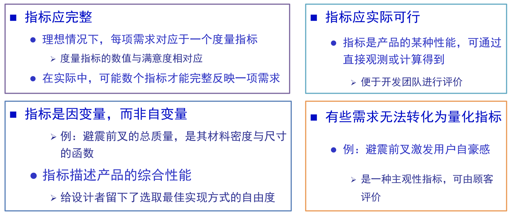

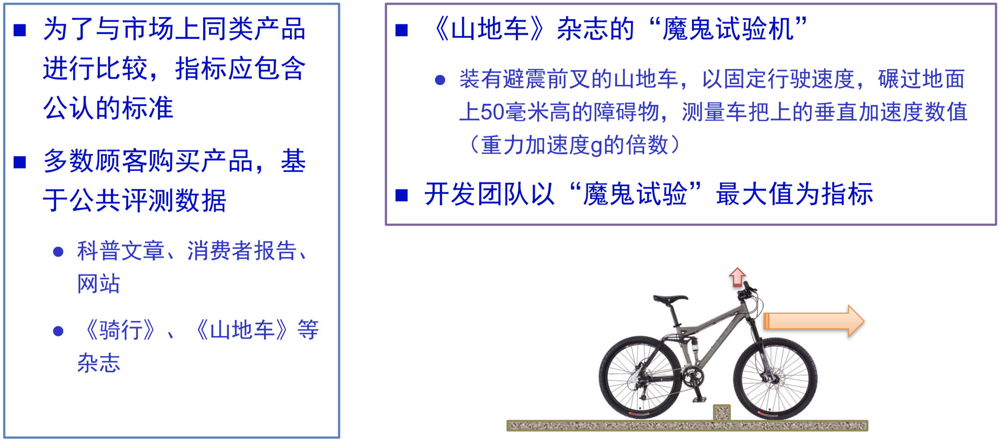

避震前􏰀叉测度指标清单:

- **每列：指标代号，影响到的需求代号集，指标描述，重要性，单位**
- 有时一些**依存性或标准测试的键值**：可能是**一个list（适配于其他某个指标的键值，或可选认证）**或者是一个**Binary 2选1：P/F**
- **指标重要度源于需求重要度以及与需求相关性**，团队讨论建立算法
- 但**规格较少，而建立重要性关系非常重要时，==关联分析Conjoint Analysis==很重要**

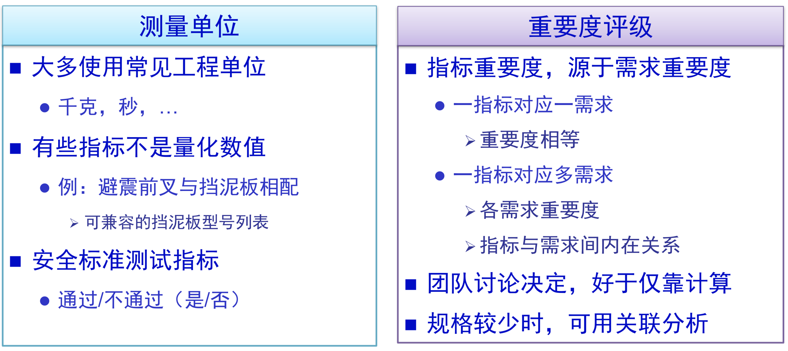

### 6.3.2 收集竞争性标杆信息

#### 6.3.2.1 标杆分析的目的与必要性

- 除非垄断，否则竞争关系界定商业成功
- 基于竞争思想开发新品，以目标规格为语言，研讨新品相对于现有产品的定位，包括**产品本身定位，以及与竞品的定位** =》==目标市场与目标人群，以及该区域内竞争分析SWOT/4ps/5pcs==
- 为了上述定位的准确性，必须搜集竞品信息
- 竞争性标杆分析图可以作为附近添加到度量指标的表格中==，相当于质量屋的一个屋子==

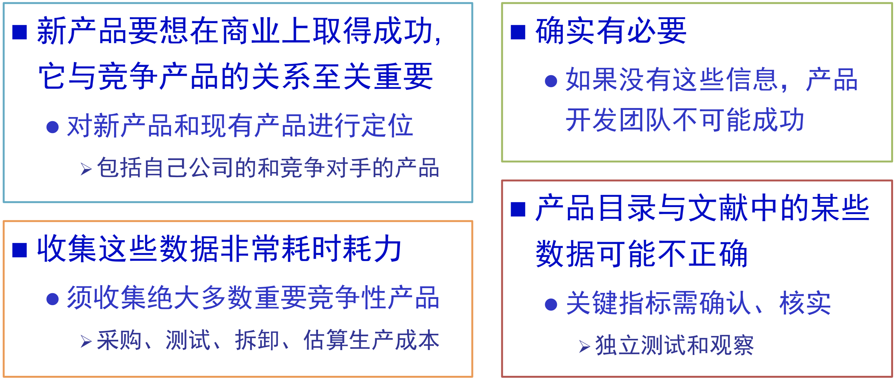

#### 6.3.2.2 竞争性标杆分析图=PK表

- 独立指标键名：各竞品键值list =》**基于<u>规格：键值对</u>的竞品分析=<u>度量指标竞争性</u>图表，至少要有**
  - 收集费力，但必要
  - **竞品目录与文献值可能不准确，因此关键指标需要独立测试核实**
- 需求：各竞品满足度list =》 **基于<u>需求：任务满足度</u>的竞品分析=<u>竞争性标杆</u>图表，最好要有**
  - ==比较顾客对产品满足其需求程度的洞察力==
  - 第三方书籍介绍==如何测试客户关于满足需求的洞察力的相关知识==

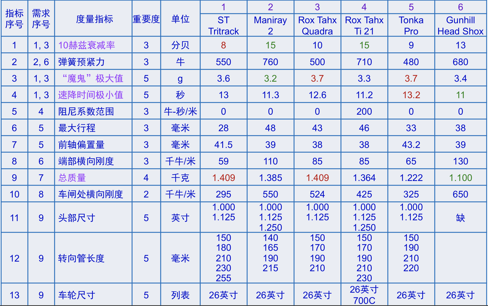

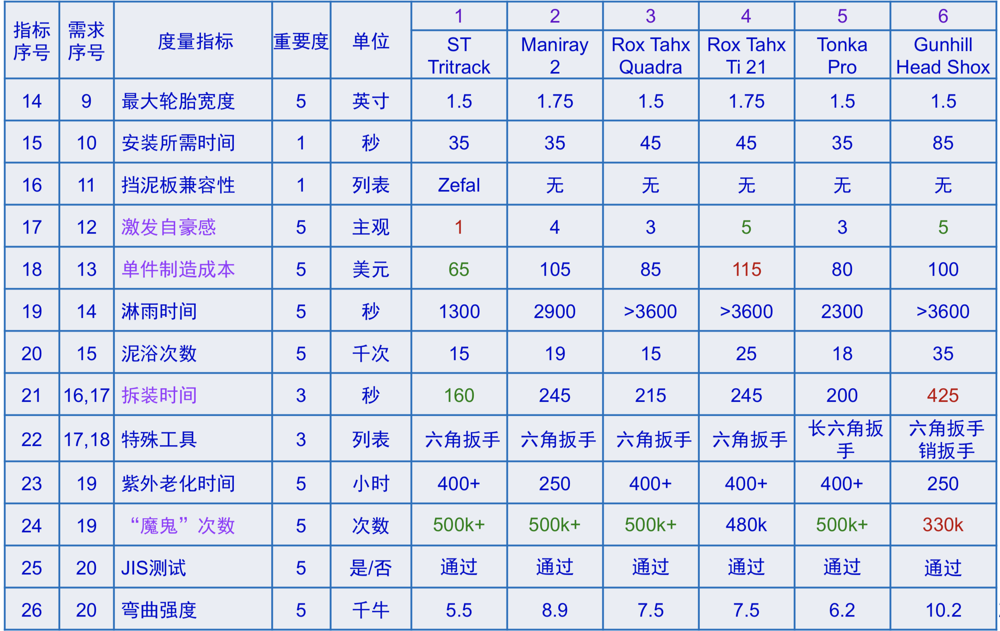

与竞品需求满足程度对比：

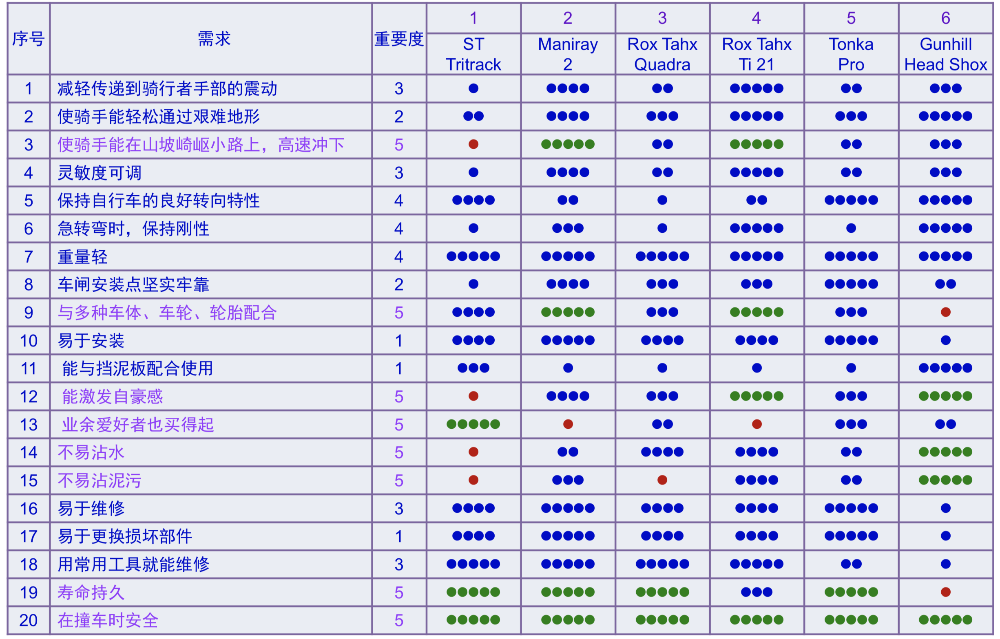

### 6.3.3 为每个度量指标设定指标理想值与可接受边界值

#### 6.3.3.1 二值定义：

- 理想值 **Ideal Value**：最佳状况
- 边界值 **Marginally Accepted Value**: 面前可用

####  6.3.3.2 表达度量指标值的5种方式：

- 不小于X：指明下限，越高越好
- 不大于X：指明上限，越低越好
- 介于X和Y之间：设定上下限范围
- **准确值X：特定精确值，如非必要不推荐，根本上约束产品设计，建议替换为区间**
- 一系列离散值
- **表述为对另外一个度量值的依赖：可以设，但是在制定精确的规格值之前不推荐复杂表述**

#### 6.3.3.3 **选取键值（=竞品可行空间边界<u>≠选择指标</u>，此时不求精确）的考量因素**：

- **竞争性标杆**分析图：现有竞品性能
- ~~现有竞品性能~~
- **竞品未来性能**
- **产品任务陈述**
- **产品目标市场**

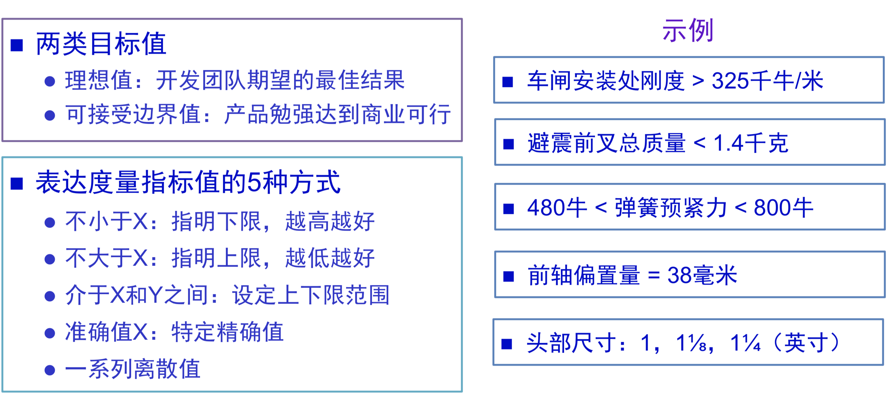

### 6.3.4 对结果与过程反思

开发团队需 经多次迭代Iteration， 方能在目标上达成共识 ,每一轮之后，都需要进行反思，以确保与项目的目标一致 =》**滚动式迭代规划：共识，及需求跟踪矩阵：建立需求与目标之间的联系**

考虑问题：

- **开发团队成员之间是否存在“博弈”**? 
  - 营销人员坚持过高指标？
  - 开发团队协商的指标，更具现实性与更大意义？ 
- 是否应提供**多种产品**，至少是多种型号?
  - 最佳匹配各个细分市场的特定需求
  - 还是提供一种**“平均”产品**就足够了?
- **规格是否有缺失?**
  - 规格反映了那些决定产品商业成功的特征吗?

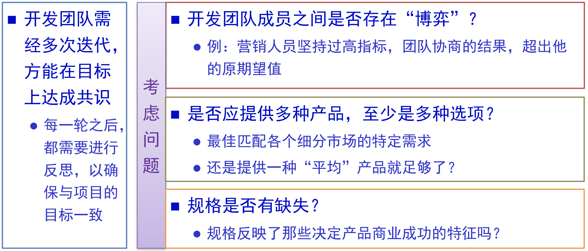

## 6.4 确定最终规格

目标规格不精确，后续修正、完善形成最终规格

- 产品概念选择之后，准备后续设计开发工作之前 
- 度量指标数值，从范围较宽，到精细化 
- 难度：指标间固有的相反关系
  - **在不同技术性能指标之间**，须不断权衡 =》**内在互斥产品特性**
  - **技术性能指标与成本之间**， 总是需要权衡 =》**<u>性能指标包括了质量与等级</u>，==除了成本约束还有<u>技术约束</u>==**

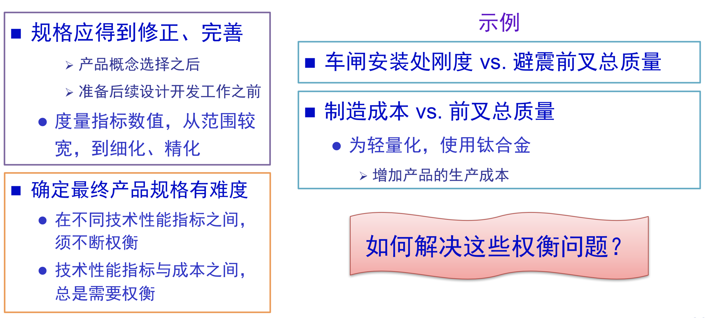

### 6.4.0 设定最终规格五步法：

`最终规格：技术模型->成本模型->权衡取舍->规格分解`

1. [开发产品的**技术模型**](#6.4.1 开发产品的技术模型=》==内部属性特征互斥=技术制约==) =》**技术制约(含内部互斥参数要素)**
2. [开发产品的**成本模型** ](#6.4.2 开发产品的成本模型 =》成本制约)=》**成本制约**
3. [修正产品规格，必要时**进行权衡**](#6.4.3 修正规格，必要时进行权衡分析)
4. [**产品规格分解**至合适程度](#6.4.4 产品规格分解至合适程度)
5. [反思结果与过程](#6.4.5 对过程与结果反思)

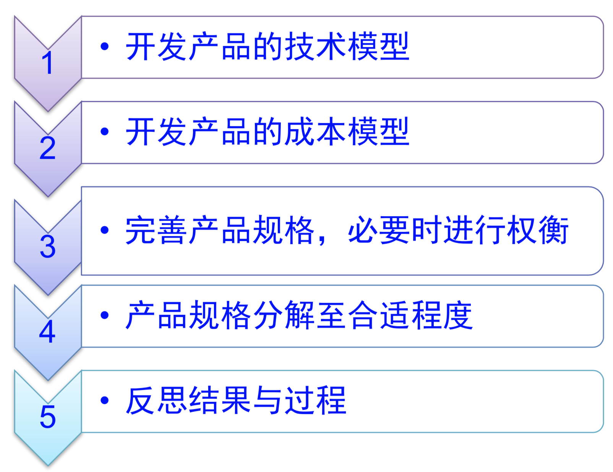

### 6.4.1 开发产品的技术模型=》==内部属性特征互斥=技术制约==

**产品技术模型**：针对特殊设计决策的工具，可依据一组设计决策的输入，预测度量指标值的变化，是对产品的计算与物理模拟 =》**针对一组设计决策输入，输出目标指标键名的键值变化**

#### 6.4.1.1 **计算模型=解析模型**：

- **电子表格或计算机仿真计算**，易于实现，快速预测，低成本
- **多数情况**下，可对**少量指标**使用解析模型，如动态系统当中的工程只是开发衰减模型
- 当每一个**独立模型**与一个度量**指标子集相对应**（2个要素之间独立）时，**几个独立模型会比综合模型更具备可操作性** =》产品综合模型尽量分解为几个独立模型(==是指的输入独立还是输出独立==)

#### 6.4.1.2 **物理模型=非解析模型**（如悬架疲劳特性）：

- 实物模型、原型样机、实验装置
- 有助于**理解内在复杂机理**，耗时长，成本高
- 需创建多种类型的物理实验模型或样本，才能应用设计变量的组合
- 为减少模型数量，**实验设计==DOE(Design of Experiment)==技术很重要**

####  6.4.1.3 **技术模型用途：**

- **探索不同的设计变量组合**
- **预测任何一组特殊的规格是否技术可行**
- 防止将产品概念可用范围内不可行的规格组合在一起

#### 6.4.1.4 **模型/产品概念：映射关系唯一而不普适**：

- 与特定产品概念相对应的技术模型通常是唯一的，不可无改动套用
- **选择产品概念后才能创建该模型**

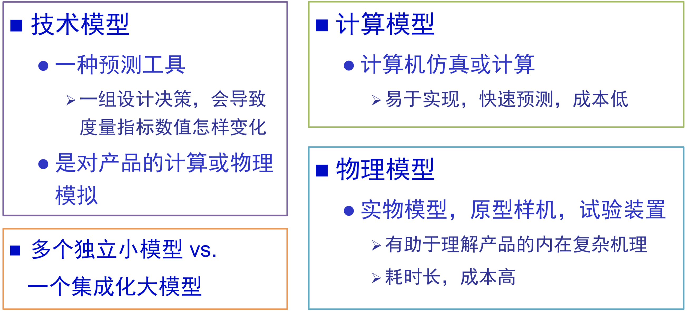

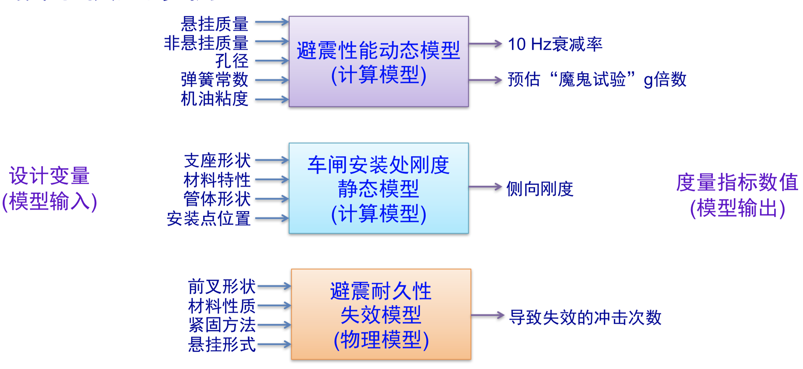

### 6.4.2 开发产品的成本模型 =》成本制约

#### 6.4.2.1 成本模型的目的:

确保产品能以**目标成本**生产出来 =》**价格有竞争力，并依然能盈利** 

#### 6.4.2.2 目标成本：

- **（市场价格-该级渠道利润）*（1-该级毛利率）** =》**注意基数每轮变化，用方程式代入链式传递**
- **不提倡成本加成法CostPlus**，**无视竞争市场价格由用户与上市场因素决定**的事实
- **价格有竞争力，并依然能盈利**

#### 6.4.2.3 初步估算制造成本的方式：

`制造成本=SUM(部件清单单元*实时价格上下限)+组装生产+其他费用`

- 初步列出**零部件清单**
- 估计**每种零部件购买价格**，或**自制成本** =》先下限/不确定性范围
  - 暂时无法确定所有组件，只是**尽可能列出**
  - 由**采购专业人员和生产工程师**支持
  - 估计每种零部件的**最高和最低可能价格**=》不确定性范围 ，**以每周更新修正的材料清单进行成本分析**
- 粗估产品**组装成本和其他制造成本（管理费 ）**

#### 6.4.2.4 对于太多组件的复杂产品的成本估算：

- 列出其**主要部件和子系统**
- 基于以往经验与供应商协助判断，来分配其成本==(比例配额计算？？？)==

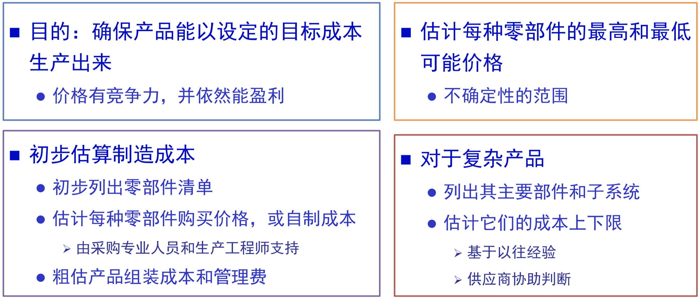

零部件清单及成本估计：

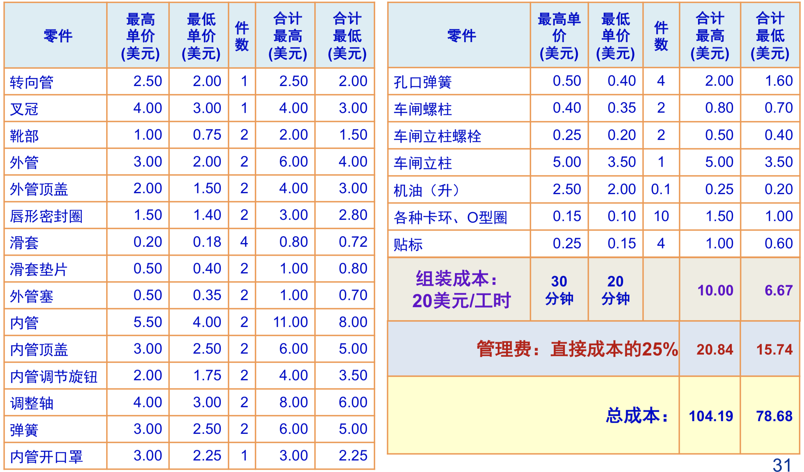

### 6.4.3 修正规格，必要时进行权衡分析

#### 6.4.3.1 确定最终规格的方式与工具

`技术模型=》可能的键值对组合=》成本模型=》成本范围=》竞争模型=》满足约束&竞争优势=》小组会议=》完成一次迭代`

- 使用**技术性能模型=》（可行的键值对组合）=》成本模型=》（成本范围）** 
- **小组会议**方式
- ~~确定可行的指标数 值组合~~
- ~~探索对成本的影响~~ 

以迭代方式，收敛至一组规格：

- **最有利于竞争地位**
- **最大程度满足顾客需求**
- **确保适度的利润** 

**竞争分析图Competitive Map=权衡图<u>≠竞争性标杆分析图</u>**，一种决策工具：

- 在**两个选定的指标维度**上，将**竞争产品标记为散点图**，将**自身产品概念制作成权衡曲线**
- **根据竞争态势，确定新产品定位，一个理想区间，一个边界区间**
- ~~权衡曲线，表示产品概念相对于一定设计变量范围的性能~~
- ~~相对于竞争产品，==展现出性能优势==或成本优势吧？？？？~~ 
- 电子表格绘图，以及通常会为**少量这种指标准备不少于3-4个这种图**

通过**技术模型+成本模型+竞争模型**，不断修正规格，既**满足自身约束，又可为竞品提供一种更优势的性能，以解决权衡问题**

#### 6.4.3.2 成熟产品确定最终规格的关联分析

对于**成熟的产品种类**，竞品的性能**度量指标已经广为人**知，**==关联分析Conjoint Analysis对修正规格==**非常有用。

`成熟产品：易于理解的公众指标=》客户调查=》构建偏好模型（指标重要度）=》评估假想特征=》预测客户选择=》预判市场份额=》选优`

- **通过顾客调查，构建偏好模型，评估假想特征，预测客户选择**
- 调查针对的**属性需为易于客户理解的指标，主观指标可用图像**
- 根据**客户反映推断属性重要程度**
- **对抽样的所有样本进行预测，可确定各个备选产品的市场份额，进而选优**

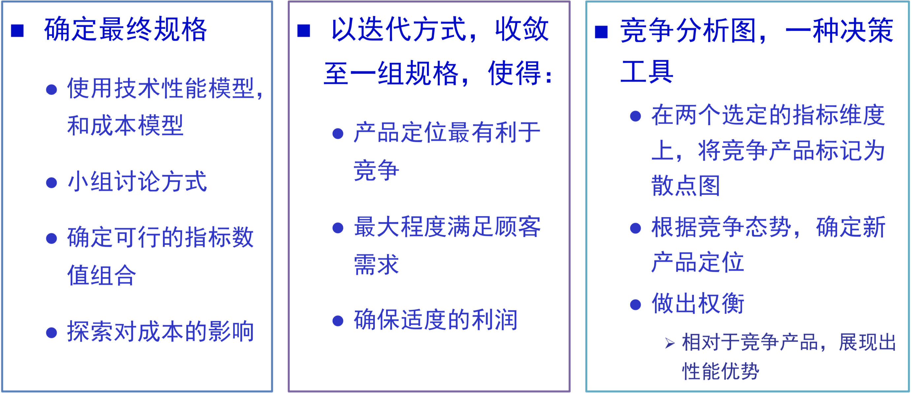

避震前􏰀叉竞争分析图（与曼昆的书一样有一点XY倒置的感觉）：

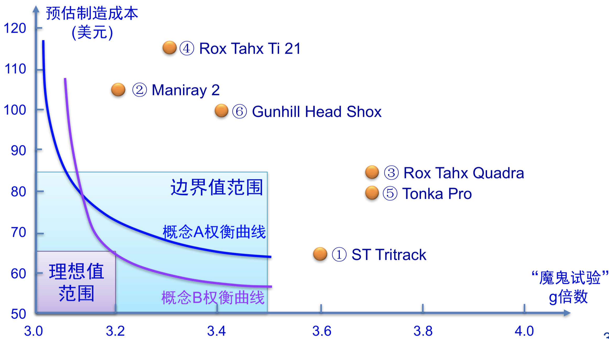

避震前􏰀叉最终规格：

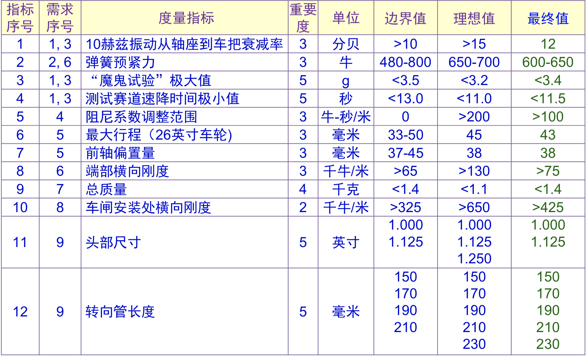

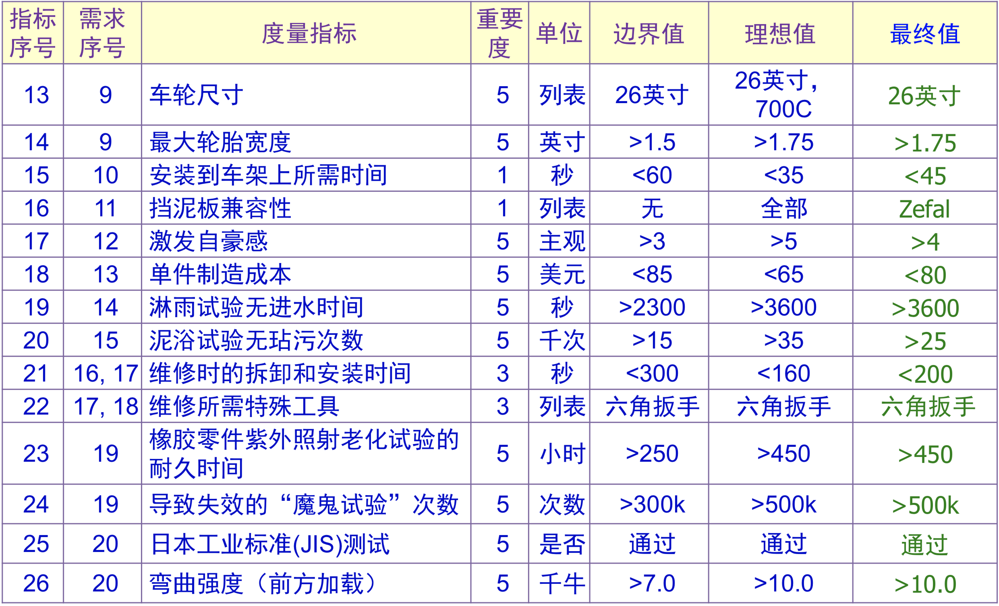

### 6.4.4 产品规格分解至合适程度

#### 6.4.4.1 复杂产品规格分解的意义与难点

复杂产品，多个子系统由不同团队分别开发

- 产品规格用于**定义每个子系统以及整体产品的开发目标**，并**按照每个子系统的规格来规定整体系统的规格**
- 分解难点：
  - 确保**子系统的规格，能够切实反映产品总体性规格**=》**分解映射完备：子系统规格达成，整体总规格达成**
  - 确保**不同子系统的特定规格的实现难度相当**，==否则产品成本就可能过高==

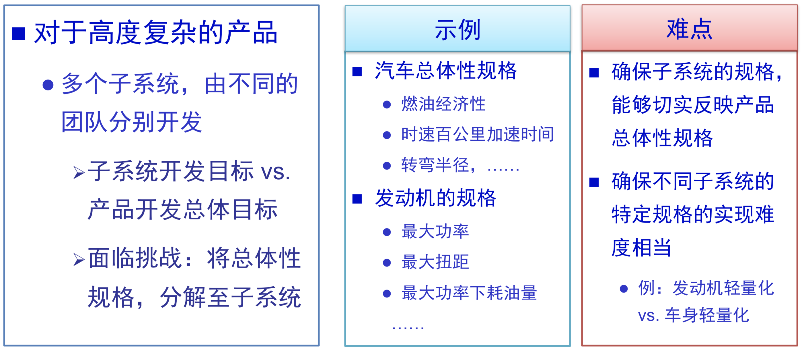

#### 6.4.4.2 预算分配Budget Allocation：

- **明确总体额度与各分支额度的相关性模型**=》成本、质量、几何量是单纯加和，但其他未必
- **依据模型将总额度分给子系统**
- 确定复杂系统规格的综合性策略是系统工程研究的领域

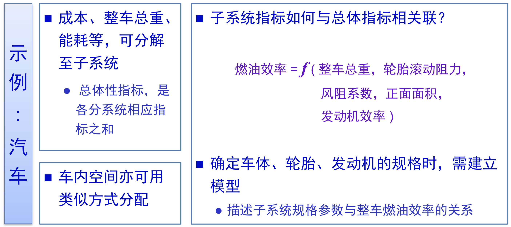

### 6.4.5 对过程与结果反思

1. 产品**能否成功**?
   - **选定的产品概念，其规格应满足需求并具竞争力**
   - **否则，返回概念创成与选择阶段** 
2. 所选概念是否**适应目标市场**?
   - 也能很好**适应其他（上下限而不是中值）细分市场**吗? 
   - 如果概念大大优于竞品，也许可用于**需求更旺、利润更高**的细分市场 
3. **技术模型和成本模型，有多大的不确定性**?
   - 如果不确定性太大，则应完善模型，提升置信度
4. 企业是否有必要开发更好的技术模型?
   - 有时团队对技术缺乏真正理解 ，不足以创建有用的性能模型
   - **深入理解技术，搭建完善模型，有利于未来的开发项目** 

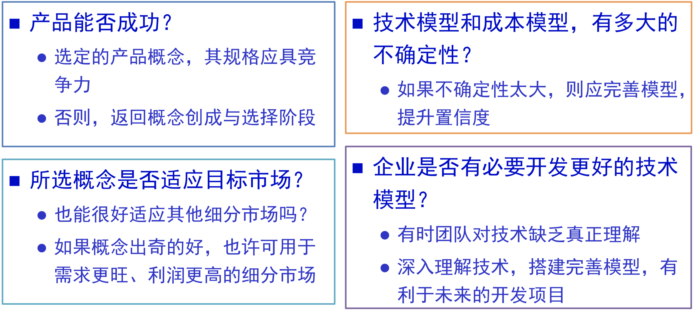

## 6.5 小结

顾客需求以顾客语言表述，规格简洁明了，具体准确细致描述实现功能以获得商业成功，反映客户需求，竞争优势以及技术成本上的可行性。

- 至少两次确定产品规格：
  - 识别顾客需求之后：目标规格
  - 概念选择与测试之后：最终规格 
- 用于描述与确定规格的决策的方法与工具
  - 信息辅助系统，电子表单
  - 度量指标清单，需求—度量指标矩阵
  - 竞争标杆比对表，竞争分析图
- 知识与团队
  - 市场知识，顾客知识，核心产品技术，方案成本核算
  - 人员:营销，设计，制造 
- 目标规格：**开发团队的希望与抱负 ，未考虑约束**
  - 准备度量**指标清单**
  - 收集**竞争性标杆**信息 
  - 设定指标**理想值与 可接受边界值**
  - 反思结果与过程 
- 最终规格：**利用解析计算与物理模型， 评估技术约束与期望成本，同时对各种产品特性进行权衡** 
  - 开发产品的**技术模型**
  - 开发产品的**成本模型** 
  - 修正产品规格，必要时进行**权衡分析**
  - **分解到合理规格**
  - 反思结果与过程

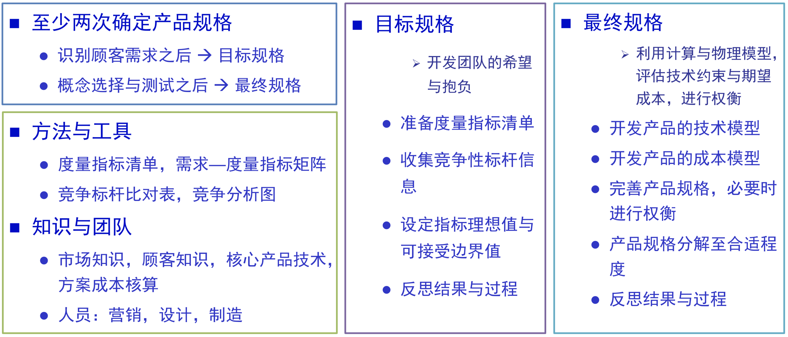

## 6.6 练习

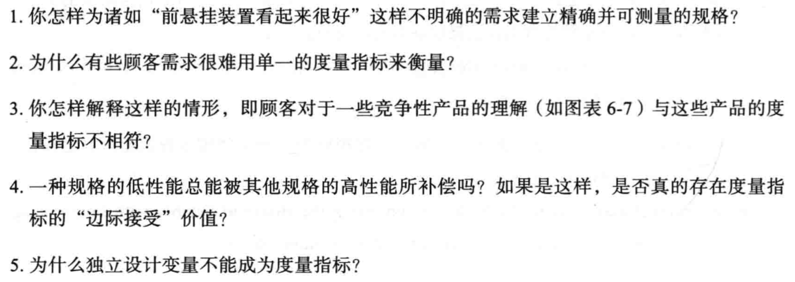

