# 第7章 概念生成

[TOC]

建立目标规格字后，要思考的事情：

- 是否有**现成的产品概念**，适合这种应用方式? =》外部探索
- 哪种**新的产品概念**，能满足已经设定的需求和规格? =》内部探索
- **有哪些方法**，可以用来支持产品概念创成的过程? 

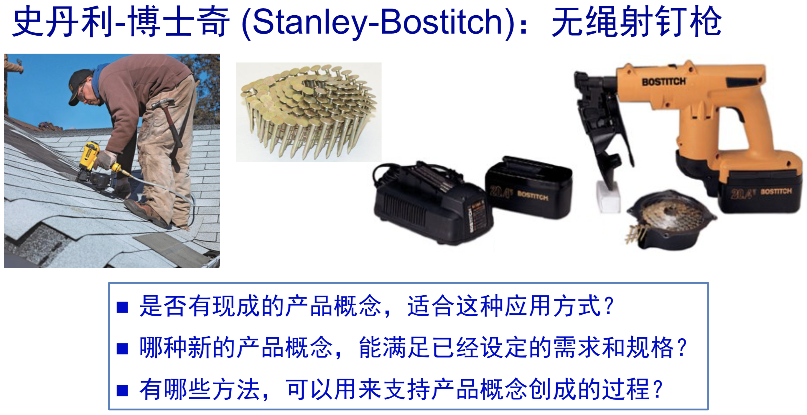

##  7.1 概念生成的活动

### 7.1.0 产品概念定义、特点、价值与意义

产品概念定义:对产品所用**关键技术、 工作原理、形状结构**的粗略描述

- 草图或三维模型，附带简要文字描述
- 相对成本低、速度快，值得有效利用
- 开发团队经常创成数以百计的产品概念, **其中15~20个概念，值得在概念选择**阶段，细加斟酌 =》**概念生成过程当中已经有了过滤选择**
- 优秀的产品概念，令开发团队 充满信心
  - **可开发空间，已被完全遍历探索**
  - **竞争对手难以找到更好的方案**

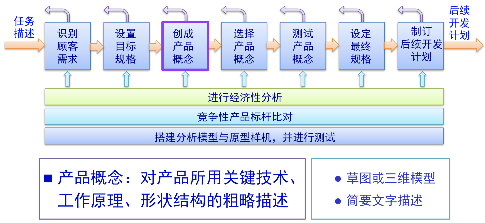

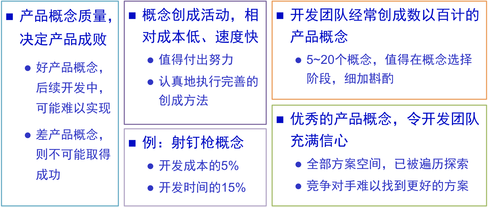

### 7.1.1. 结构化方法，减少可能导致的高代价问题

#### 7.1.1.1 开发团队常见的问题：

- 开发团队**只有一、两人进行**概念创成，其他成员**缺乏信心与责任感** =》**参与概念创造的人太少**
- 只考虑**最有主见成员**提出的**一、两个**概念方案 =》 **只考虑有限人员的有限概念**
- 未能认真考虑**其它公司**产品概念的可用之处  =》**其他公司无关产品的可用之处**
  - 相关产品
  - **不相关产品**
- 不能有效地**整合富有前景的子方案** =》**子方案整合不好**
- ==未能充分考虑一类概念方案的完整范畴==

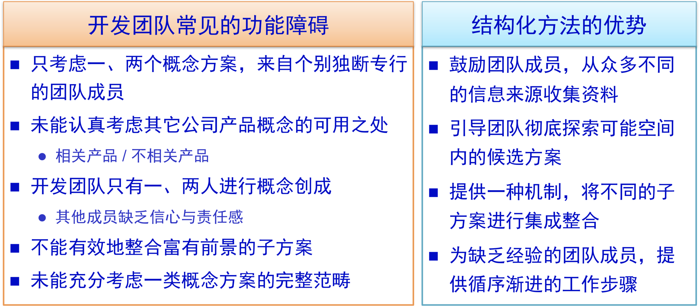

#### 7.1.1.2  结构化方法的优势

- 鼓励团队成员，从**众多不同的信息来源**收集资料
- 引导团队**彻底探索可能空间内**的候选方案
- 提供一种机制，将**不同的子 方案进行集成整合**
- **为缺乏经验的团队成员，提 供循序渐进的工作步骤**

### 7.1.2 概念创成五步法

1. **厘清问题**
   - 理解
   - **分解**为子问题
   - 关注**关键子问题**
2. **外部搜索=》针对子问题，现有概念**
   - 领先用户
   - 专家
   - 专利
   - 文献
   - 标杆
3. **内部搜索=》针对子问题，新概念**
   - 个人
   - 集体
4. **系统搜索=》子问题解决方案整合为整体解决方案**
   - **概念分类树**
   - **概念组合表**
5. 对过程与结果进行反思

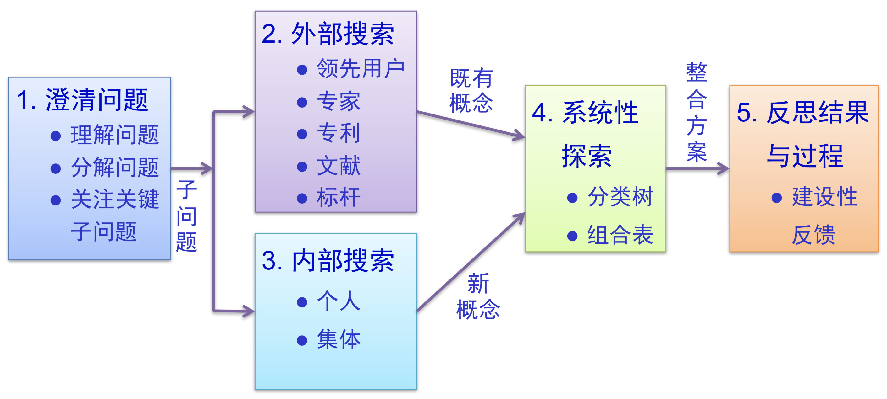

## 7.2 厘清问题

- 深入全面地理解问题
- 必要时**分解**为数个子问题
- 以任务描述、顾客需求陈述、目标规格（如下表格）为输入，所有团队成员都必须熟悉

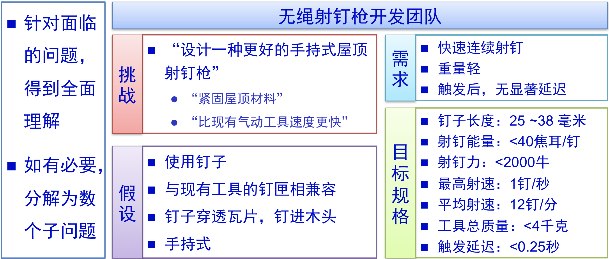

### 7.2.1 将一个复杂问题，分解为数个简单问题

简单问题不适用，复杂问题需要分解 (Problem Decomposition)。

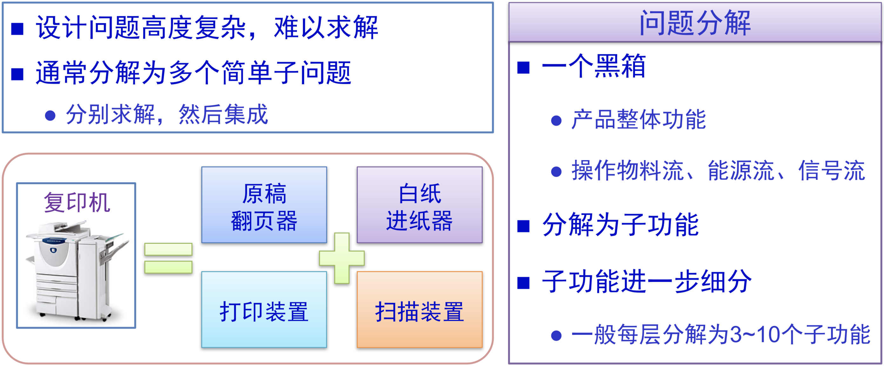

问题分解的方式：

- 基于**功能Functional**的分解：
  - 视为**物质（粗实线运动）、能量（细实线传递转化）、信息（虚线控制反馈）的黑箱BlackBox**
  - 将黑箱**分解为若干层级子功能**，以及局部元素对整体功能的作用（**但不描述具体实现方式，==后者是在内外搜索特别是系统搜索的再分解当中细化？==**），一般要分解为**3-10个**子功能
  - 适用于技术产品较多
    - 快速生成几个草图，然后精简到**与团队能力相匹配**
    - 为**现有产品**创建功能图
    - 为开发团队创成的**任意产品概念**，创建功能图
    - 根据**已知的子功能技术**创建功能图
    - 按照**物料流、或能量流、或信号流等流程内与流程间关系**， 确定所需的操作
    - 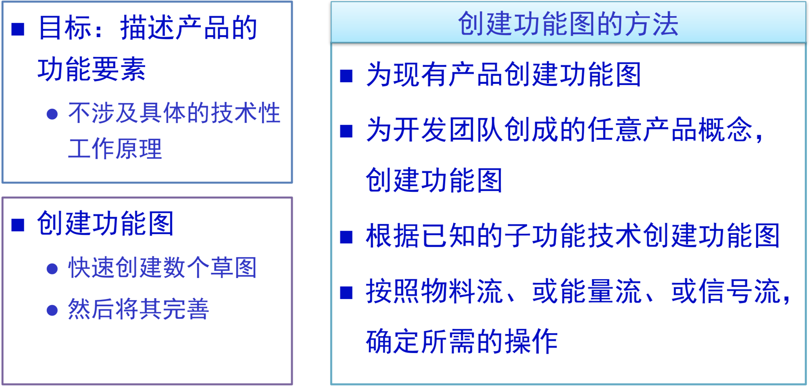
- 按照**用户动作顺序**进行分解
  - **技术功能简单**
  - **较多用户参与**
- 按照**用户关键需求**进行分解
  - **工作原理不是问题**
  - **形状结构是主要问题**

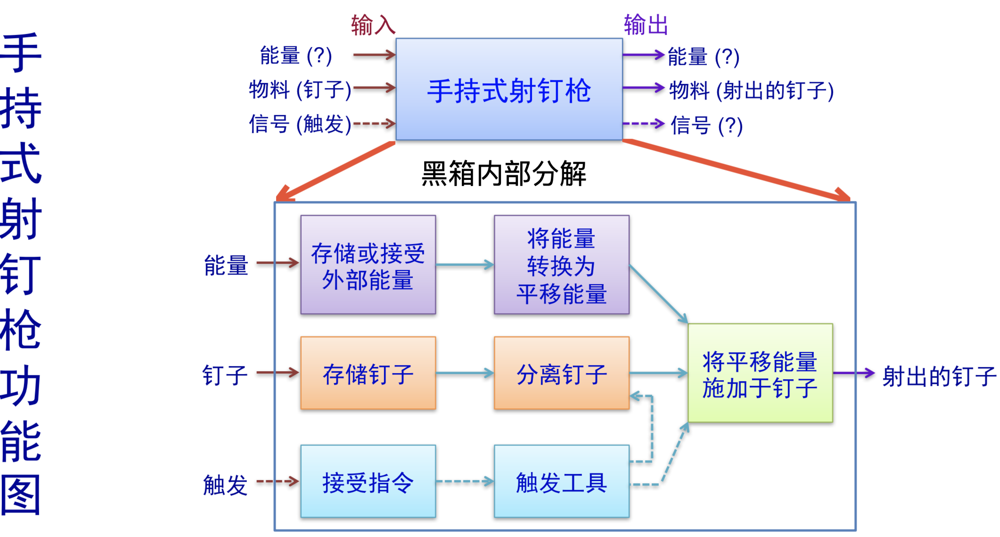

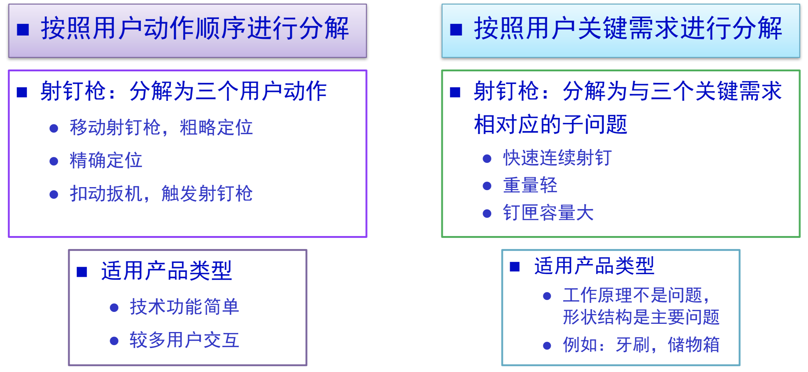

### 7.2.2 最初阶段，关注关键子问题

选择的关键性子问题：

- 最有助于产品成功
- 最可能受益于创新性方案
- 其它子问题（以及用户交互问题）被有意识地推迟解决，团队会议对优先级达成一致

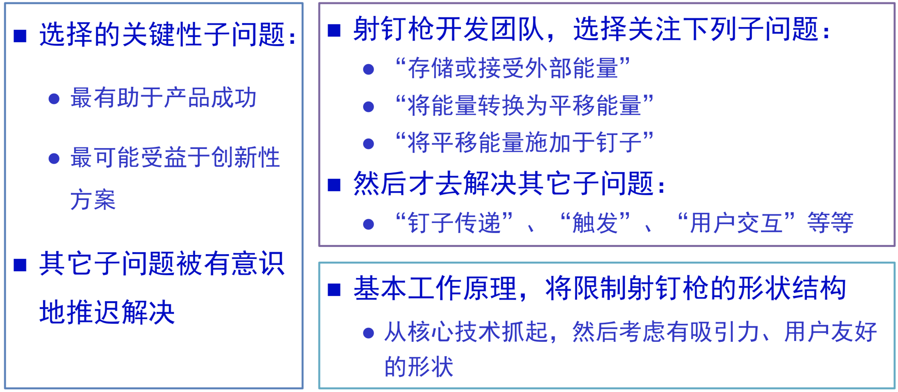

##  7.3 外部搜索 =》现有概念，可信度已鉴高

外部搜索的目的与意义：

- 对整体问题及其子问题，找出**现有解决方案**，持续开展贯穿整个概念开发过程
- **采用现有方案比重新开发新方案更快、更节省**，将精力集中于关键子问题
- **大部分子问题传统方案+关键子问题创新方案=优秀的整体设计方案**

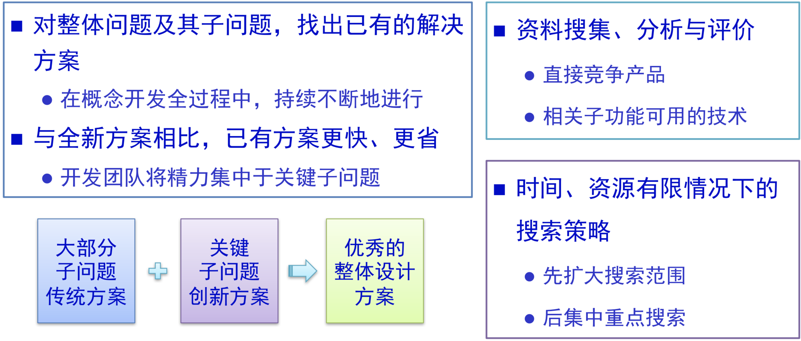

外部搜索的本质与方法：

- 本质上是一个资料搜集、分析与评价过程：
  - **针对直接竞品分析+子功能可用技术分析**
  - **先扩大Expand搜索范围（可能涉及的相关资料），然后集中Focus重点搜索(希望改进的方向)**
- 搜索的对象与途径：
  - 领先用户调查
  - 专家咨询
  - 专利检索
  - 文献检索
  - 设定相关产品作为基准 =》竞争对标分析

### 7.3.1 领先用户访谈：

领先用户常已发明自己解决方案，并熟知目前方案缺点

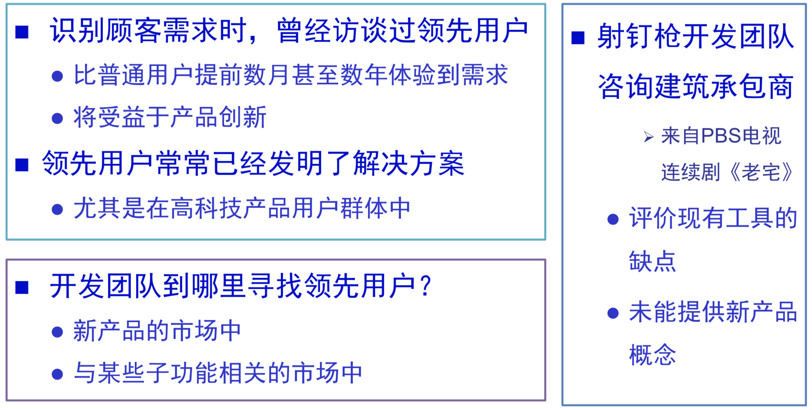

### 7.3.2  专家咨询：

#### 7.3.2.1 专家的意义与作用：

- 专门知识
- 直接提供解决方案
- **转向更有效的思路与搜索方向**
- **专家转介推荐专家**

#### 7.3.2.2 专家位置：

- 企业专业人士
- 专业咨询顾问
- **大学教授**
- **供应商技术代表**

#### 7.3.2.3 如何接触：

- 电话
- 文献
- 社交

#### 7.3.2.4 收费：

- 多数一小时内不收费
- 顾问深入咨询收费
- **承诺供应商采购，无偿支持**
- 竞争对手专家不愿意提供独有信息

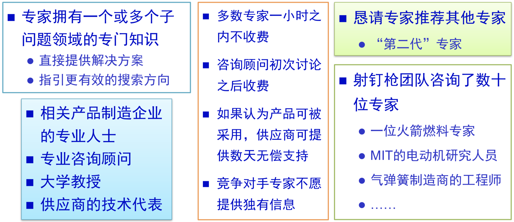

### 7.3.3 检索专利：

专利是技术资料的详细图纸以及产品说明的现成丰富来源，特点如下：

- 专利保护一般20年，需付费
- 避免侵权风险
- **没有申请到本国专利或全球专利，以及过期专利可以免费使用**

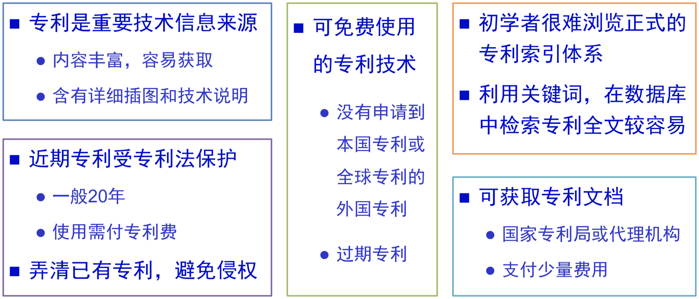

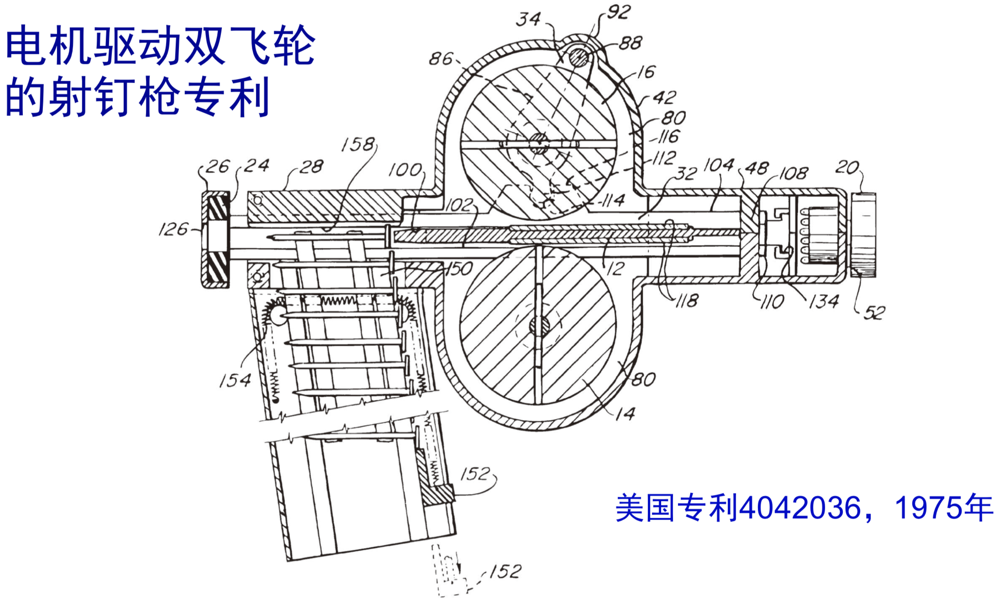

### 7.3.4 文献检索：

公开文献：

- 期刊、杂志、**会议、政府报告**
- 市场、消费者、产品信息、新产品公告
- **技术资料手册**

注意事项：

- **评估文献质量与置信度**
- **确定关键词与搜索范围**

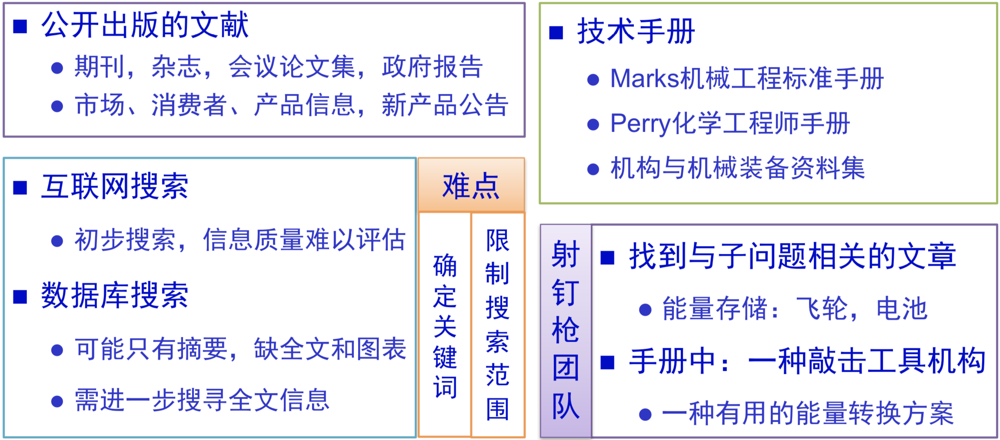

### 7.3.5 与相关产品对标基准分析：

#### 7.3.5.1 基于标杆比对的基准设定：替代品与互补品，波特五力模型

- 与待开发产品功能类似的现有产品=》类似产品
- **与关键子问题相似功能的现有产品**=》**类似功能**

#### 7.3.5.2 标杆基准的作用：

- **揭示现有概念：共性原理与生产细节(含供应链)**
- **分析竞争态势**：

#### 7.3.5.3 寻找标杆的方式：

- **注册制造商名录**：按照产品类型分类==,参见**#瞳城计划**==
  - 难度：**找相关的名称与相关的分类**

- **创建数据库**，拓展专家网络

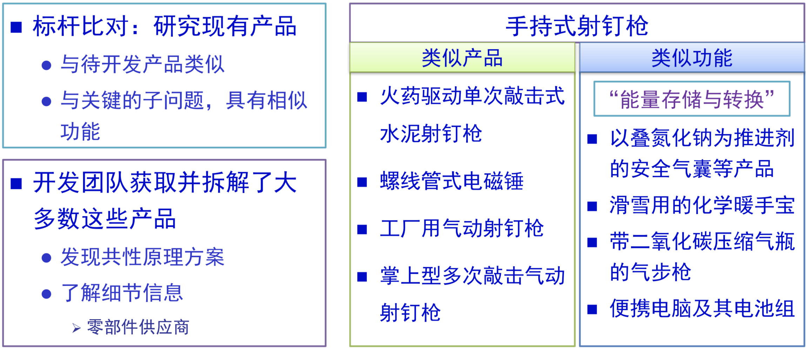

## 7.4 内部搜索=头脑风暴 Brain Storming，新概念未验证

### 7.4.0 内部搜索的定义与效率准则

内部搜索的定义：

利用个人与团队的知识与创造力，来产生开放性、创造性的新产品概念

内部搜索的效率准则：

- **延缓决策**：
  - 与日常快速决策行为取胜不同，概念生成的决策影响深远
  - 推迟决策几天或几周是成功关键
  - 规则是：**不批评任何概念，而是建设性修正，避免主观臆断**
- **大量想法**：
  - 提高想法数量，并鼓励分享沟通深入挖掘
  - 一个想法可能激发更多想法
- **鼓励提出不可行的想法：** =》**内部搜索特例，外部搜索基本上属于已验证部分，而后系统搜索时候会进行剪枝**
  - **起初不可行，但可debug与repair促进改进**
  - **冲击拓展思考边界，鼓励突破桎梏惯性极限**
- 使用**图形与物理实体**介质

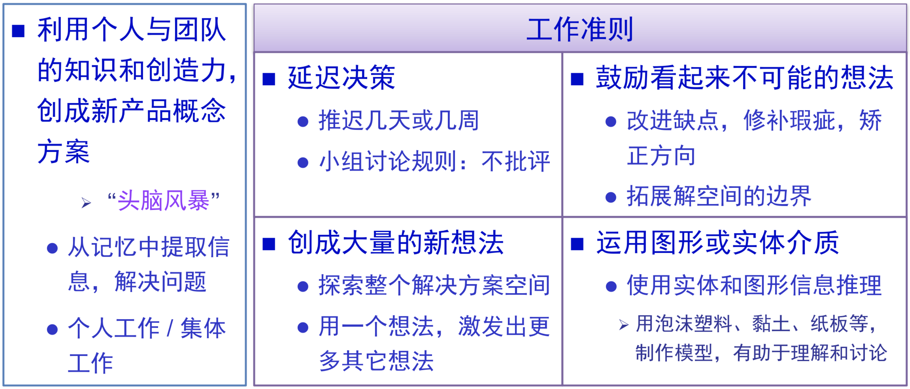

### 7.4.1 个人静处与团队讨论：

- **团队成员在概念生成阶段应该有<u>独自工作</u>一段时间**：可以**分配子问题并设定最低反馈结果**=》初步概念生成
- 团队会议：
  - 理想：建立共识、沟通信息、讨论/评价/提炼/完善概念等
  - 实际：团队会议也用于生成概念，保证投入，不被打断

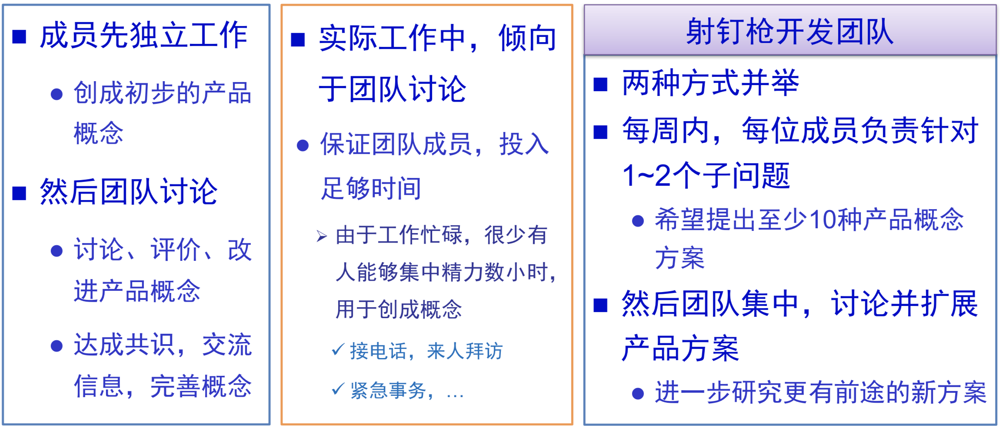

### 7.4.2 生成概念的线索与启发：

#### 7.4.2.1 类比模拟

- 其他工具实现
- 自然仿生
- **更大或更小的情形场景**
- **不相干的领域的类似实现**=》啄木鸟，打桩机、射钉枪：多次击打

#### 7.4.2.2 积极设想

- 假设条件分析，ifWhat
- **允许极端与不可行，冲击惯性边界**

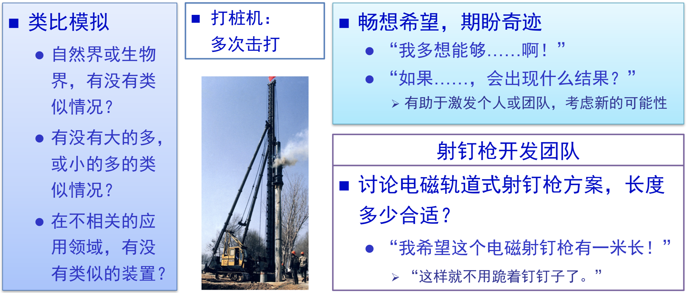

#### 7.4.2.3 使用相关刺激

- 刺激指的引线，需要是待解决问题范围内产生的刺激，**诞生于问题背景**中
- 比如：**交换每人单独工作时列出的清单，联想到新创意**
- 比如：顾客需求，**场景或类景照片**等

#### 7.4.2.4 使用无关刺激

- 随机或无关的刺激
- 比如**随机照片，思考与问题的相关性**
- 本身也是一种**团建放松**

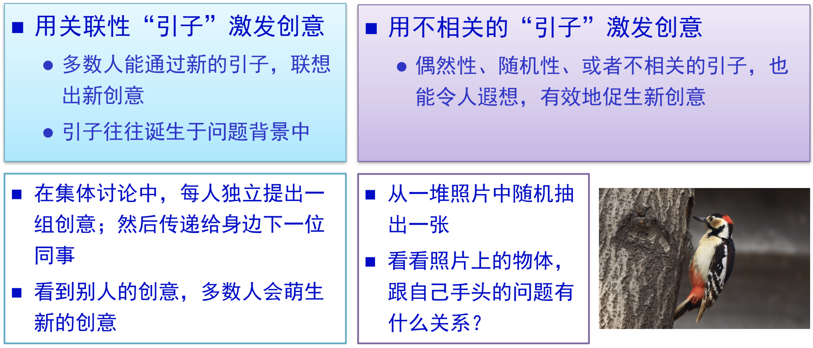

#### 7.4.2.5 量化目标

规定要求每人负责完成的创意概念数量

#### 7.4.2.6 画廊法 Gallery

- 展示大量的概念并进行讨论
- 会议室贴纸，每纸一概念；提出者解释，团队改进

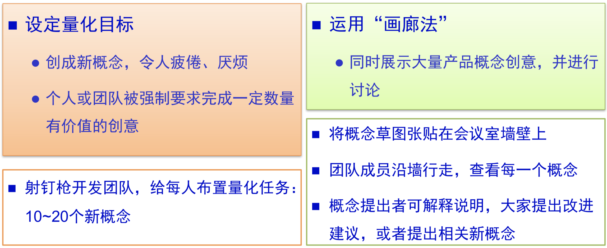

#### 7.4.2.7 俄罗斯萃智(Triz)理论：Theory of Inventive Problem Solving

- **主要用于： 解决技术问题的工作原理**
- **关键思路：辨识问题中隐藏的矛盾**
- **Triz基本原理：==合计有40种==**，比如定期运动脉冲替代一次性或连续性动作
- **Triz 工具：==39X39特性矛盾矩阵==**
  - **每个单元是对应两种特性之间的矛盾**
  - **每个单元有解决问题冲突的4个工作原理**

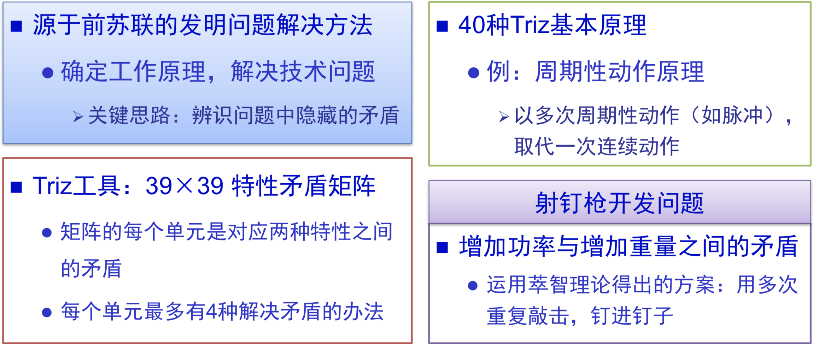

射钉枪的子问题可能方案:

- 存储或接受能量:

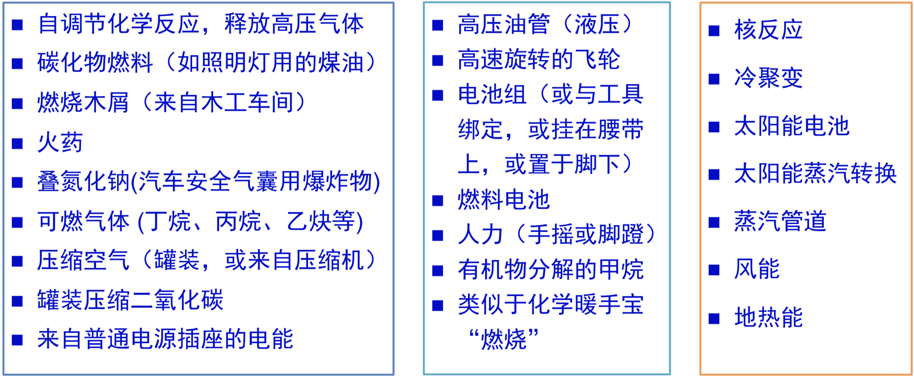

射钉枪的子问题可能方案:

- 将平移能量施加于钉子:

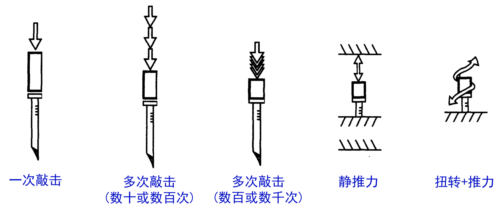

## 7.5 系统搜索

### 7.5.0 系统搜索的意义与工具

内外搜索=》遍历所有的可能方案空间，得到每一个子问题的数十种解决方案，全部研讨各种可能的组合方式不现实，因此需要管理这种复杂性并组织团队的思路：

- **概念分类树：将可行概念，划分为相互独立的不同类型**
- **概念组合表：选择性的考虑、组合各子方案概念**

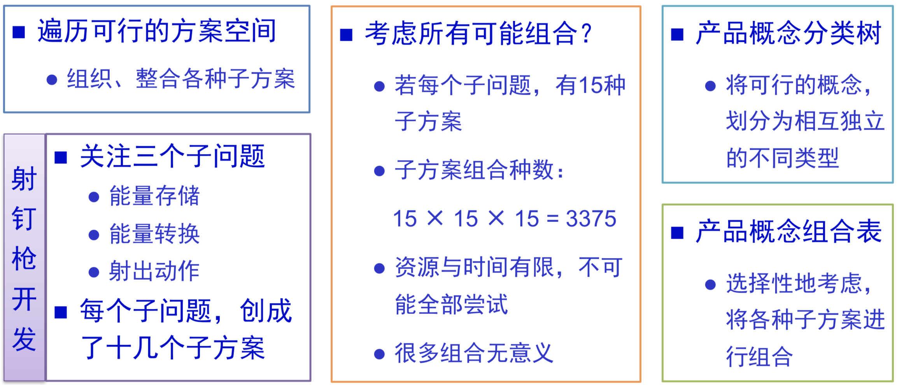

### 7.5.1 概念分类树：

- **将可行解的整个空间，划分为若干类别，以便进行比较与剪枝**
- 如果某**子问题解决方案强烈制约其他子问题**，就应该对该子问题建立分类树

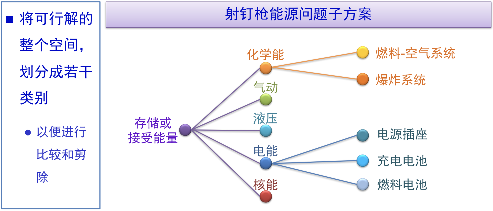

使用分类树的益处：

- **及早对不可行的分支剪枝  =》对应<u>内部搜索</u>时候允许不可行分支来冲击边界**
- **辨识解决问题的独立方法** =》有些子分支相互独立，可以清楚分配子团队分别任务并行，降低复杂性，促进良性竞争
- 暴露**对各分支精力分配的不当** =》损有余而不不足
- **细化分解特定分支** =》对实现进一步具体化(==这里是否意味着开始讨论进一步的技术实现？？如下文的储能移动？==)

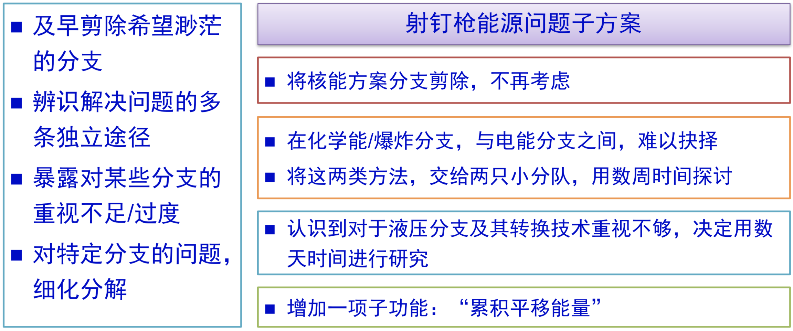

“累积平移能量”子功能：

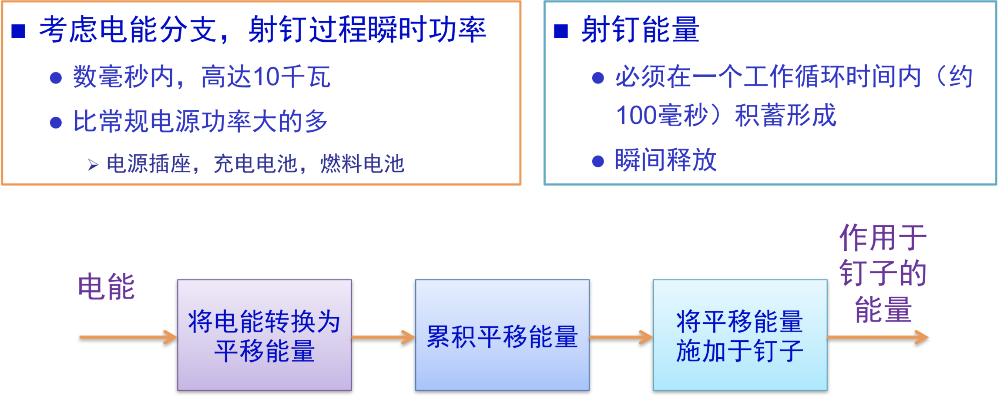

### 7.5.2 概念组合表：

定义：**将上述1XN分类树链接，变成MXN矩阵，M为子问题列主题，N为每个子主题下的解决方案或者子概念**

意义：

- 组合为完整解决方案
- **强迫组合，刺激创造性思维**

简化方法：

- **某条目不可用，含该条目的选项全部删除**
- **关注耦合子锁定问题，及某子方案的某子概念，必须与其他某子问题的子概念同时使用**
- 每个子问题的子概念/方案条目一般不要超过4个，否则会很复杂

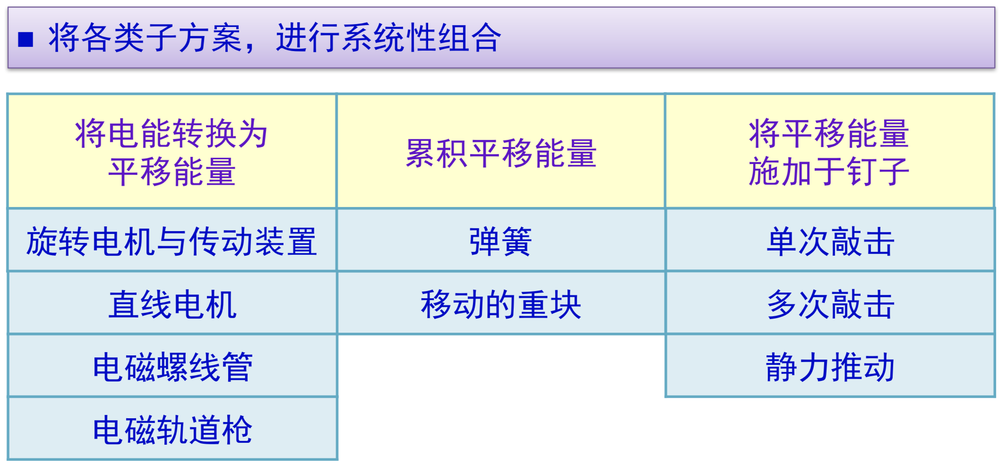

“螺线管 + 弹簧 + 多次敲击”方案：

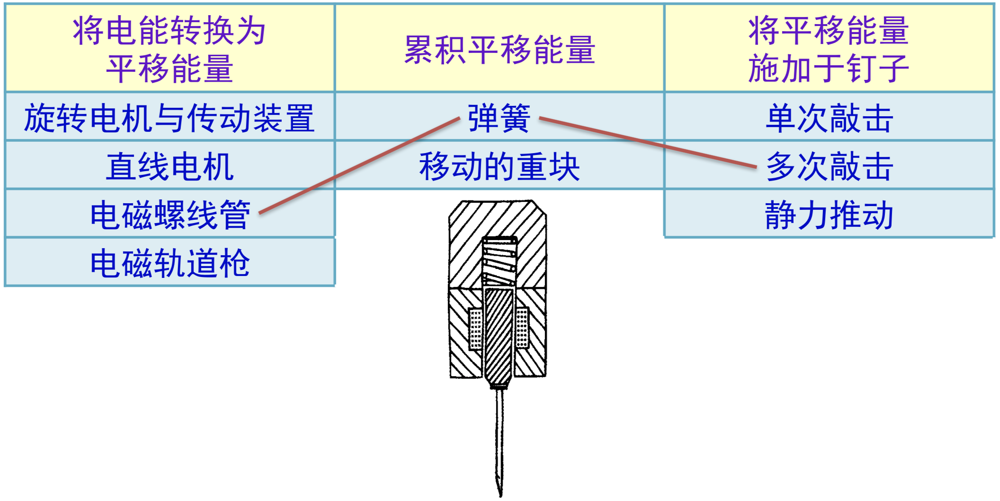

“旋转电机与传动装置 +弹簧 + 单次敲击”方案：

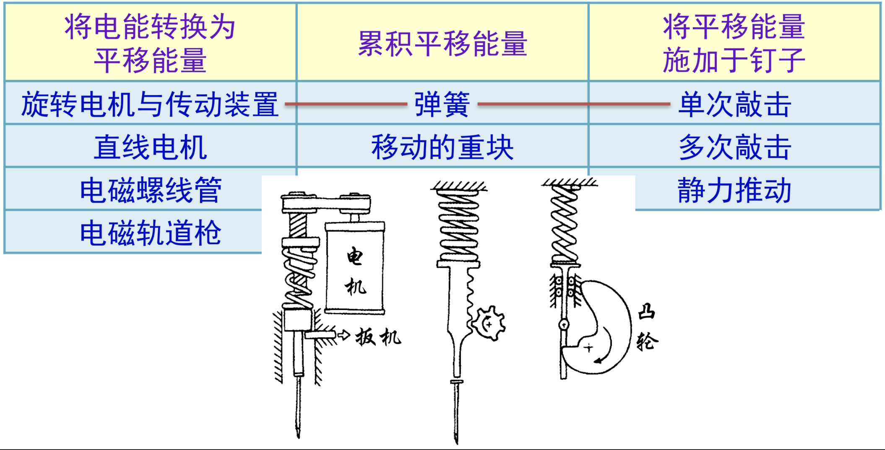

“旋转电机与传动装置 +弹簧 + 多次敲击”方案：

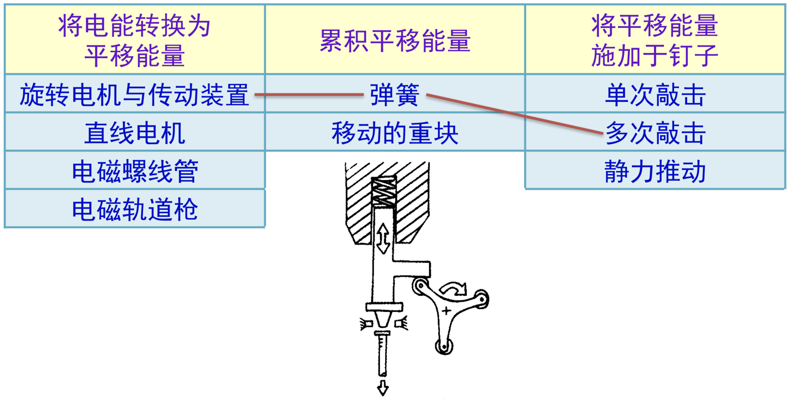

“直线电机 + 移动重块 + 单次敲击”方案:

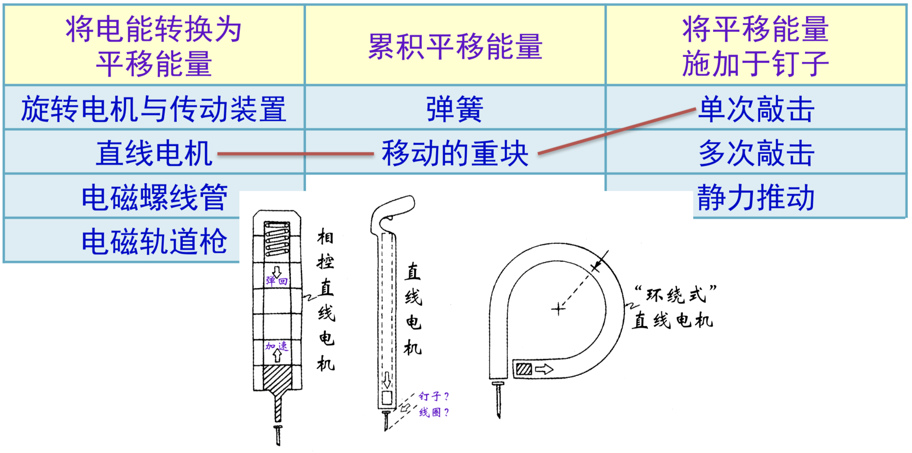

### 7.5.3 对探索过程的管理：

- 分类树与组织表，有助于组织思维，引导创造力
- 往往会创建**多个不同的分类树与组织表**以供选择
  - **完善对原始问题的分解方式**
  - **精炼原始问题，追加进一步的内外搜索**
  - 探索过程管理并非概念生成的最后阶段
- 初期关注少量关键子问题=》收缩探索范围，最后进行完善细化=》解决所有子问题

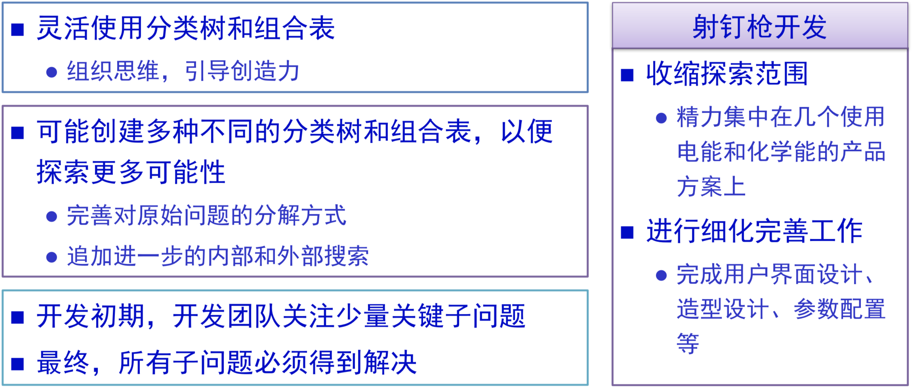

## 7.6 对过程与结果进行反思

- 是否已经充分探索了**所有可行空间**?
- 是否还有**其它形式的产品功能图?**
- 是否还有**其它方式来分解问题**?
- 是否**充分地搜索了外部资源**?
- 是否采纳并**整合了每位团队成员的想法**

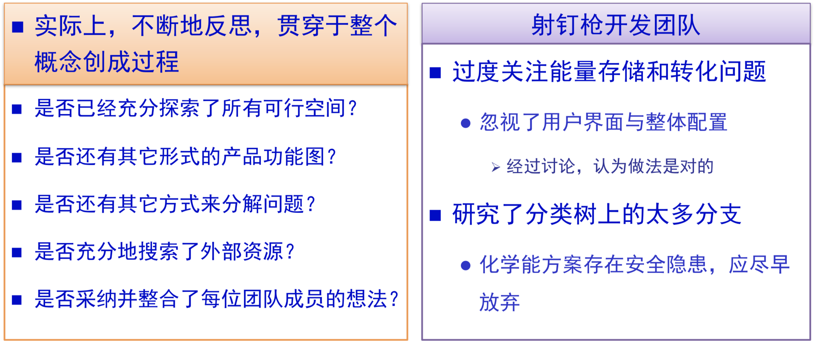

无绳射钉枪的最终产品概念：

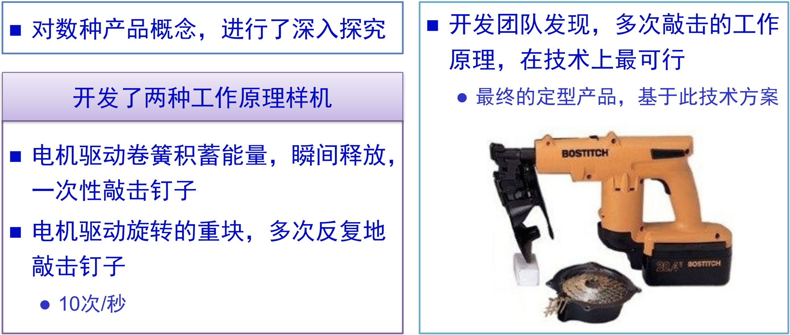

## 7.7 小结

- 概念是产品技术、原理、形式的近似描述，很大程度上决定了需求满足度与商业成功度。
- 概念生成始于需求确定，目标规格形成，**输出一系列（从数百个当中脱颖而出的5-20个）概念供接下来的概念选择**。
- 概念生成有5步骤：`厘清分解-》外内搜索（5+2）-》系统搜索（1+1）-》反思`，非顺序而贯穿始终，迭代。
- 结构化方法，助于遍历，防止遗漏，提供流程。

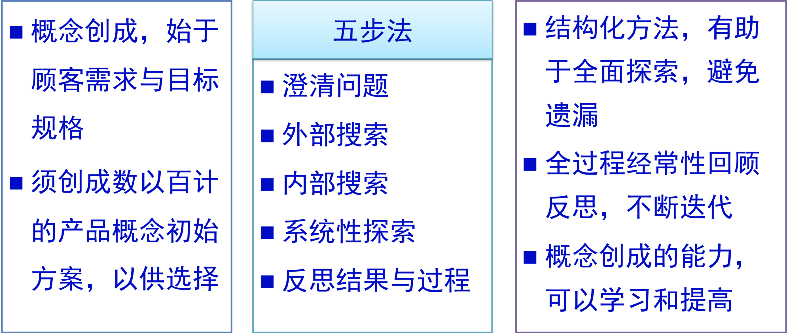

## 7.8 练习

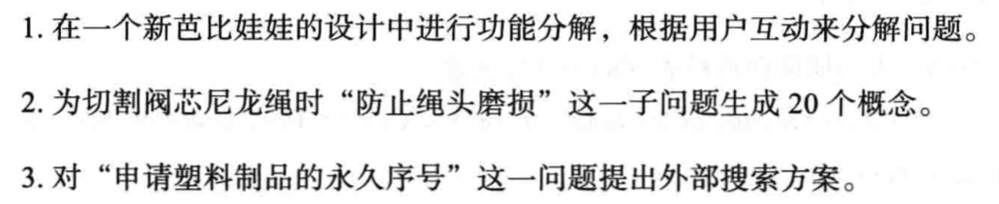

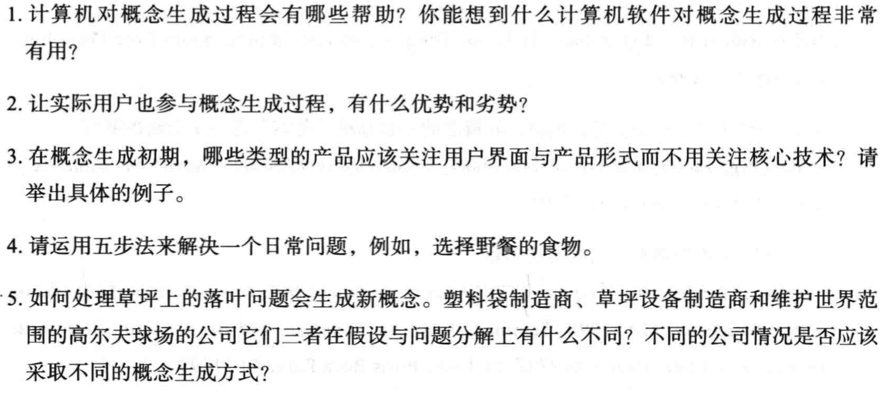

