# 第8章 概念选择

[TOC]

案例：

新注射器要求：

- 准确控制剂量
- 重复使用
- 核心问题：
  - 成本，现有产品为不锈钢制造
  - 注射剂量的准确性
  - 性能与目前市场主流方案一致

开发团队选择概念的7个指标：

- 处理的简便性
- 使用的简便性
- 剂量设定的可读性
- 剂量注射的准确性
- 耐磨性
- 制造的简易性
- 便携性

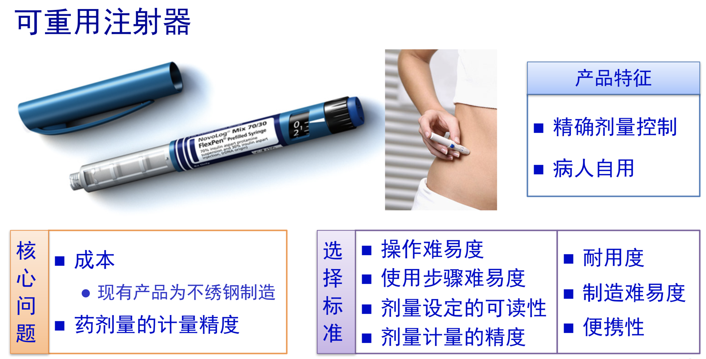

概念选择当中遇到的问题：

- 设计概念都很抽象，如何选择最优概念
- 如何使开发团队全员共识
- 如果选择出的概念设计很好但可行性不佳怎么办
- 如何记录概念选择过程

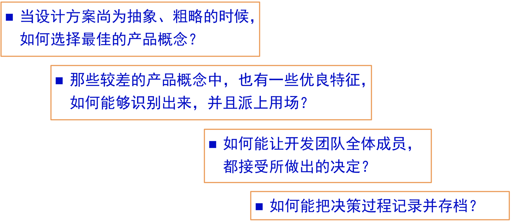

概念A:“液压缸”

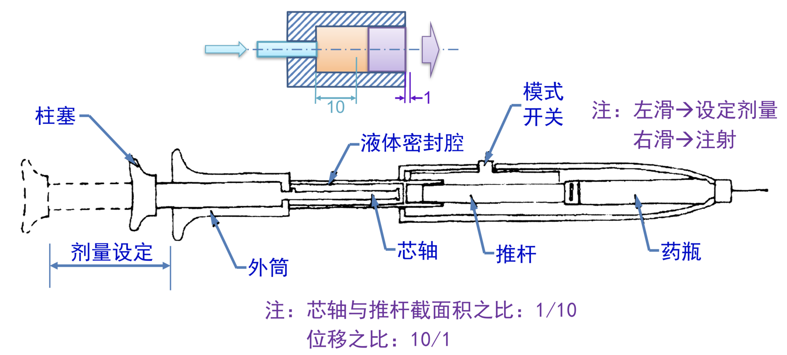

概念B:“橡胶闸”

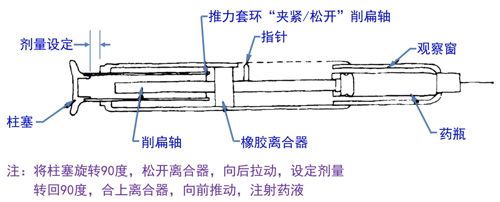

概念C:“棘爪”

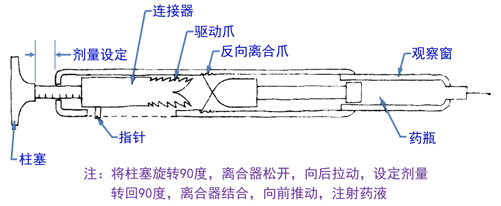

概念D:柱塞限位

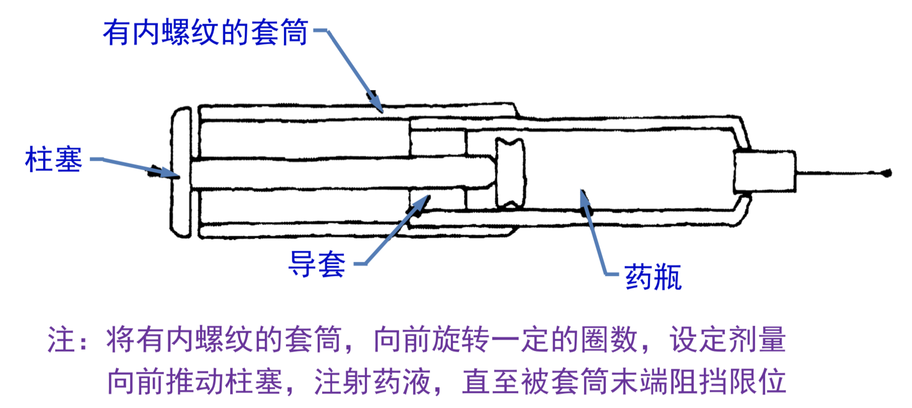

概念E:“倾斜圆环”：

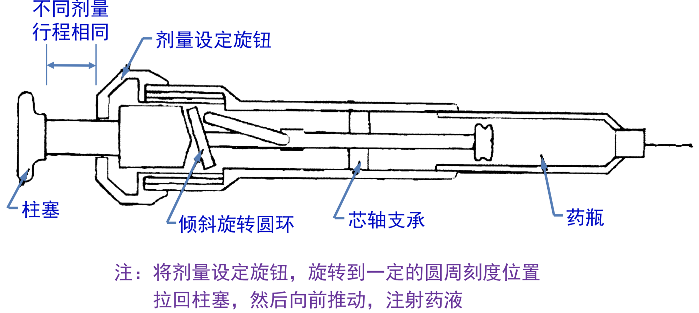

 概念F:“手柄设定”

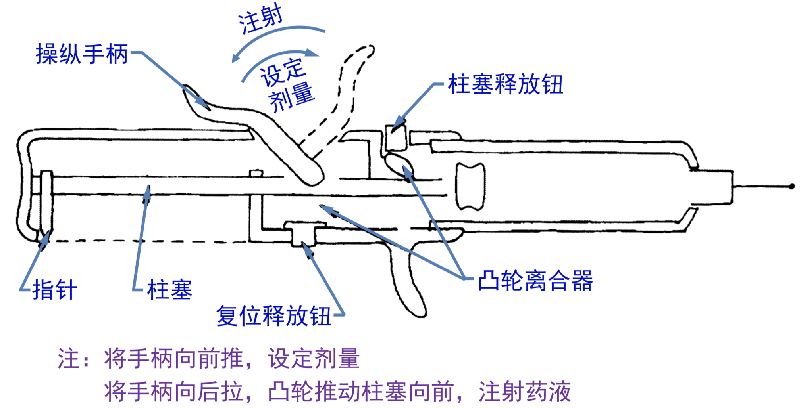

 概念G:“刻度盘螺杆”

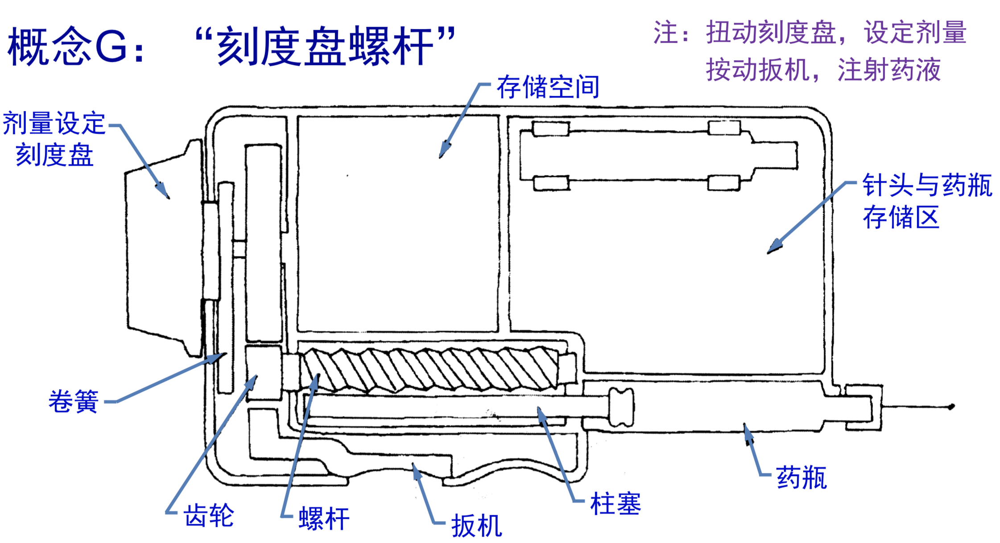

## 8.1 概念选择Concept Selection:产品开发过程的必要环节

概念选择:根据顾客需求和相关标准，评估产品概念

- 比较现有概念的相对优势和劣势
- 选出一个或数个产品概念，投入后续研究、测试和开发

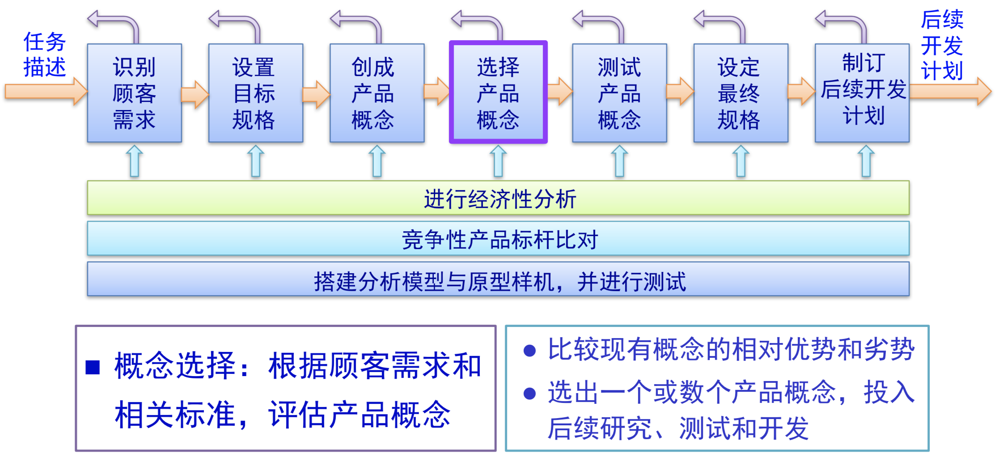

产品概念选择的过程：

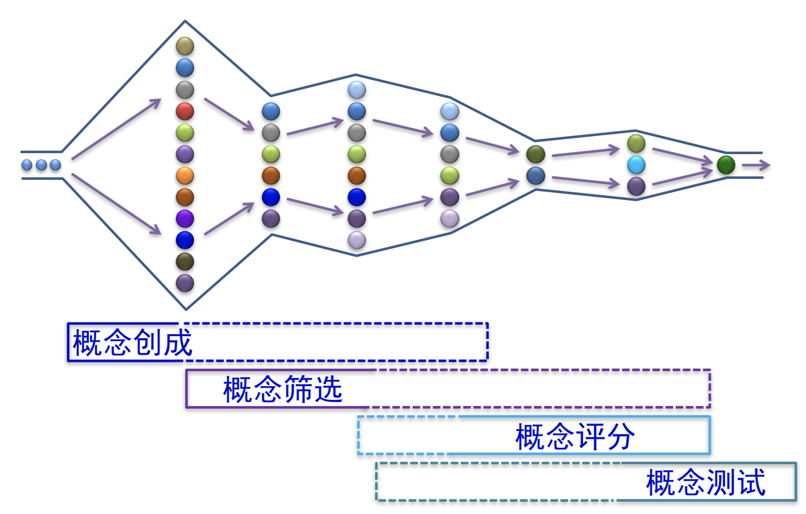

## 8.2 概念选择方法

- 外部决策 External Decision：顾客或其他外部
- 内部决策/产品冠军/圣牛模型：团队内资深影响力，基于经验偏好
- 直觉决策 Intuition：主观决策
- 多数表决 MultiVoting: 团队投票
- 网络调查 Web-based Survey
- 优劣性 Pros & Cons：列优劣表，团队集体决策
- **原型化与测试 Prototype & Test: 对重点概念开发原型并测试选优** =》==与后面的概念测试区别？==
- 决策矩阵 Decision Matrix： 利用预先的选择标准，对各个概念评分

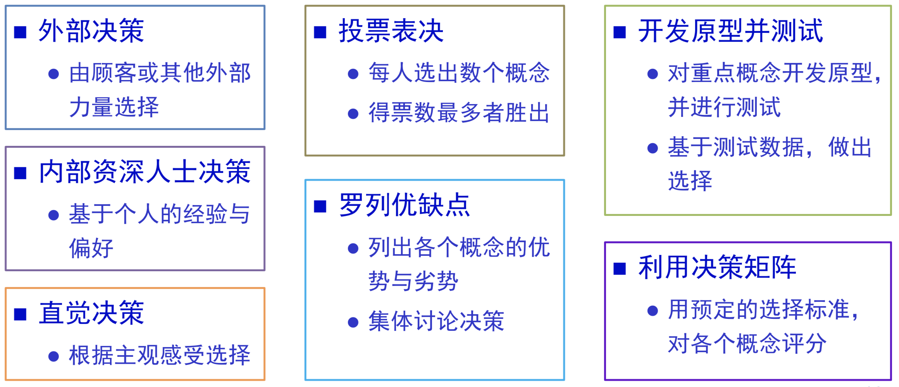

## 8.3 结构化方法的优点

- 以顾客为中心的产品 Customer-focused Product：
  - 依赖于客户的指标衡量评价
- 具有竞争力的设计 Competitive Design: 
  - 概念符合当前设计的基础上，关键参数超过竞品
- 更好的产品/工艺协调性 Better Product-Process Coordination: 
  - 符合生产指标的清晰的产品评价(==面向制造的概念设计？==)，提高产品的可制造性，使产品与企业生产工艺相适应
- 缩短产品的投放时间 Reduced Time to Product Introduction：
  - 结构化方法是跨职能的共同语言
  - 减少歧义
  - 加快沟通
  - 减少错误
- 有效的集体决策 Effective Group Decision Making：
  - 基于客观标准决策
  - 降低武断或个人因素影响
- 记录决策过程 Documentation of the Decision Process:
  - 易形成易理解的结构性说明文档
  - 对于新成员、迅速评估需求、与概念变更都很有价值

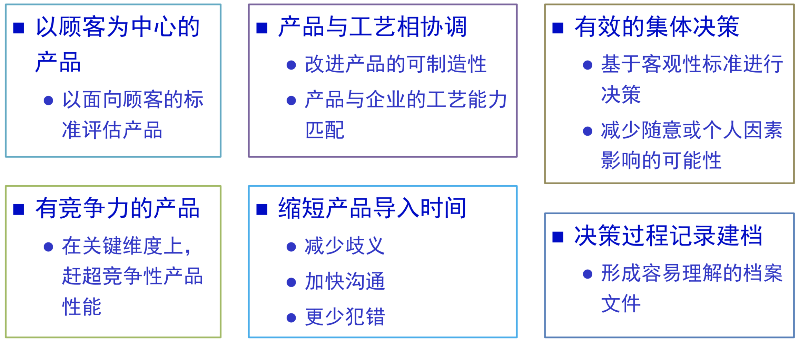

## 8.4 方法概述

1. 概念筛选 Concept Screening： 
   - 相对于参考概念，迅速、近似的评价
   - 只能定性没有定量有可能误导
   - 简单产品概念只需要筛选
2. 概念打分 Concept Scoring： 
   - 更细致量化进一步评价
3. 都基于决策矩阵，后者可以评估等级Rate，等级排序Rank，以及择优。
4. 筛选与评分都经过6步法：
   1. 准备选择矩阵
   2. 对概念评级
   3. 对概念排序
   4. 对概念整合改进
   5. 选择1或多个概念
   6. 反思结果与过程

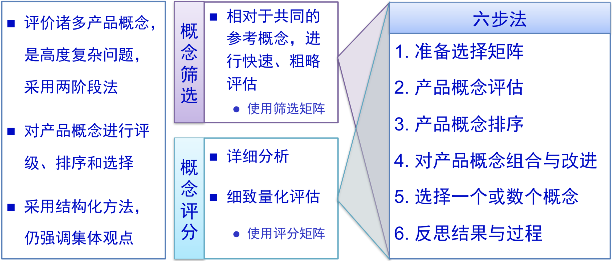

## 8.5 概念筛选

目的：迅速减少概念的数量并改进概念的质量

### 8.5.1 准备选择矩阵

- 较小指标列，可用如下图
- 较大规模，用黑板或活动挂图
- 参考矩阵的填写：
  - 左侧**指标（≠参考基准）**，顶部不同**产品概念(当中含有一个参考基准，以图片或文本标签)**
  - 各种概念的细节上要处于同样等级，避免无意义比较或偏见选择
  - 概念最好同时准备文本与图表描绘

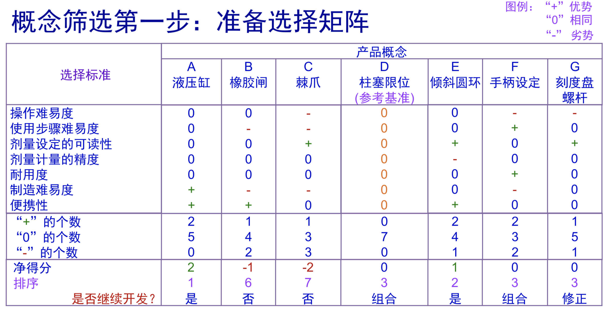

关于选择矩阵的注意事项：

- 概念数太多：
  - **如果概念数>12，先进行多数表决每人只能选3-5个**
  - 如果概念数超级多，也可以用筛选矩阵，电子表格进行行列转置
- 所谓的选择标准，其实是指标，基于顾客需求或企业要求(制造成本风险责任等)
  - ==高抽象==与区分度
  - 5-10个代表性指标维度，要能体现各概念的差异性
  - 每个指标权重相等，不能随便用不重要指标
- 选择一个概念作为参考概念Reference Concept
  - 工业标准
  - 团队熟悉易懂概念
  - 商业可行性产品
  - 上代产品最高级
  - 待选概念当中的次优特征组合

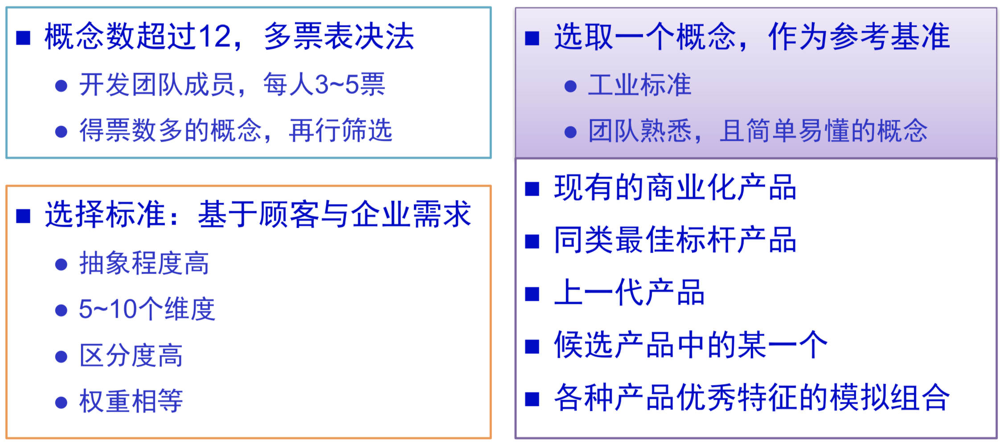

### 8.5.2 对概念评级

- 相对评分机制：通过与参考概念的键值对比，给出±1或0，代表胜负同，粗略三极管对应此刻的高粗粒度
- 一般情况下，多指标少概念，按照指标刷概念；反之反之
- 如果可行，使用**客观性测度指标（就是替代左侧的模糊指标，来自目标规格创建过程）**评估
  - 装配成本：与零部件数基本正比
  - 使用难易：与操作步骤数基本正比
- 如果没有客观指标矩阵：
  - 无记名投票，决策基于团队共识

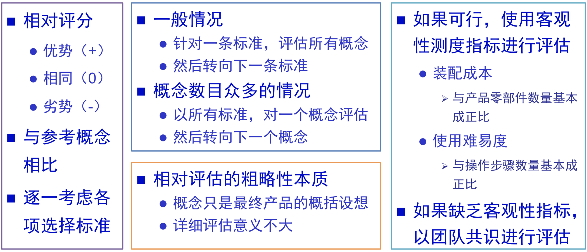

### 8.5.3 对概念排序

- 对上述的±1&0@每个概念求和，然后排序；
- 关注少数区分度高的指标键名

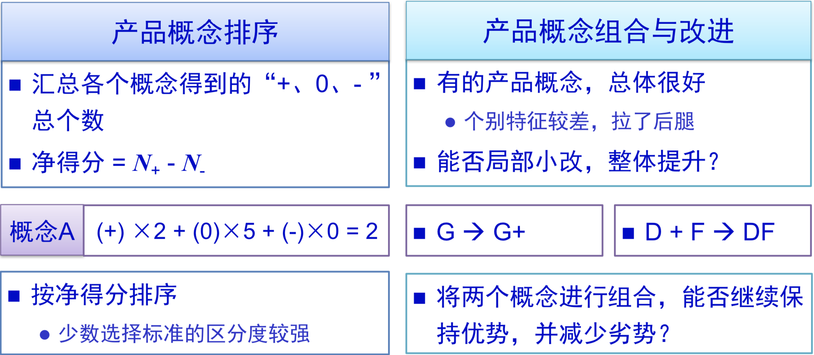

### 8.5.4 对概念整合与改进

- 评估结果的有意义与有效性，可整合性与改进性
- 有的产品综合很好，个别特征较差 =》局部改进
- 几个概念组合，保持优势，减少劣势 =》整合
- 将新改进与整合的概念放回决策矩阵，重新比较

概念D + 概念F=新概念DF：

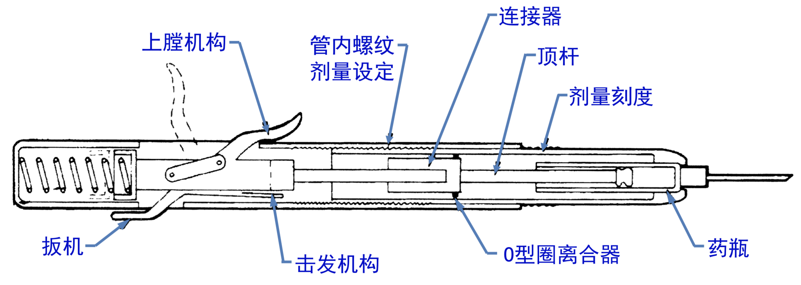

概念G -》新概念G+：

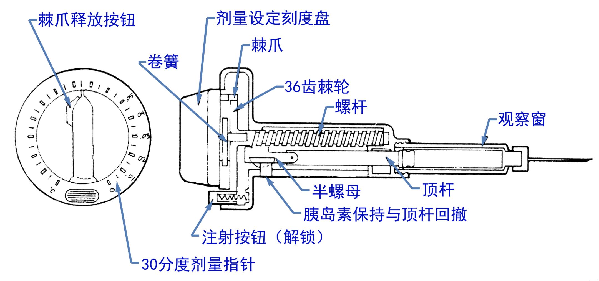

### 8.5.5 选择一个或多个概念

- 选择留下的概念数目取决于团队资源、时间、成本限制
- ==弄清哪些问题是必须调查的==
- 是否进行新一轮筛选
- 是否进行概念评分
  - 带权重的选择条件
  - 更细致的评估体系

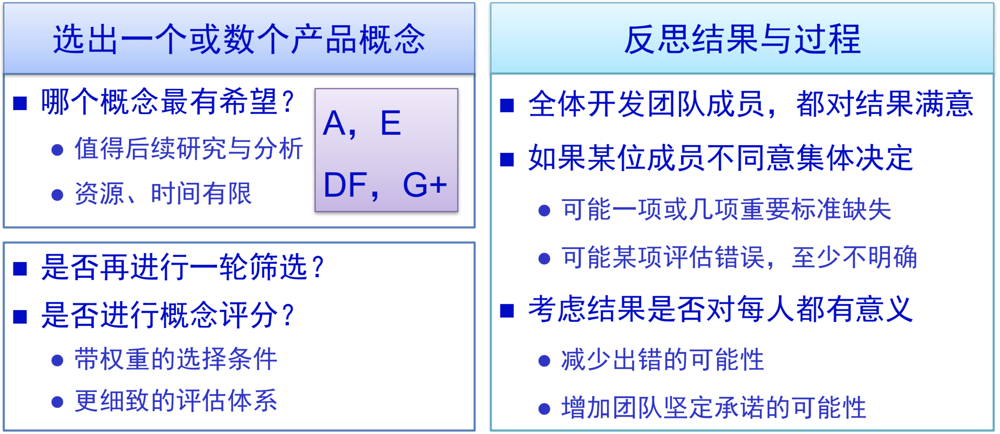

### 8.5.6 反思结果与过程

- 须全员满意，减少出错，增加凝聚力
- ifNot，则可能：
  - 一项或几项重要标准缺失
  - 某项评估错误或不明确

## 8.6 概念评分

评分相对于筛选，指标有了权重，对经过筛选的概念进一步细致评估

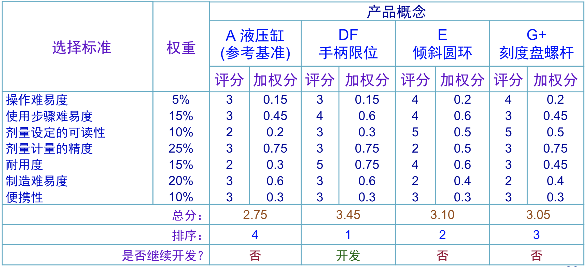

### 8.6.1 准备选择矩阵

- 使用电子表格辅助分级与进行灵敏度分析
- 指标可以针对性增加或细化分解（需求陈述的二级或三级对应规格），精细程度取决于团队需要
- 指标分配权重，可以1-5，可以百分比，可以市场调研获取顾客数据的经验型权重，但一般依赖于团队共识的主观决定
- 除了指标权重，每个指标的打分也不再是±1&0，而是比如1-5的数字，而且需要注意标度压缩

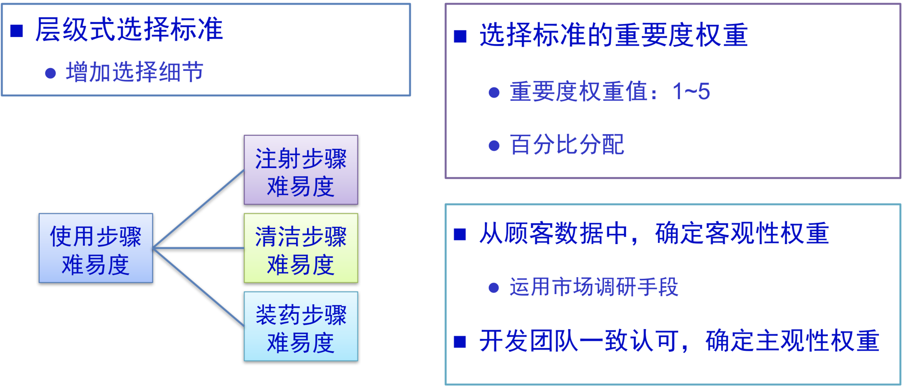

### 8.6.2 对概念评级

- 打分不再是±1&0，而是比如1-5的数字
- 参考概念仍存在作为综合参考，但不像定性筛选，不再每个指标都作为参考指标，因无法保证参考概念的指标始终居中，进而难以避免标度压缩
- 不同的指标选择不同的参考点
  - 可能来自参选概念
  - 可能来自基准分析
  - 可能来自产品规格目标值或平均值

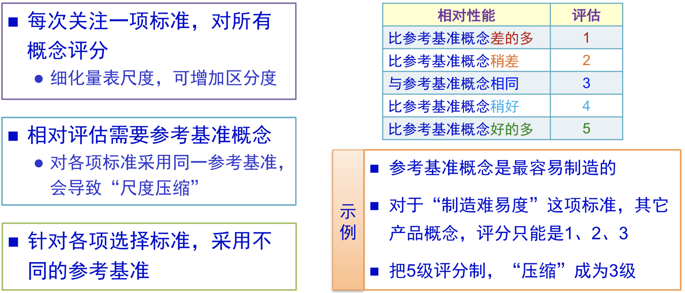

### 8.6.3 对概念排序

对各指标得分与其权重乘积求和，然后排序

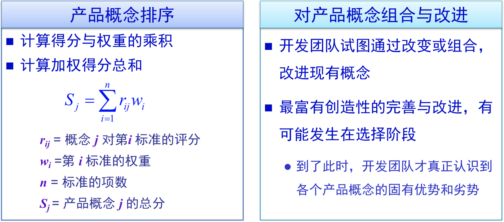

### 8.6.4 对概念整合与改进

最重要且最富有创造性的完善与改进，此时才真正认识到每个概念的固有优劣

### 8.6.5 选出一个或数个产品概念

-  定量分析打分后，不再简单选择高分概念
- 通过灵敏度分析，评估不确定性因素的影响程度
  - 改变权重==与评分，观察对排序的影响==
- 可能选一个得分较低但是不确定性也低的概念
- 不同细分市场，可能选不同的评分矩阵(不同权重指标)，也可能通吃全场

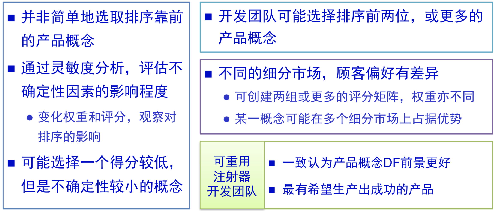

### 8.6.6 反思结果与过程

- 概念选择是一个里程碑
  - 无遗漏问题
  - 所选概念最大程度上满足需求与经济效益
- 重新审视淘汰概念，是否误伤更优
  - 遗漏指标
  - 权重不当
  - 方法不当
- 概念选择方法以何种方式支持团队决策
- 如何改进方法，促进团队效能提升

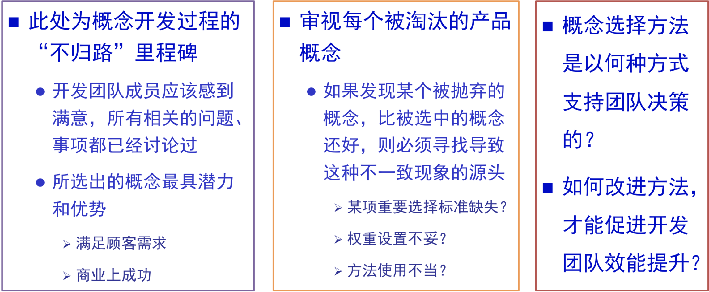

## 8.7 附加说明

- 概念质量的分解 Decomposition of Concept Quality = 选择标准的分解
  - 理论基础是指标可以独立评价，概念的质量=打分是求和
  - 有时概念性质无法拆解为独立指标，或概念与各指标的关联程度无法与整体概念质量挂钩
  - 例如：网球拍设计整体取决于一些非常复杂的方面，如质量、旋转灵活性、振动传递性、能量吸收 =》 选择指标的非线性关系在内的多属性概念决定
- 主观指标，比如美学指标
  - 团队共识并非最佳
  - 缩小范围到3-4种，建模，征求目标市场客户代表意见
- 促进概念的改进 to facilitate improvement of concept
  - 定位概念最显著/突出的属性/指标/标准(正负面)
  - 找出可用于其他概念的特征，以及改进过程中有待解决的问题
- 何处考虑成本 where to include cost
  - 大部分指标基于客户需求
  - 建议加上易于制造与生产成本，决定经济可行性
  - 其他利益相关者的需求
- 集成概念（=复杂概念）的选择原理 Selecting Elements of Aggregate Concept
  - 选择复杂概念中的简单子概念
  - 依据于生成概念时候所用的结构
  - ==举例：所有注射器都需要用不同类型的针，在注射器选择之前，先选择针==
- 概念选择贯穿于整个开发过程 Apply Concept Selection Throughout the Development Process
  - 不同层次，反复使用

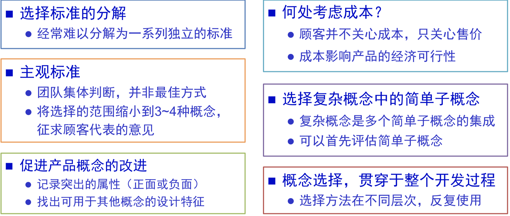

## 8.8 小结

- 概念选择是采用==用户需求及其他指标==来评价概念，判断相对优劣，为后续活动筛选

- 方法包括直觉方法与结构化方法

- 结构化方法包括概念筛选与概念评分，有助于项目成功，前者粗糙，但不可跳过

- 概念评分与概念筛选相比，前者指标有权重，打分有细化，不再是三极管，不同指标参考点不再仅仅固定于唯一参考概念

- 筛选与打分都经过如下步骤：

  `矩阵->评级->排序->整合改进->选择1到多个概念->反思`

  1. 准备选择矩阵
  2. 对概念评级
  3. 对概念排序
  4. 对概念整合改进
  5. 选择一到多个概念
  6. 反思结果与过程

- 概念选择全程用到

- 概念选择负责择优，达成共识，留档记录

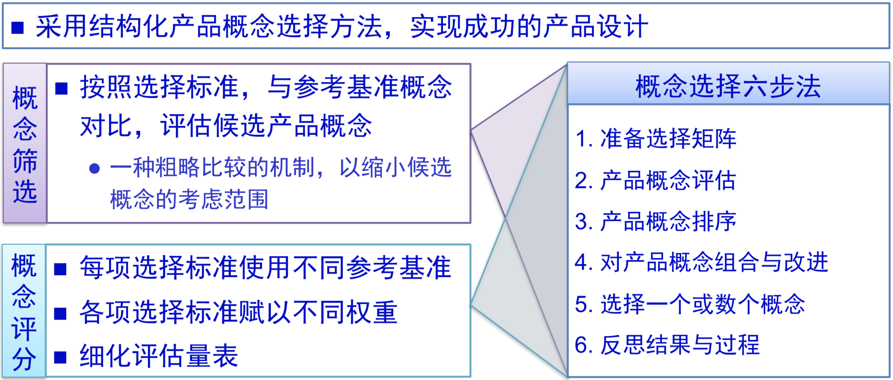

## 8.9 练习

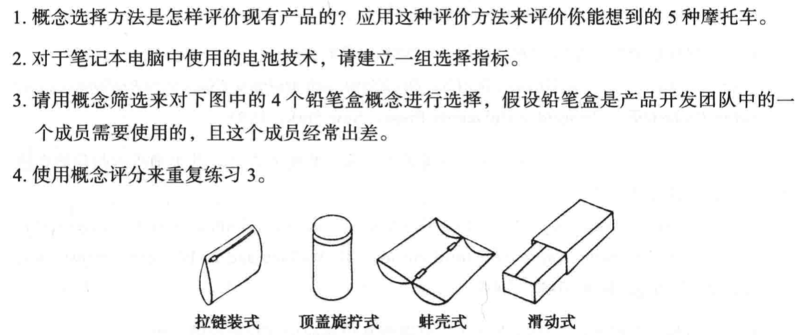

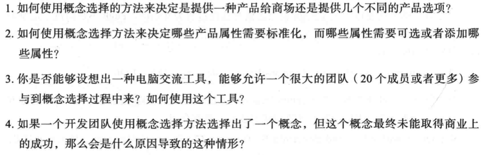

## 单选题

 

(1 满分)

以下关于概念筛选的第二步：产品概念评估的描述错误的是

- 般情况下，针对一条标准，评估所有概念概念
- 数目众多的情况下，以所有标准，对一个概念评估
- 概念是对最终产品的详细设想，需进行详细评估
- ~~如果可行，使用客观性测度指标进行评估~~