# 第9章 概念测试

[TOC]

## 9.0 概念测试的定义与意义

定义：在**概念选择完成内审筛选**后，通过**外审调查客户对概念（通常原型）**的反映，以决定是否继续进行，并判断是否符合公司财务状况等

目的：

- 选择最适宜下一步的概念
- **获取改进，以及销售潜力的信息，后者是经济分析的内容**

特点：

- 测试**不仅仅于概念开发阶段**
  - **口头测试=》确定初始产品机会=》任务描述的基础**
  - **研发结束，大批量生产前=》测试用户生产期反馈**
- 测试与否取决于**测试时间/成本相对于产品周期/制造成本**
  - **互联网软件类，测试可不做，直接通过后续迭代**
  - 对商用飞机等研发周期与成本非常大，后果严重，必须做**概念的用户测试**

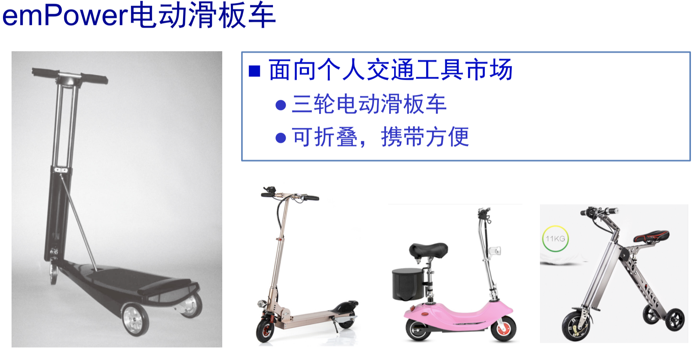

产品开发过程中的概念测试:

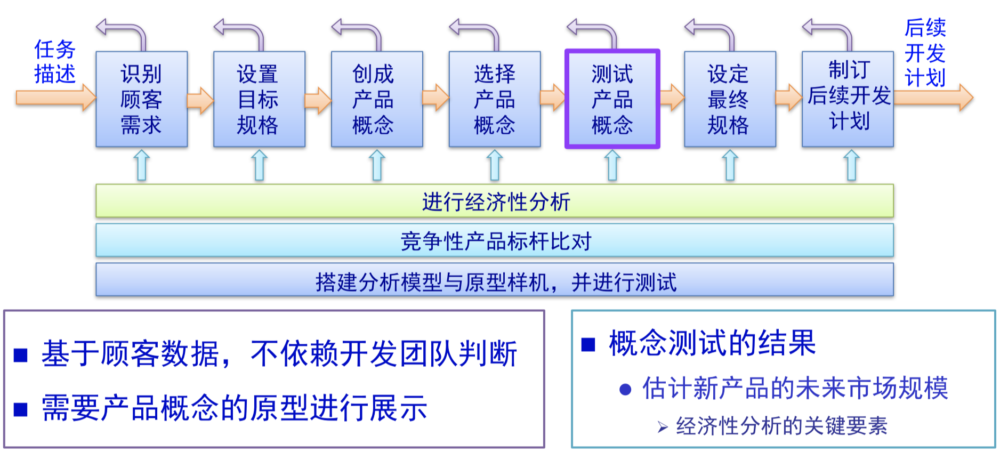

概念测试七步法:

- 确定概念测试的**目的**
- **选择顾客调查的人群**
- 选择**调查方式**
- **沟通概念**
- **测度顾客反响**
- **解析调查结果**
- 反思结果与过程

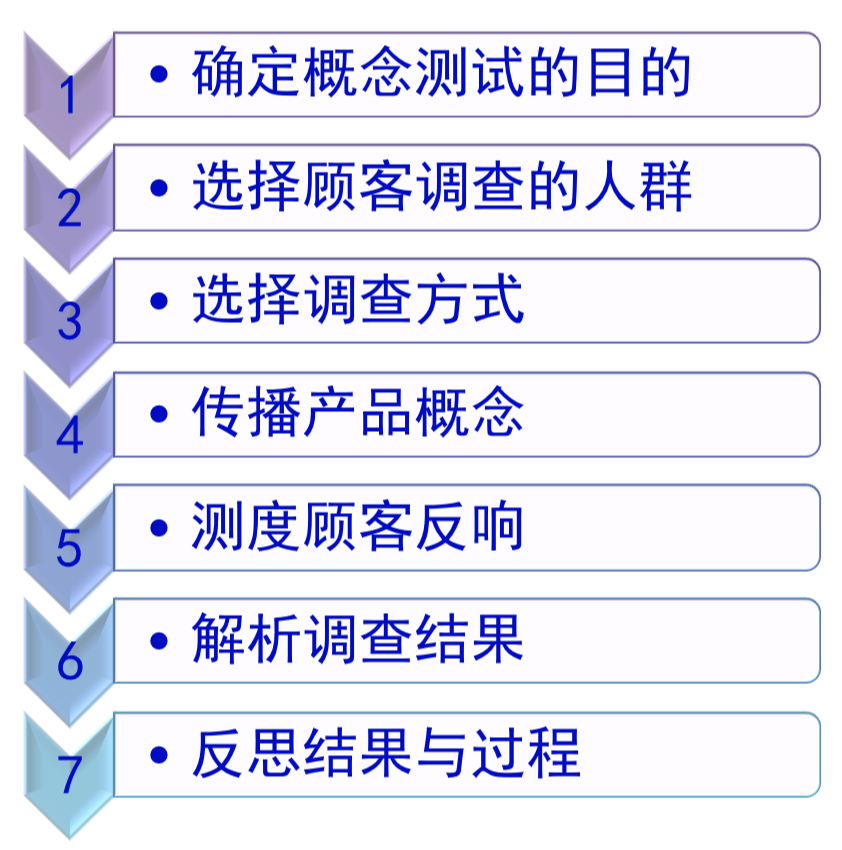

## 9.1 确定概念测试的目的

希望概念测试回答哪些问题：应明确阐述，书面写下

- 候选概念中的哪个可以胜出继续
- 如何改进以更好满足顾客需求
- 未来销量估算
- 研发是否继续

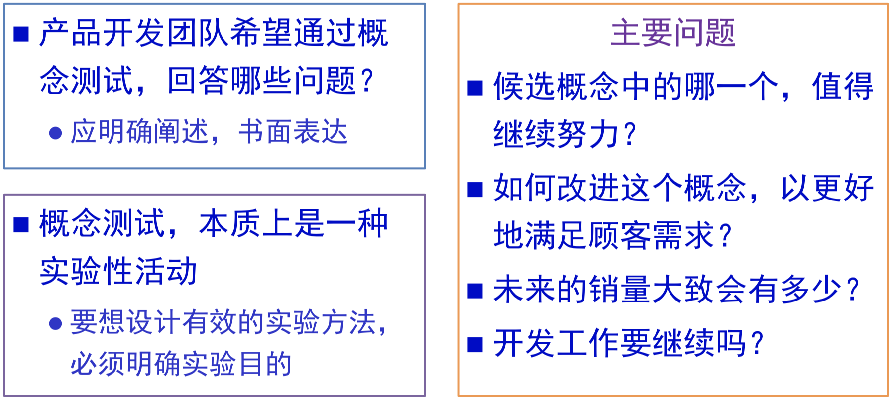

## 9.2 选择顾客调查的人群

### 9.2.1 关键假设：被调查客户群，反映目标客户群的需求

- 调查的最初几个问题，作为筛选性问题Screener Questions
- 如涉及多个细分市场，应该都涉及到
  - 如果遍历成本高，只调查最大市场，可能公允性下降
- 样本应该足够大，以便对结果建立信心
- 有时会对不同目标进行多次调查/测试，可能针对不同抽样人群与不同规模
  - 12人：基本概念吸引力
  - 1K人：购买倾向Purchase Intent =》财务预测

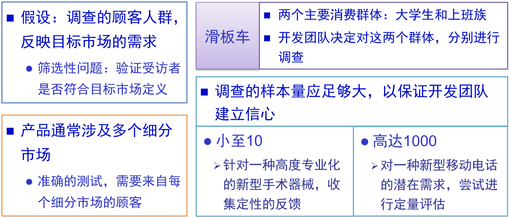

### 9.2.2 调查样本数量的影响因素：

|                                 | 适合低样本数量的因素         | 适合高样本数量的因素 |
| ------------------------------- | ---------------------------- | -------------------- |
| 测试时期                        | 概念开发早期                 | 概念开发晚期         |
| 数据细粒度                      | 定性                         | 定量                 |
| 测试成本：**时间/资本**         | 高                           | 低                   |
| 后期研发上市**时间/资本**投资额 | 低                           | 高                   |
| 预测目标市场客户受益率          | 大多数客户(不必大量样本找到) | 少数人               |

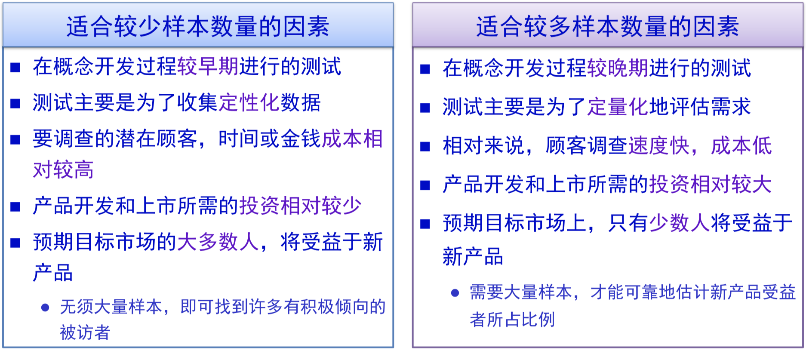

## 9.3 选择调查方式

### 9.3.1 调查方式及特点

- 面对面交互Face2Face Interaction
  - 目标地区拦截相关人
  - 电话预约
  - 贸易展台
  - 集体约见/焦点小组：6-12人小组
- 电话
  - 事先预约的电访
  - Cold Call
- 信件邮寄
  - 材料邮寄，速度慢
  - 回复率低，需要物质激励
- 电邮
  - 相对邮寄回复率稍好
  - 垃圾邮件多降低回复率
    - 参与调研受益
    - 已调研人私交
- 互联网调查
  - 概念测试网站：了解概念同时恢复
  - 电子邮件招募引流

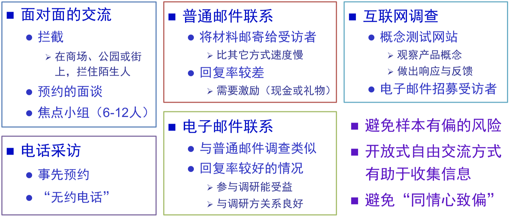

### 9.3.2 测试工具引入的样本偏差与实践

测试工具引入的偏差：善用与规避

- 电子邮件或网络调查排除了不熟悉的人群
- 台式机定位于没有笔记本的人，却用互联网调查是败笔

测试风格与具体实践：

- 开放式自由问答：适合概念研发早期的探究式测试，面对面，直接捕获细节反应
- 结构化测试：电话邮件，概念目的已经比较明确，可雇佣第三方市调公司
  - 第三方市调可以面对面
  - 避免同情心致偏，或讨好取悦开发者

## 9.4 沟通传达概念

概念的沟通方式与调查模式的选择密切相关

- 文字描述Verbal Description：小短话或要点集合，通过阅读或倾听
- 框架图 Sketch: 线条图，展示与关键点标注
- 照片或渲染图 Photos & Renderings:
- 情节图板/故事板 StoryBoard： **按照使用顺序将产品使用的一系列动作**临时排列
- 视频Video：产品详细结构形式，以及使用方式
- 仿真Simulation：仿真工具模拟产品的**功能与交互特性（与渲染图仅仅是静态形式区分开）**
- 交互式多媒体Interactive Multimmedia：结合视频动态优势以及仿真的交互特性，昂贵只用于大型项目
- 实物模型Physical Appearance Model: 形似，展现结构外观形式（偶尔其他功能），**以木头泡沫+喷涂，与照片渲染图当中的实物图区分开**
- 工作原型 Work Prototype: 神似，与上述外形类似模型区分开，主要是功能类似模型，描述如何工作，多数情况下比最终产品功能差，视觉效果也差，**要避免用户混淆**

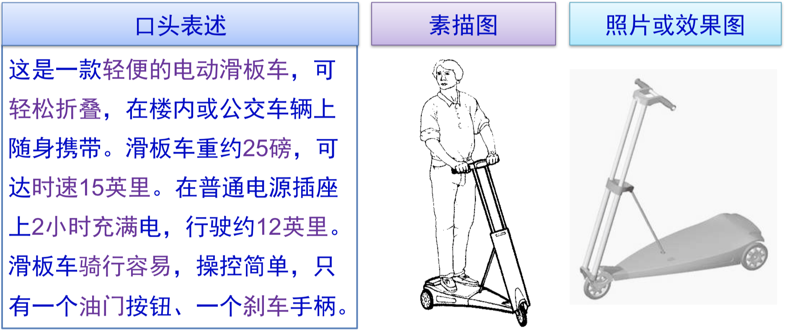

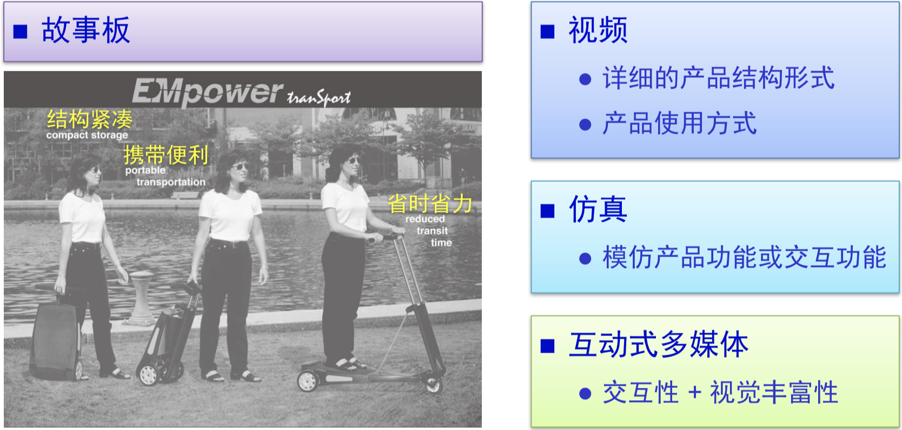

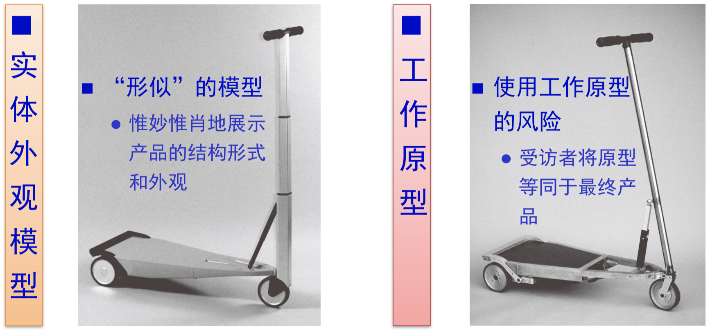

### 9.4.1 调查形式与沟通方式的匹配

无法以电话用工作原型沟通

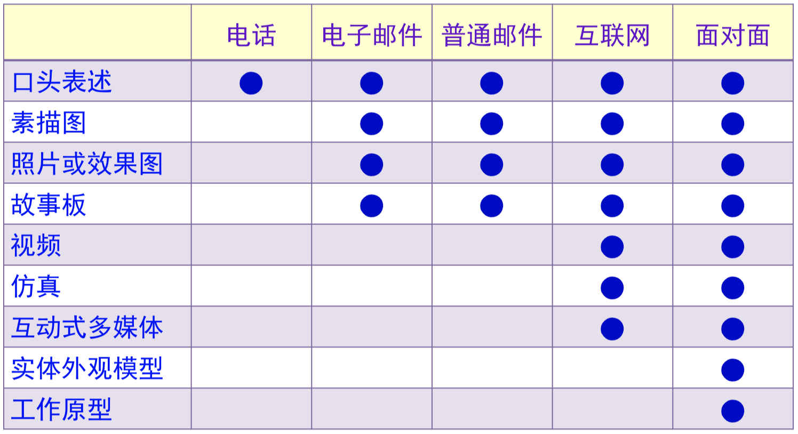

### 9.4.2 概念表达沟通的注意事项

- 概念沟通描述，尽可能最确切反映客户购买决定的最重要激励
- 过于夸张会被认为具备粉饰广告性
- 价格是客户响应的有力杠杆
  - 价格太高与太低，可以列入描述
  - 与现有情况类似或符合用户预期，可不列入描述
  - 询问客户预期价格，偏差大要review概念或将价格加入描述要素
  - 全新产品无从比较，需要将价格列入概念描述沟通过程
- 可用于多概念择优
- 可用于竞品分析，对比展示，获得优劣评价，估计潜在份额，必要时候使用被迫选择这种调查技术

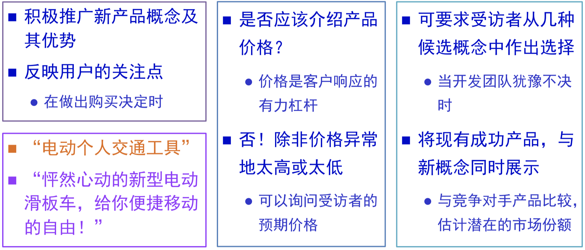

## 9.5 测度顾客反应

- 有时候需要通过多个概念中选择来测度反应
- 附加问题：反应原因与改进方向
- 尝试测度购买意向，5级或7级

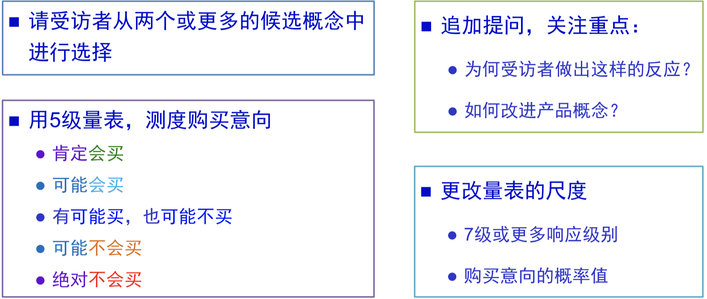

电动滑板车概念测试访谈指南

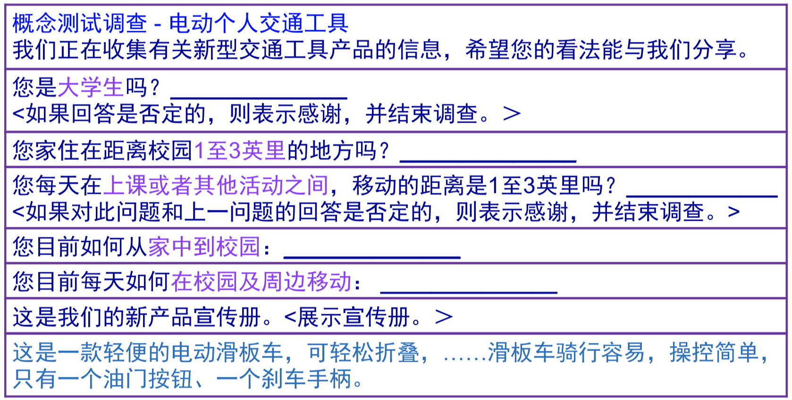

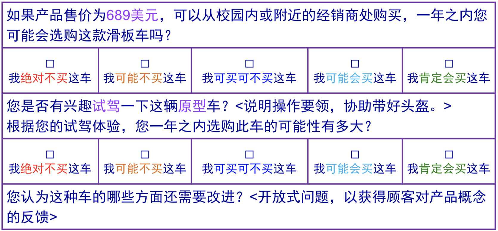

## 9.6 解析调查结果

关于N选1，在充分理解待选概念间区别的前提下：

- 如果某概念优势显著，则为首选
- 如果不显著：考虑成本或其他因素，或多个版本
- ==关键假设：==
  - ==各概念制造成本差异很大，而且没有与调查者沟通价格信息；== 
  - ==否则用户倾向于较贵方案。==

关于评估入市后一段时间通常一年内的需求:

- 持久购买力：维持销售几年，而不用考虑回头购买率(**==复购率，耐用品==**)；与刀片牙膏等不同，后者需要考虑试验阶段及此后的重复购买概率。

- 预测模型有巨大的不确定性，常犯错，但相关性仍可参考

- Q=NXAXP

  - N：特定时间内潜在客户数

    - 如果是稳定市场产品，可依据现有类似产品估算，或已知人口规模
    - 对于全新类型产品（**或产品应用于全新细分市场**），需要根据产品解决需求的替代品等来估算

  - A：N中了解Aware的百分比*N中买得到Avaliable的百分比，比如**渠道的覆盖率**

  - P：上面乘积当中，根据测试购买意向Purchase Intent的意向分组*各自的经验系数

    - $$
      P=F~一定买~* C(0.1to0.5) + F~可能买~*C(0to2.5)+.....
      $$

    - 调查者习惯性高估销量

预测与实际销售偏差的原因：

- 口述的重要性：表达能力，但不易察觉
- 概念描述的逼真度Fidelity：概念与最终产品的不一致性，引入差异
- 定价：实际价格与预期价格差异很大
- 促销水平：广告等促销作用被忽略，没有在“了解程度/有用性/概念材料展示”体现

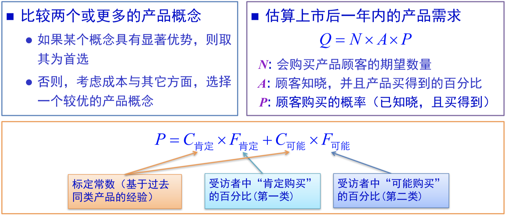

面向大型工厂上班族的电动滑板车年销量预估

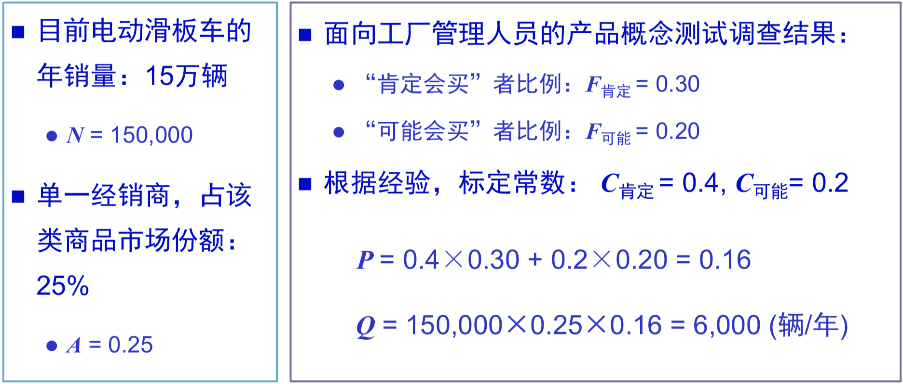

面向大学生的电动滑板车年销量预估

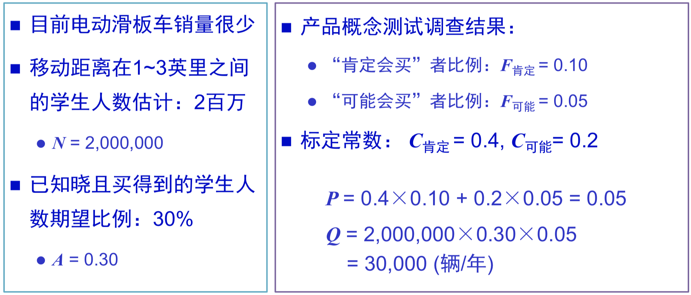

## 9.7 反思结果与过程

- 概念测试最大优势来源于用户的直接反应
- 预测模型的3个关键变量 =》敏感度分析PMP，龙卷风图
  - 市场的整体规模：不要遗漏主线直接市场之外的可替代市场
  - 知名度与可得性：分销渠道与促销计划
  - 实际购买百分比：改进产品设计，以及广告促销
- 2个诊断性问题：
  - 产品概念向客户传播交流沟通表达的方式是否正确=》引发反馈回应是否代表真实意愿与趋势
  - 结果预期是否与相近标杆近期实际销售额相符
- 新产品的经验可用于未来类似产品开发，记录可以用于后期比对

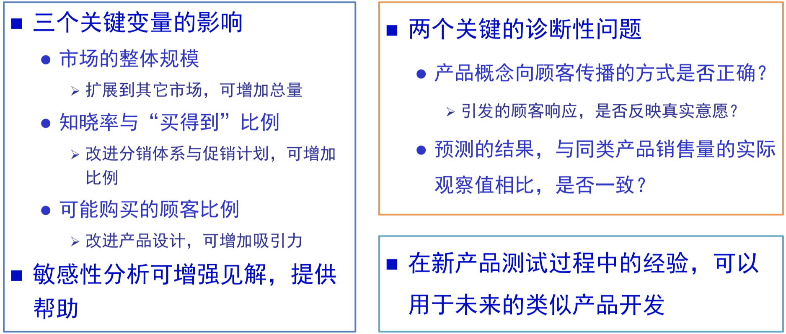

## 9.8 小结

- 概念测试得自潜在用户的直接反馈，而非概念选择当中团队主观；
- 意义：
  - 是否满足多方面需求
  - 预估销售潜力
  - 进一步完善概念提供客户信息
- 时间点：
  - 识别产品机会
  - 多概念择优
  - 评估销售潜力
  - 决定是否继续研发和商业化生产发售
- 概念测试7步骤
  - 确定目的
  - 选择对象
  - 选择调查方式
  - 选择阐述方式
  - 测度反应
  - 解析结果
  - 思考过程结果

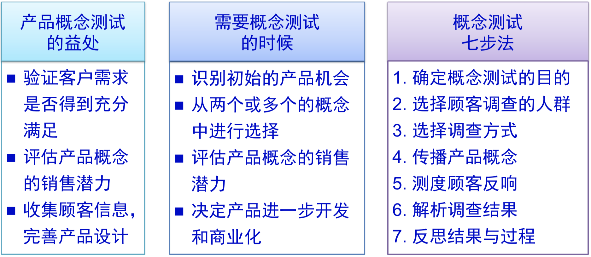

## 9.9 练习

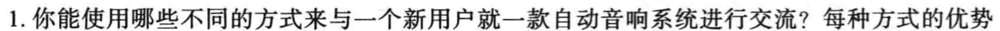

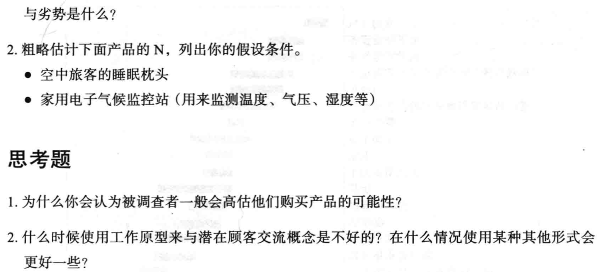

