# 第5章 识别顾客需求

[TOC]

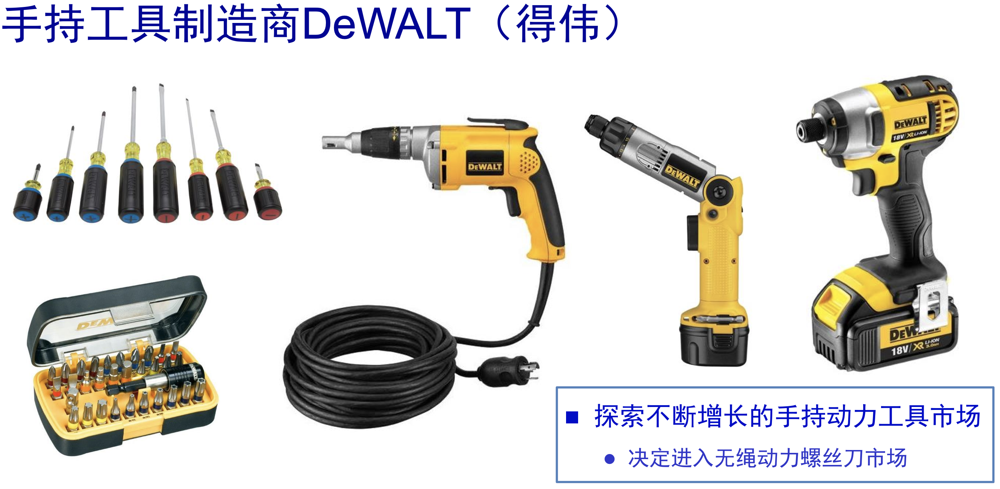

## 5.0 识别顾客需求的综合方法

初步概念工作后，原型测试，有受欢迎的产品带有不受欢迎的特征，得出结论是需求识别过程不合理。

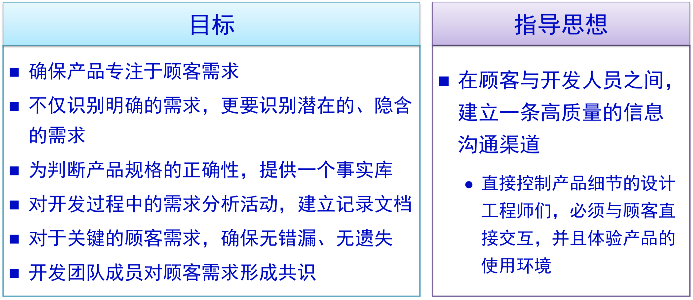

### 5.0.1 全面识别需求的目标是：

` 1.专注 2.无遗漏 3.隐藏需求，4.需求分析文档 5.开发共识，6.规格判据`

- 确保产品**专注用户需求** ***=》专注需求 =》范围***
- 识别**潜在/隐含的**以及明示的需求 ***=》纵我不言，子宁不知***
- 提供一个**判别产品规格的事实基础** ***=》规格正确性判据***
- 建立一个**开发流程所需活动的原始记录** ***=》记录需求分析文档***
- 确保**没有遗漏**重要的客户需求 ***=》关键无遗漏***
- 开发团队成员**对顾客需求形成共识** ***=》开发共识***

### 5.0.2 指导思想与关键假设：

- **高质量信息渠道**，用户与开发直接沟通，体验使用环境 Use Environment
- 开发：工程**与ID工业设计**
- 沟通与体验 =》 技术权衡，创新方法，满足需求

### 5.0.3 识别顾客需求Need在**概念开发Concept Development**中的位置与作用

#### 5.0.3.1 通用型产品开发流程

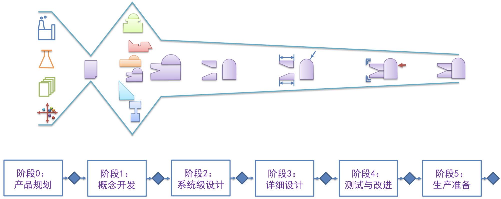

#### 5.0.3.2 概念开发:前端流程

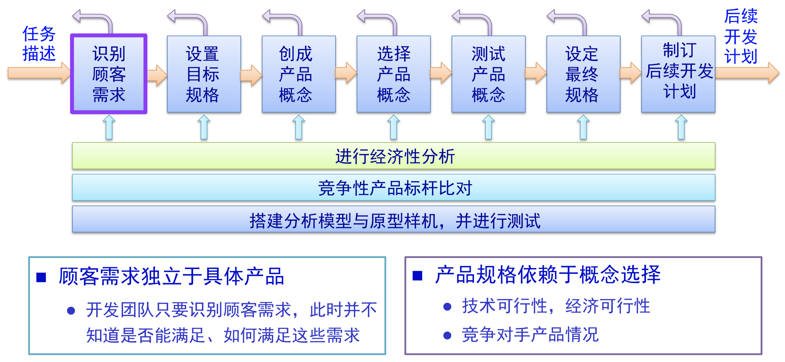

### 5.0.4 顾客需求Need与产品规格Specification之间关系

- **需求独立于具体产品**，[**并不一定是我们选择与追求的概念**](#5.2 从顾客需求角度理解原始数据 =》需求陈述)；=》==因为可能自相矛盾、表象而非内在需求、低优先级、技术经济制约、技术上无法实现或实现成本偏高？？==
- 此时**不必知道是否可满足，如何满足**，仅识别就好 => **无视可实现性与具体实现方式，仅采集**
- **规格依赖于概念选择，技术/经济可行性，竞品与需求。**
- 需求**Need**=期望**Want**=顾客属性**Customer Attribute**=客户要求**Customer Requirement**

### 5.0.5 识别需求5步法

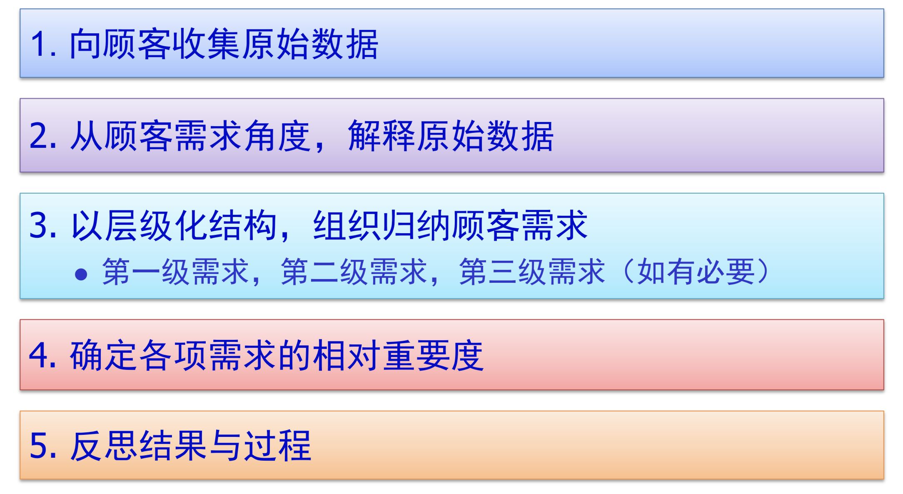

` 收集客户陈述=》解释为需求陈述=》组织为层级需求金字塔=》需求排序=》自省`

1. [向顾客收集原始数据](#5.1 从客户处收集原始数据=》生成顾客陈述) =》**收集数据-><u>顾客陈述</u>**
2. [从顾客需求角度，解释原始数据](#5.2 从顾客需求角度理解原始数据 =》需求陈述) =》**从<u>顾客陈述</u>到<u>需求陈述</u>列表**
3. [**层次化组织（动词不是名词）**归纳顾客需求](#5.3 组织需求的层级=》金字塔层级需求RBS) =》**层次化是RBS分解，其实更多是自下而上聚集，而不是说不同高端到低端等级的要求，<u>生成需求层级金字塔</u>**
4. [确定各项需求的相对重要度](#5.4 确定需求的相对重要度=》数字化权重排序) =》**<u>重要度排序</u>**
5. [反思结果与过程](#5.5 对结果与过程进行反思) =》永远有这一步

### 5.0.6 无绳动力螺丝刀项目的开发任务书

- 任务书=任务描述/陈述Mission Statement=**章程Charter≠~~Chapter~~**=设计概要Design Brief
- 指明方向，但不精确，当然**相对于PVS前景陈述**还是要精确一点的

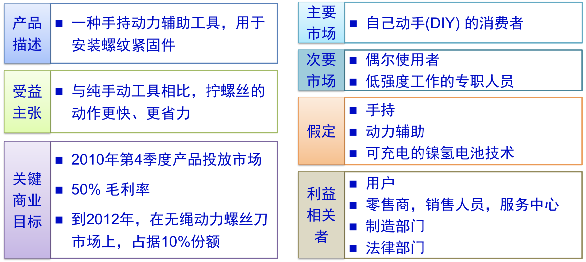

结构化方法**对顾客没有体验过的全新颠覆性产品仍然有效**：

- 产品成功的必要条件：为用户提供某种可见的益处
- **需求是否被成功识别的唯一真实标志：<u>用户是否喜欢第一个原型</u>**
- 无论用户是否清晰阐述其潜在需求，与目标用户沟通，都有利于构建**基于用户环境与用户观点**的个人理解

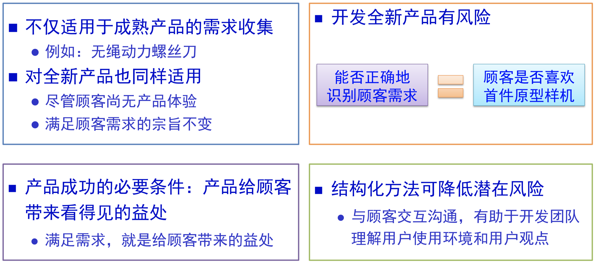

## 5.1 从客户处收集原始数据=》生成顾客陈述

### 5.1.0 数据收集内容、方法及比较

数据收集内容：

- 接触客户
- 体验产品环境

数据收集方法：

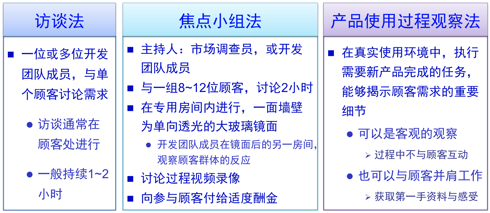

- **访谈法 Interview**：通常对单一用户@客户处，持续时长1-2小时
- **焦点小组 Focus Group**：
  - 8-12位用户，2小时
  - 市场调研人员或开发组主持人
  - **全程录像，双面玻璃单透监控**
  - 支付酬金
- **观察使用中的产品**：
  - 使用现有**产品或**需要新产品的**动作**
  - 可以**被动观察**(与用户无交互)，也可**共事**(第一手资料感受)
  - 可以对**操作对象**，或**替代对象**(手术刀切水果)
- ~~**书面/网络调查**~~：
  - 流程后期普遍，但**需求初期不推荐**
  - **不能提供产品环境的足够信息，在揭示无法预期的需求上是无效的**

数据收集方法的比较与有效性：

- 1个2小时的焦点小组=2个1小时的访谈： **==横向比，不是纵向X2，这说明增量效果一致，不含固定成本==**
- **访谈首选**：单位时间成本低，体验使用环境
- 焦点补充：高管**观察到客户群**，与更大团体进行**视频分享**，以及更多**差异化**互动(最后一点研究未强烈支持)

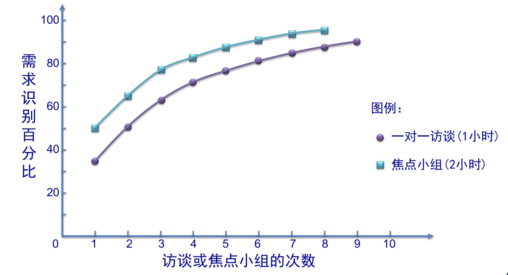

### 5.1.1 选择顾客

#### 5.1.1.1 访谈次数

- **10-50次访谈**
- **数学归纳**，K+1,2,3没有新需求揭露则终止
- 细**分市场分层抽样**，每次重复上述
- 概念**团队分组并发**进行访谈

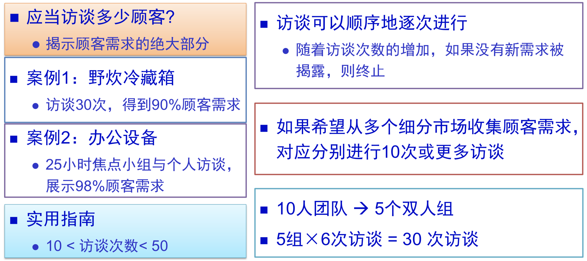

#### 5.1.1.2 领先用户 Lead User =》潜在需求先清

定义：市场普及前，数月/年就能体验需求，并从产品创新中获益。

特别意义原因：

- **能清晰阐述新需求(=主流用户的*<u>潜在需求</u>*)**，因对现状十分不满
- 可能已经**发明了自己的解决方案**
- 预测趋势，超越竞争

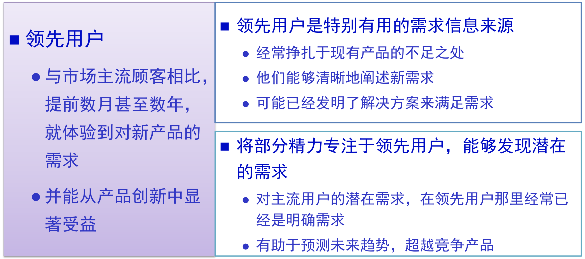

#### 5.1.1.3 极端用户 Extreme User =》 非主流新需求，也可能是潜在需求

定义：

- 以**不寻常方式**使用产品的人
- 有**特殊需求**的人
- **不一定是高端复杂玩家，还可能是身体弱势的残疾人**

特殊意义：

- 揭示主流市场客户群体不敏感的***<u>新需求</u>或者<u>潜在需求</u>***
- 带来**重要机会**，使得新产品更具竞争优势

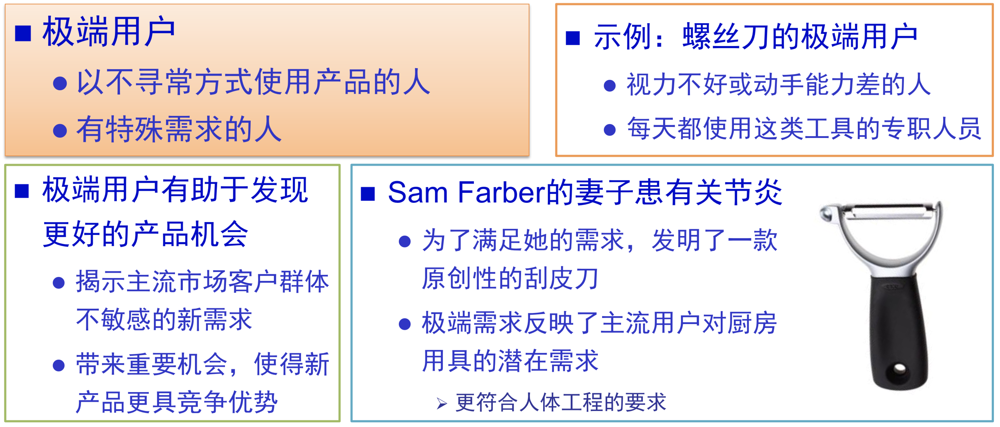

#### 5.1.1.4 顾客选择矩阵

用户分类：

- 购买决策者 =》 部分情况下，可选补充
- **产品终端用户 =》所有情况下，必选途径**

顾客选择矩阵：=》只针对终端使用者

- **细分市场在左侧(市场分层)**
- **用户类型在顶部(用户类型：领先、极端、主流、渠道、服务=》<u>只针对终端使用者</u>)**
- **调查深度表现为数字，期望的接触数量**

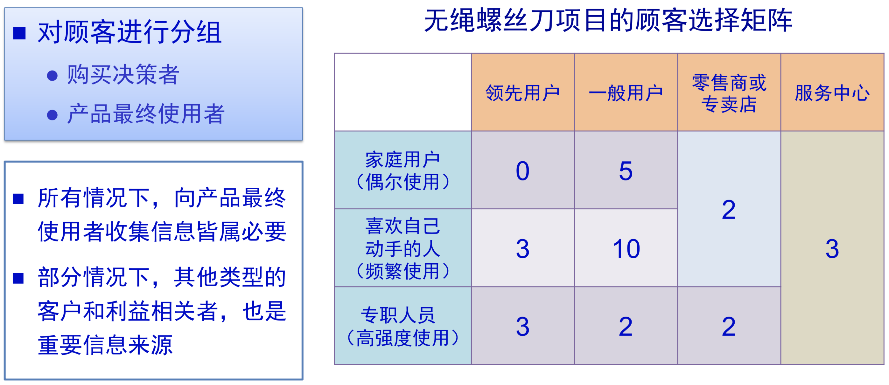

#### 5.1.1.5 定位顾客

方式：电话+邮件

- 从**销售处**、网络、电话簿等获取名录
- 注意顾客选择的偏好，**注意代表性**
- **工商业产品容易**安排
  - 生产力工具不可或缺
  - 有主动诉求
  - 集中有限代表性
- **消费类产品不易**安排
  - 很少直接获益
  - 询问基数较大

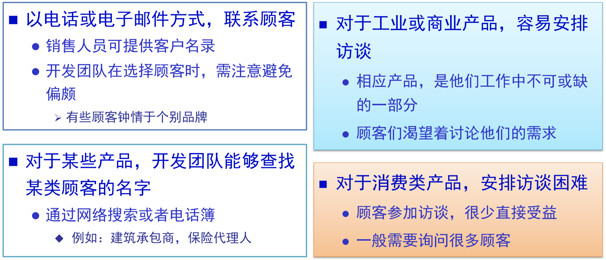

### 5.1.2 诱导顾客需求信息的艺术

#### 5.1.2.1 基本方式：

- 接受信息，**避免对抗**
- **不同于销售说服**，要引导正确清晰表达
- **基于有层次问答**，**准备访谈指南**，辅助引导性语句

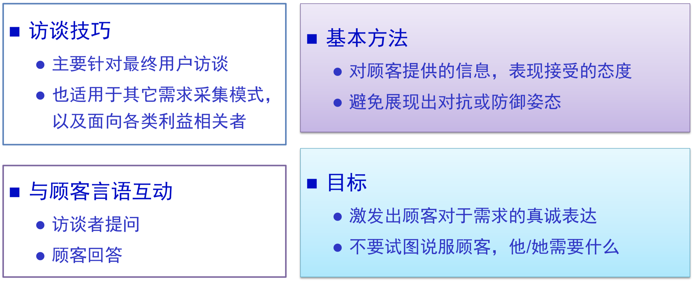

#### 5.1.2.2 引导性语句，访谈指南与问题列表：

- [ ] 访谈者自我介绍
- [ ] 解释访谈目的

` （时间、原因、过程=视为记叙文6要素）、爱恨+卖点+改进`

- [ ] ```python
  您什么时候、为什么会使用这类产品? =》时间、原因
  请给我们展示一下，您使用产品的典型过程? =》过程、场景
  您喜欢现有产品那些方面? =》爱，卖点
  现有产品的哪些方面，是您不喜欢的? =》恨，不足
  在购买该产品时，您考虑了哪些事项? =》卖点
  您认为产品应该如何改进? =》不足
  ```

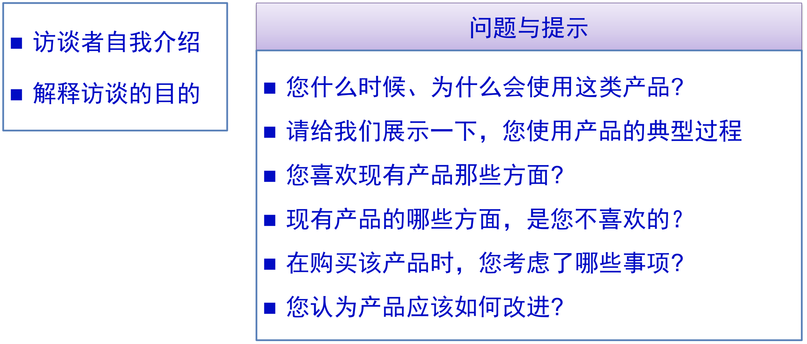

#### 5.1.2.3 与顾客有效互动技巧：

1. **顺其自然**：只要有用，不在意符合访谈指南
2. 使用**视觉刺激和道具**：
   - **现有产品，竞争产品，待开发产品模型**
   - 展示**新产品的初步概念**，得到顾客对各种技术路线的早期反应 
3. 关于产品技术，**抑制先入为主的假设**
   - ==顾客就他们期望能满足其需求的产品概念常做假设：访谈者在讨论如何设计或制造产品的假设时，避免偏见==
   - 顾客提到具体的技术方案或产品特征：访谈者应该努力探究**内在基础需求而非表象**
4. 请顾客**演示产品**，并且用产品完成**典型任务**
   - 使用环境中访谈，便于演示，有利于发现新信息
5. 对顾客的**意外表现**和表达出的**潜在需求**，保持高度警觉
   - 追加连续提问根源，挖掘潜在需求：尚未满足，且未被清晰描述与理解的需求
6. **注意非语言信息**
   - 特别是对人**文维度**的产品需求：舒适、想象、风格
   - **面部表情**，手持产品的姿态
7. 以上都是假定客户熟悉类似产品，如果完全找不到类似的**创新产品，访谈问题应当集中在新产品的<u>任务或环境中，而非产品本身</u>**
8. 最后要表示感谢，维系良好关系，便于后续追踪反馈

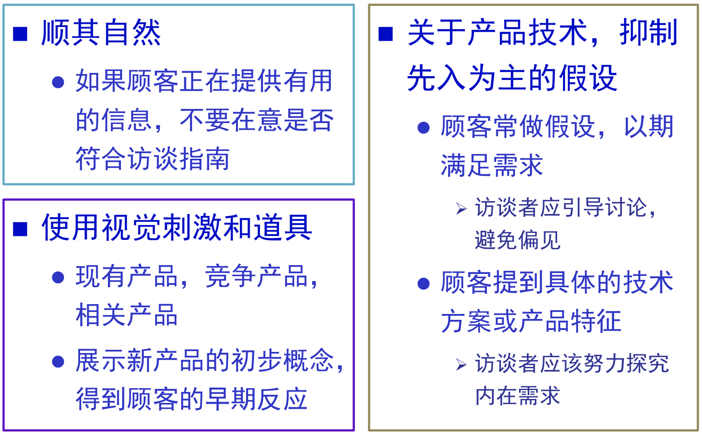

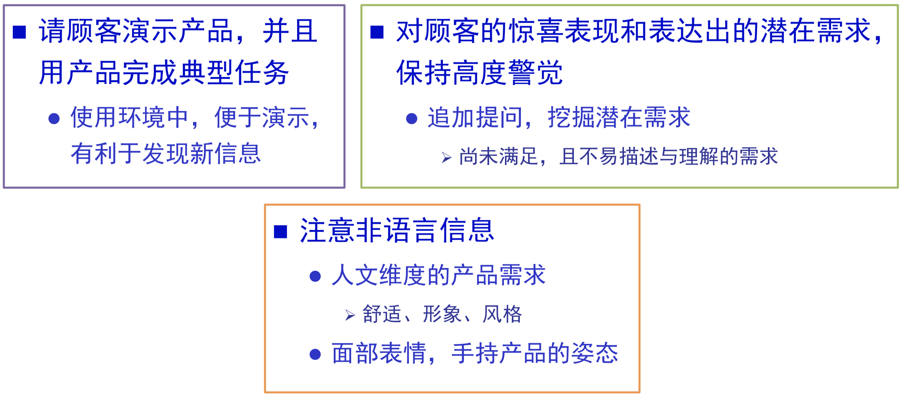

### 5.1.3 整理归档与顾客互动

#### 5.1.3.1 四种方式：

1. 录音=》音频，原始资料
   - 实施简便
   - 转换为文字不易或外包昂贵 =》==现在已经NLP已经很容易了吧==
   - 令有些顾客生畏 
2. 笔记=》文本，具备总结性、系统性，适合作为最终沉淀并易于建立索引
   - 常规常见记录手段
   - 一人为主记录，其他人专注有效提问
   - 努力捕捉顾客全部言辞细节
   - 事后整理，作为访谈记录
   - 支持团队成员分享观点 
3. 录像=》视频，更丰富的细节与原始资料
   - **常用于焦点小组访谈** =》知情权与付酬
   - 也用于全程记录顾客在应用环境中使用产品的过程
   - 让团队新成员看录像“补课反复”，跟上速度
   - 原始资料向管理层展示
   - 多视角，有助于识别潜在需求
   - 捕捉最终用户环境的多方面信息 
4. 拍照=》图像，原始资料
   - 类似于录像的多种益处
   - 更方便，相对录像对现场干扰更少，容易实现对客户对现场观察
   - 照片易展示，图像质量高，==设备可利用==
   - 缺乏动态信息

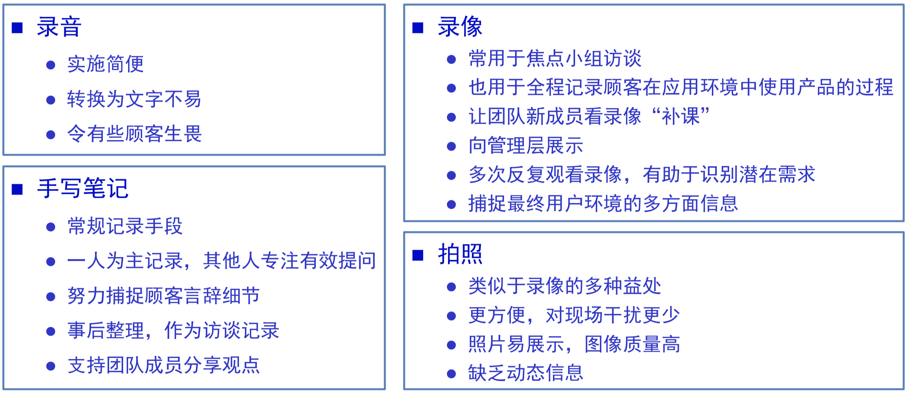

#### 5.1.3.2 顾客陈述 Customer Statement

- **顾客陈述是收集的原始数据的表现形式**，辅助以照片或视频。
- 推荐采用下图的表格式模板，并在**互动后尽快**填写

| 顾客与联系方式 | 顾客、地址、电话                                | 访谈者信息与时间、产品、用户类型                             |
| -------------- | ----------------------------------------------- | ------------------------------------------------------------ |
| 问题/提示      | **顾客陈述**或**实时/非实时&直接/间接行为观察** | 对左侧隐含需求解释==，注重潜在需求（！标记）==，隐藏于幽默/建议/恼怒/非语言信息观测=》**需求陈述** |
| 后续跟踪意愿   |                                                 |                                                              |
| 典型应用       |                                                 |                                                              |
| 优点卖点       |                                                 |                                                              |
| 缺点不足       |                                                 |                                                              |
| 改进建议       |                                                 |                                                              |

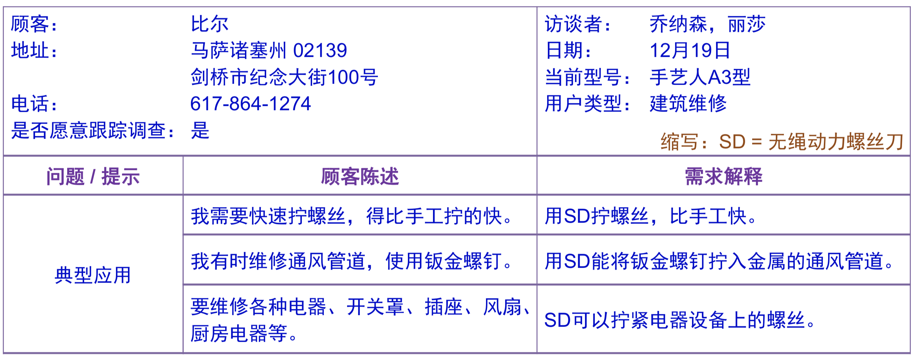

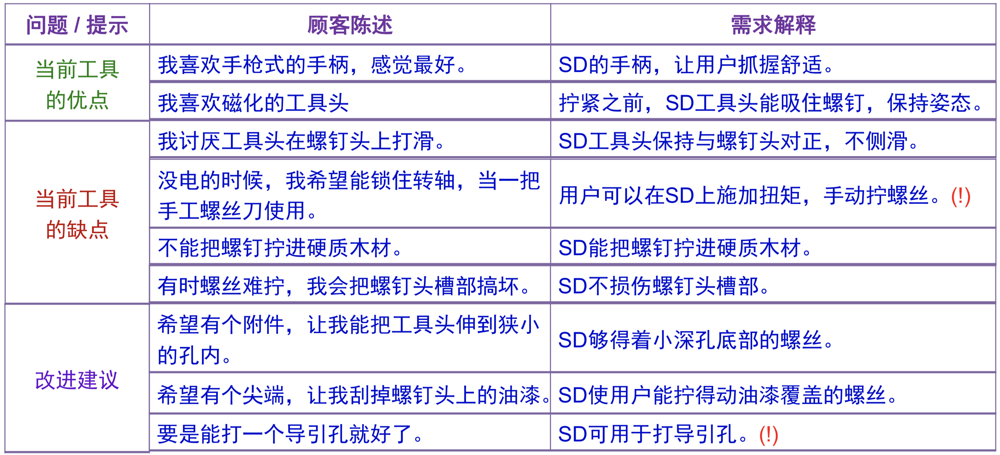

## 5.2 从顾客需求角度理解原始数据 =》需求陈述

陈述/观察=》访谈记录=》理解因人而异,因此需要多位开发团队成员，共同参与解释工作。

解释五原则：

1. 描述产品必须**“做什么”，而非“怎么做”**
   - 客户倾向于描述概念或实施方法表达偏好
   - 需求书应独立于特定技术解决方案的形式表达出来
2. 需求描述可以不同细节层次表达，要尽量**像原始数据一样具体**，以免丢失信息
3. **使用肯定句**，而非否定句，**易于转化规格**，但看具体情况(‘不能如何如何’)
4. **把需求表达成产品的一种属性（产品主语而非宾语）**，体现连贯性便于向规格转化，或多数情况下表达为产品用户的一种属性(可对产品做什么)
5. 避免使用“必须Must”和“应该Should”二词，此处**不做重要性排序**

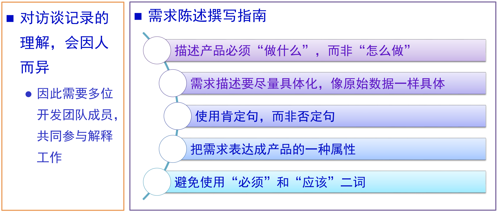

需求陈述**列表（≠需求陈述单条）**是所有受访客户需求的子集，有<u>技术上无法实现的，有受技术与经济可行性制约的，有自相矛盾的</u>，但是**识别需求组不需要做评判，只简单进行记录**！

==第6章，需求与规格指标的转化，是在顾客陈述还是需求陈述的阶段同时进行？==

需求陈述撰写示例：

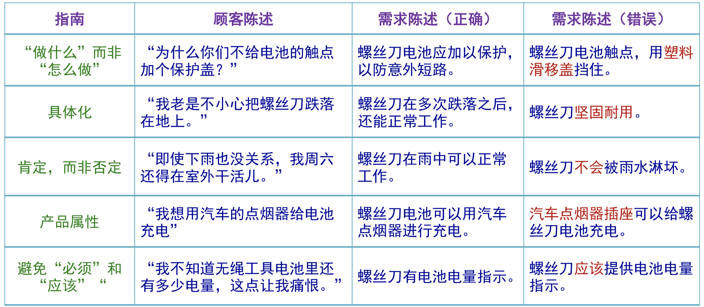

## 5.3 组织需求的层级=》金字塔层级需求RBS

### 5.3.1 需求层级概述与举例

- 前面原始数据得到的是**50-300条需求陈述**的**列表**，需要组织成层级列表
- 一组一级需求**Primary Need**中的每一个需求，细化为一组二级需求**Secondary Need**，对复杂需求还可能继续细化为一组三级需求**Tertiary Need**

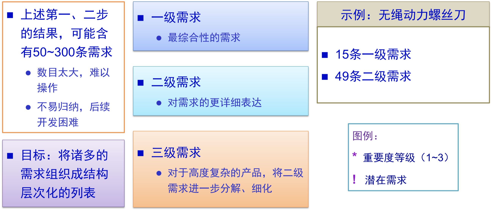

举例，以下注意，***多少代表的是重要性而不是需求层级**，大主题框代表一级需求，其他代表二级需求，没有三级需求，与三星区分开：

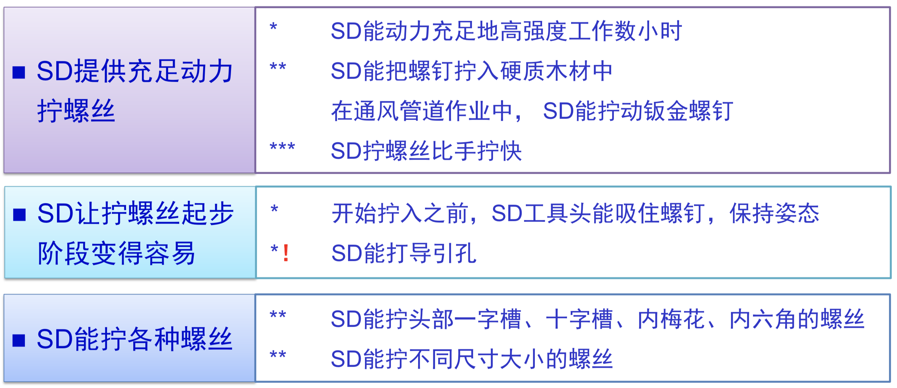

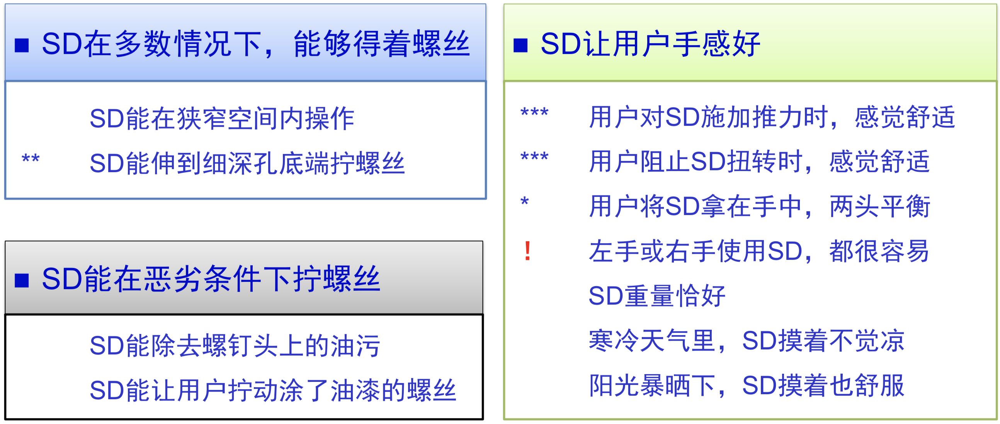

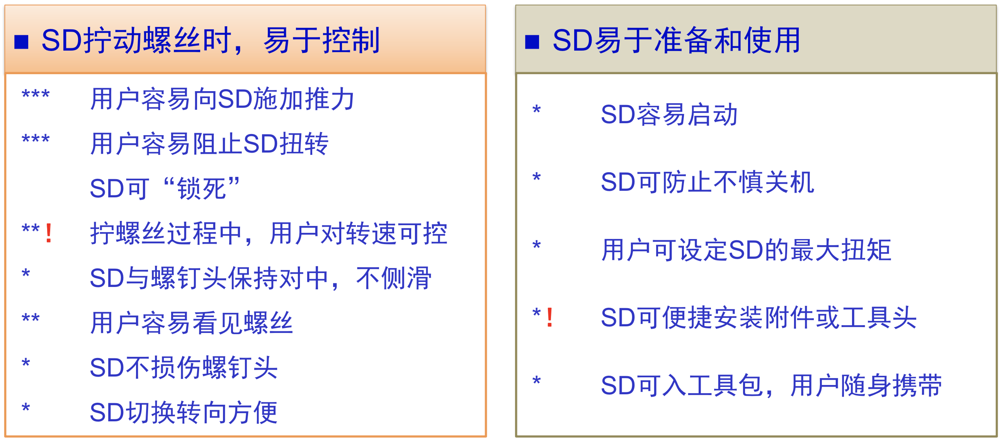

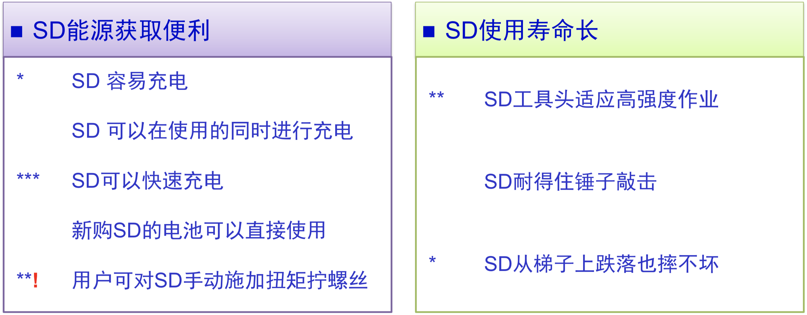

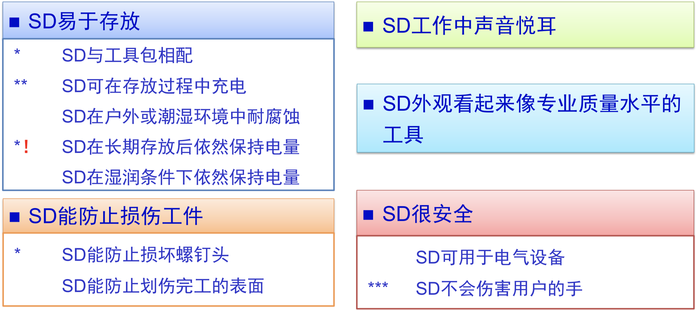

### 5.3.2 构建层级化需求列表的程序：

1. 将每项需求陈述，分别**打印成卡片**
   - **“需求陈述”用大字**，印在卡片中央
   - **“顾客陈述”用小字**，印在卡片下部
   - 卡片大小: **A4纸的1/4**
2. **删除冗余或合并同类项**的需求陈述
   - 冗余陈述钉在一起，视为一个需求
   - 要**仔细确认其真实含义相同**
3. 按照所述需求的**相似性**，将卡片**归类分组**
   - **整合为3~7组卡片**,每组表达相似的需求
   - 要特别注意归类的逻辑 
     - 归类**应该基于用户的需求**
     - 归类**不应该基于开发习惯或流程**：比如基于技术要素(材料、包装、能源)，或者假定的有形部件(胳膊腿)
4. 给**每小组需求贴一个概括标签**
   - 标签是本小组需求的概括 
   - 选一条代表性需求，或写一条新陈述 
5. 如果需求小组数过多，考虑结合为大组需求
   - **少于20个小组，两级结构**
     - 标签是一级需求
     - 具体需求是二级
   - **多于20个小组，建立大组、超级组**
     - 大组标签作为一级需求
     - 小组标签为二级
     - 具体需求为三级 
6. 评审并编辑组织好的需求陈述
   - 没有唯一正确的需求层级结构 
   - 开发团队可以考虑其它的分组方式和相应标签
7. **多个细分市场**
   - **不同颜色的细分市场Tag**，标记对应不同细分市场需求陈述
   - **对每个细分市场单独分组**，适应需求差别大，无法同样产品一起满足全部细分，有助于观察需求差别以及需求最佳组织形式

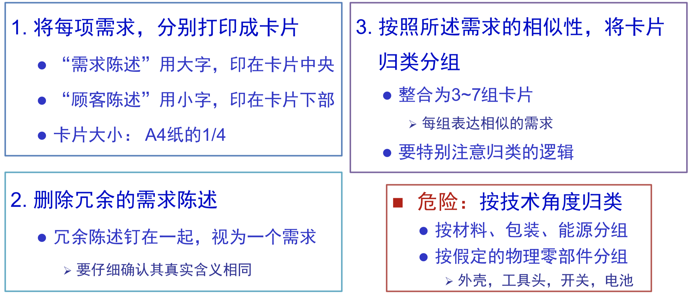

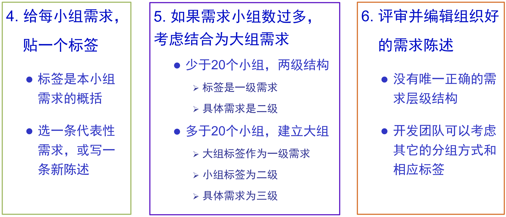

## 5.4 确定需求的相对重要度=》数字化权重排序

### 5.4.1 对每个需求建立数字化权重的方式：===》针对的是需求还是需求组？应该是每组需求挨个过吧==

1. 基于客户体验形成**团队共识** => 一次会议完成
2. 基于进一步的**用户调查**=> **准确**，但**耗时**2周起，大多数情况下认为**必要**
   - 面谈、网络、电话、邮件==@同样客户==
   - **仅对需求的一个子集，<50条**，避免逆反
   - **去掉那些明显重要、易于实现的**
   - 对**难以技术权衡或实现成本高的需求**来限定调查范围
   - ==一系列调查对不同用户@不同需求子集的重要性==
   - 识别特色、意外的**新需求与潜在需求**

### 5.4.2 数字化权重方式选择的考虑要素：

1. 基于**成本、进度、精确性**权衡
2. <u>概念生成与竞品分析</u>可以在**排序之前**执行

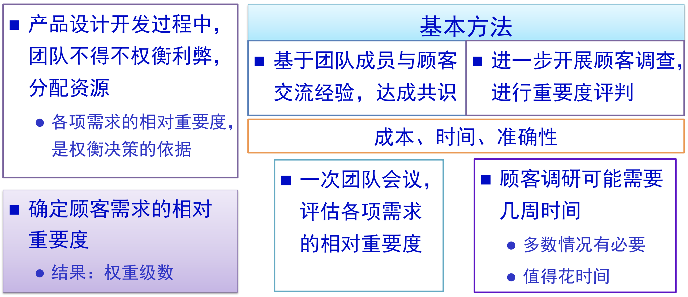

面向重要度评价的顾客调研：

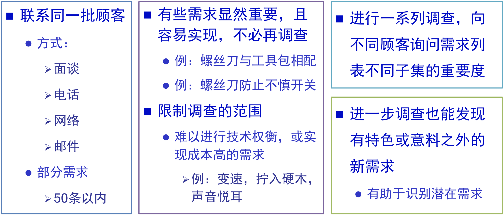

### 5.4.3 用户反馈与重要性评价方式

反馈刻画方式：**均值、标准差**、每类别收到的**回应数** =>用于分配需求的权重

需求**重要性标度：1-5，或※数**

**关键需求不可能是潜在需求**，因为关键所以期望首要满足，因而不会对其意外或兴奋。

重要度调查表示例(部分)：

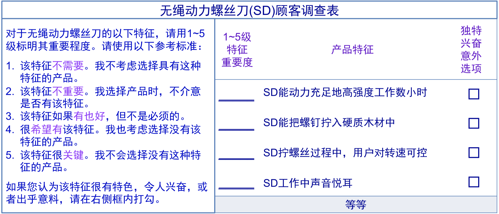

## 5.5 对结果与过程进行反思

- 是否与**目标市场**上**所有类型**的**重要顾客**都进行了交流?  =》**有针对(目标市场)，无遗漏(所有类型，重要客户)**
- 为了捕捉目标顾客的**潜在需求**，我们能够看到**现有产品相关需求之外**的需求吗?  =》**潜在需求**
- 在跟踪访谈或调查中，==是否存在我们应该继续探究的领域==?
- 在与我们交谈过的顾客中，哪些对于我们**未来的开发工作是优秀的参与者**?  =》==这里指的是，领先/极端，还是决策/使用，还是市场细分同时用户分层，还是友情维系？==
- 哪些需求是我们刚开始不知道，而现在知道了的? 我们是否对某些需求感到惊讶? =》**来自自我探索之外的新信息？**
- 我们的组织中，是否包含了**那些深入理解顾客需求**的人? ===>PM专职需求管理人员还是开发团队还是全部一致原则???==
- 在未来的项目中，我们该如何完善流程?  =》**过程审计**

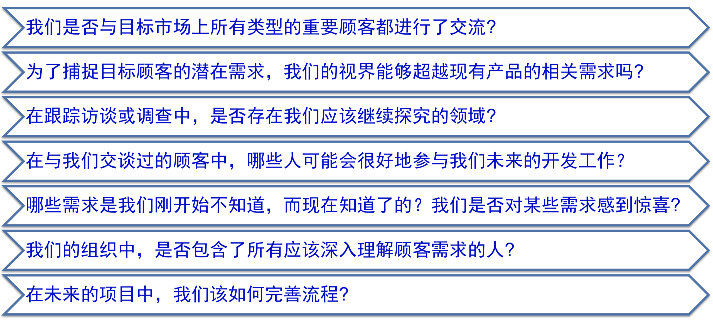

## 5.6 小结

1. 识别顾客需求，是产品概念开发的首要一环，由此产生的用户需求，用来指导建立产品规格、生成产品概念并选择进一步开发的产品概念；
2. 识别用户需求流程**5步骤**：
   1. 向顾客收集原始数据 =》**顾客陈述**
   2. 从顾客需求角度理解原始数据 =》**需求陈述**
   3. **组织（动词不是名词）**需求的层级 =》**金字塔需求RBS矩阵**
   4. 确定需求的相对重要度 => **需求排序**
   5. 反思结果和过程 =》 **惯例inspect/audit/review，监控组与知识整理**
3. 建立**顾客到开发者之间的高质量信息渠道**，确保直接控制产品细节的人包括设计者，充分理解客户需求
4. **领先用户**是良好需求来源，比主流用户**提前体验**新需求（**主流用户延时下的潜在需求**），也**明显受益**于产品创新，比一般用户更**清晰阐述**需求；**极端用户的特殊需求，反映主流用户潜在需求**
5. 在决定**顾客满意度**方面，**潜在需求可能比明示需求更重要**，潜在需求指的是用户能够在最终产品当中认识到其重要性，却不能或没有事先清楚表达的需求
6. 顾客需求应该以产品**可以做什么**而非**可能怎样做**的形式表达；坚持该原则，可使开发团队在**生成和选择产品概念**时候具有更大灵活性
7. 此方法优点是：
   - 确保产品**专注**于客户需求，**没有遗漏**重要的客户需求
   - 开发团队对目标市场的客户需求有**清晰理解并达成共识**
   - 建立一个**事实基础**用于生成概念、选择概念、建立规格
   - 建立开发流程中**需求阶段的原始档案**

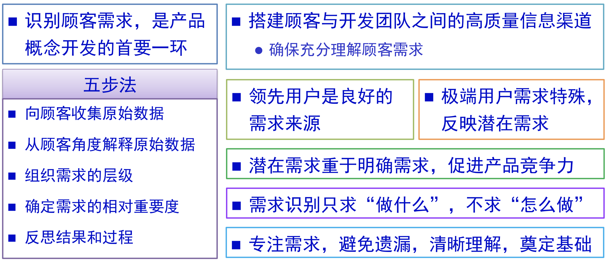

## 5.7 练习

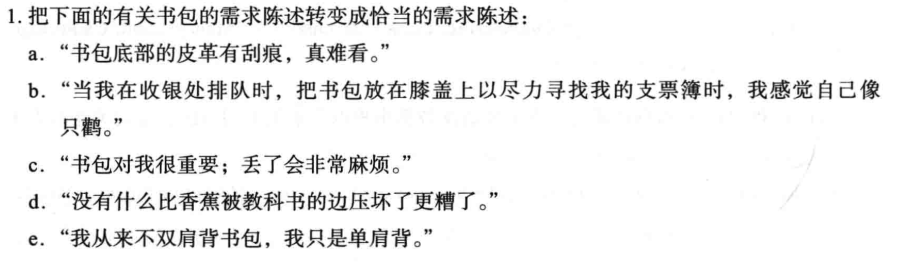

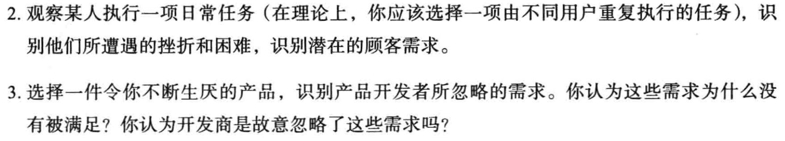

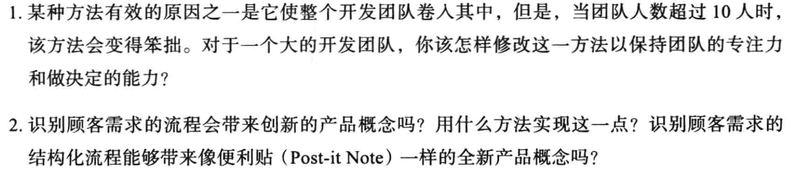


